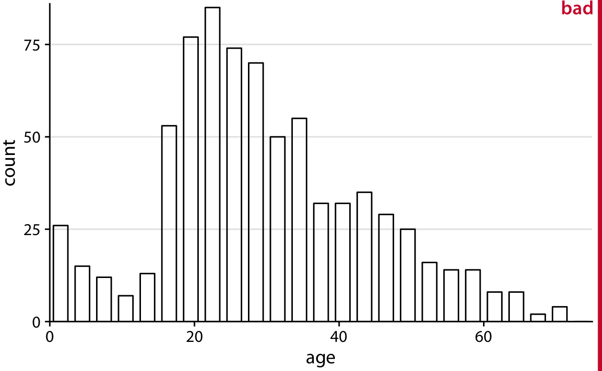
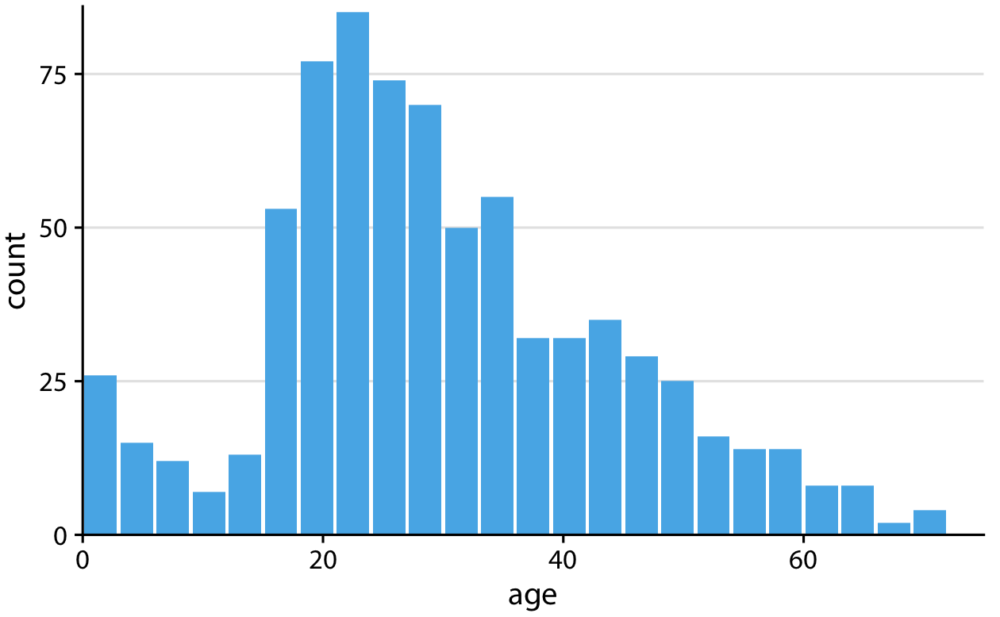
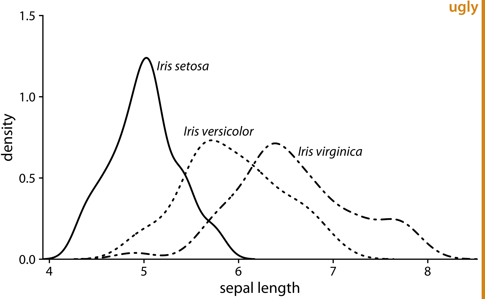
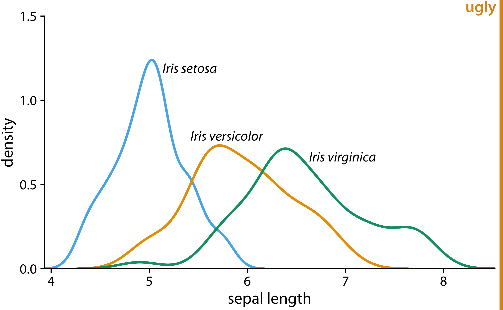
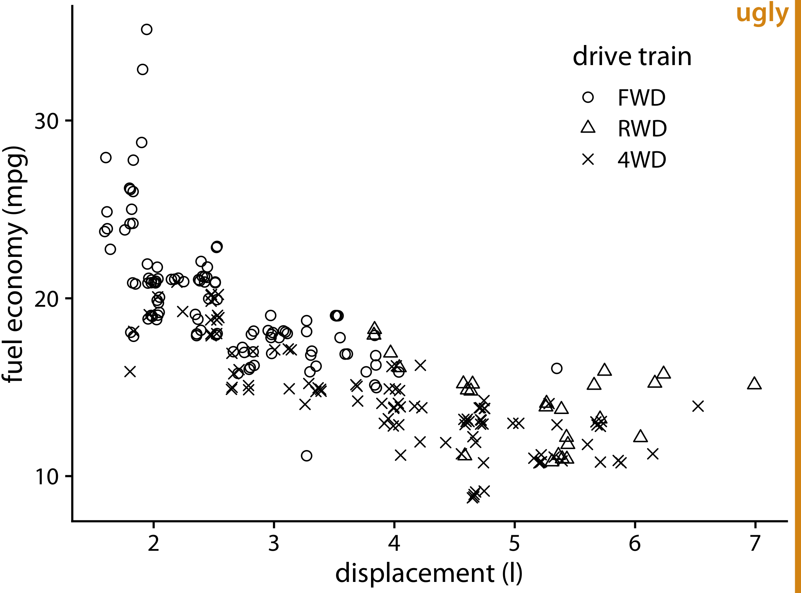
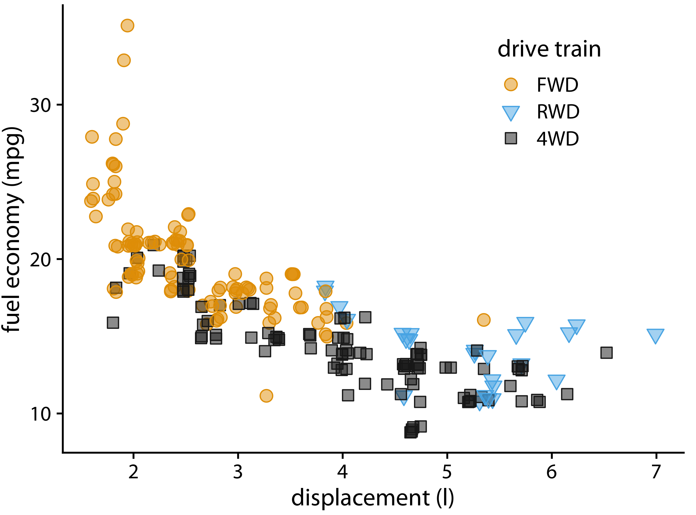
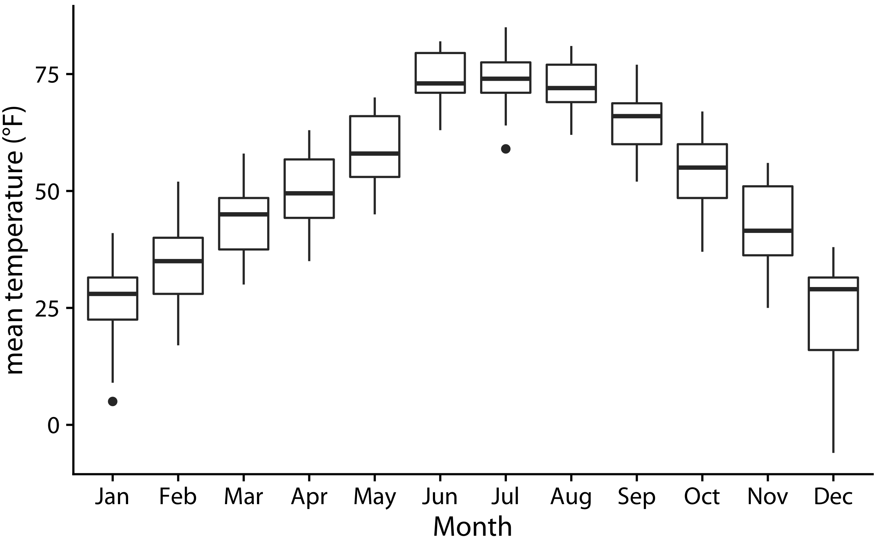
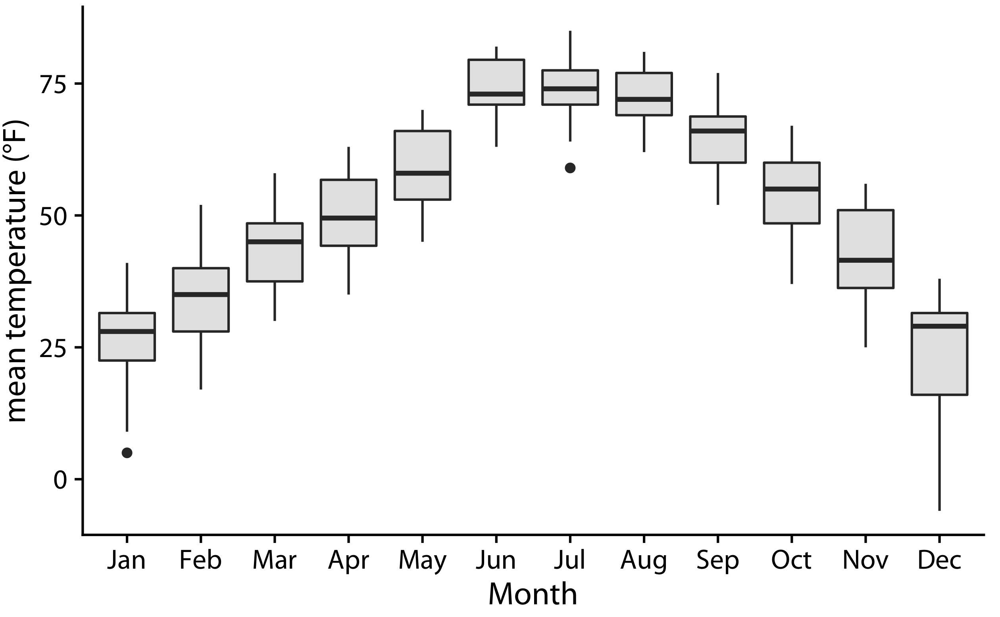

```
## Warning: package 'dplyr' was built under R version 3.5.2
```


# Avoid line drawings {#avoid-line-drawings}

Whenever possible, visualize your data with solid, colored shapes rather than with lines that outline those shapes. Solid shapes are more easily perceived as coherent objects, are less likely to create visual artifacts or optical illusions, and do more immediately convey amounts than do outlines. In my experience, visualizations using solid shapes are both clearer and more pleasant to look at than equivalent versions that use line drawings. Thus, I avoid line drawings as much as possible. However, I want to emphasize that this recommendation does not supersede the principle of proportional ink (Chapter \@ref(proportional-ink)).

Line drawings have a long history in the field of data visualization because throughout most of the 20th century, scientific visualizations were drawn by hand and had to be reproducible in black-and-white. This precluded the use of areas filled with solid colors, including solid gray-scale fills. Instead, filled areas were sometimes simulated by applying hatch, cross-hatch, or stipple patterns. Early plotting software imitated the hand-drawn simulations and similarly made extensive use of line drawings, dashed or dotted line patterns, and hatching. While modern visualization tools and modern reproduction and publishing platforms have none of the earlier limitations, many plotting applications still default to outlines and empty shapes rather than filled areas. To raise your awareness of this issue, here I'll show you several examples of the same figures drawn with both lines and filled shapes.

The most common and at the same time most inappropriate use of line drawings is seen in histograms and bar plots. The problem with bars drawn as outlines is that it is not immediately apparent which side of any given line is inside a bar and which side is outside. As a consequence, in particular when there are gaps between bars, we end up with a confusing visual pattern that detracts from the main message of the figure (Figure \@ref(fig:titanic-ages-lines)). Filling the bars with a light color, or with gray if color reproduction is not possible, avoids this problem (Figure \@ref(fig:titanic-ages-filled)).

(ref:titanic-ages-lines) Histogram of the ages of Titanic passengers, drawn with empty bars. The empty bars create a confusing visual pattern. In the center of the histogram, it is difficult to tell which parts are inside of bars and which parts are outside. 

<div class="figure" style="text-align: center">

<p class="caption">(\#fig:titanic-ages-lines)(ref:titanic-ages-lines)</p>
</div>

(ref:titanic-ages-filled) The same histogram of Figure \@ref(fig:titanic-ages-lines), now drawn with filled bars. The shape of the age distribution is much more easily discernible in this variation of the figure.

<div class="figure" style="text-align: center">

<p class="caption">(\#fig:titanic-ages-filled)(ref:titanic-ages-filled)</p>
</div>

Next, let's take a look at an old-school density plot. I'm showing density estimates for the sepal-length distributions of three species of iris, drawn entirely in black-and-white as a line drawing (Figure \@ref(fig:iris-densities-lines)). The distributions are shown just by their outlines, and because the figure is in black-and-white, we're using different line styles to distinguish them. This figure has two main problems. First, the dashed line styles do not provide a clear separation between the area under the curve and the area above it. While our visual system is quite good at connecting the individual line elements into a continuous line, the dashed lines nevertheless look porous and do not serve as a strong boundary of the enclosed area. Second, because the lines intersect and the areas they enclose are not shaded, it is difficult to segment the different densities from the six distinct shape outlines. This effect would have been even stronger had I used solid rather than dashed lines for all three distributions.

(ref:iris-densities-lines) Density estimates of the sepal lengths of three different iris species. The broken line styles used for versicolor and virginica detract from the perception that the areas under the curves are distinct from the areas above them.

<div class="figure" style="text-align: center">

<p class="caption">(\#fig:iris-densities-lines)(ref:iris-densities-lines)</p>
</div>

We can attempt to address the problem of porous boundaries by using colored lines rather than dashed lines (Figure \@ref(fig:iris-densities-colored-lines)). However, the density areas in the resulting plot still have little visual presence. Overall, I find the version with filled areas (Figure \@ref(fig:iris-densities-filled)) the most clear and intuitive. It is important, however, to make the filled areas partially transparent, so that the complete distribution for each species is visible.

(ref:iris-densities-colored-lines) Density estimates of the sepal lengths of three different iris species. By using solid, colored lines we have solved the problem of Figure \@ref(fig:iris-densities-lines) that the areas below and above the lines seem to be connected. However, we still don't have a strong sense of the size of the area under each curve.

<div class="figure" style="text-align: center">

<p class="caption">(\#fig:iris-densities-colored-lines)(ref:iris-densities-colored-lines)</p>
</div>


(ref:iris-densities-filled) Density estimates of the sepal lengths of three different iris species, shown as partially transparent shaded areas.

<div class="figure" style="text-align: center">

<p class="caption">(\#fig:iris-densities-filled)(ref:iris-densities-filled)</p>
</div>

Line drawings also arise in the context of scatter plots, when different point types are drawn as open circles, triangles, crosses, etc. As an example, consider Figure \@ref(fig:mpg-linespoints). The figure contains a lot of visual noise, and the different point types do not strongly separate from each other. Drawing the same figure with solidly colored shapes addresses this issue (Figure \@ref(fig:mpg-filledpoints)).

(ref:mpg-linespoints) City fuel economy versus engine displacement, for cars with front-wheel drive (FWD), rear-wheel drive (RWD), and all-wheel drive (4WD). The different point styles, all black-and-white line-drawn symbols, create substantial visual noise and make it difficult to read the figure.

<div class="figure" style="text-align: center">

<p class="caption">(\#fig:mpg-linespoints)(ref:mpg-linespoints)</p>
</div>


(ref:mpg-filledpoints) City fuel economy versus engine displacement. By using both different colors and different solid shapes for the different drive-train variants, this figure clearly separates the drive-train variants while remaining reproducible in gray scale if needed.

<div class="figure" style="text-align: center">

<p class="caption">(\#fig:mpg-filledpoints)(ref:mpg-filledpoints)</p>
</div>

I strongly prefer solid points over open points, because the solid points have much more visual presence. The argument that I sometimes hear in favor of open points is that they help with overplotting, since the empty areas in the middle of each point allow us to see other points that may be lying underneath. In my opinion, the benefit from being able to see overplotted points does not, in general, outweigh the detriment from the added visual noise of open symbols. There are other approaches for dealing with overplotting, see Chapter \@ref(overlapping-points) for some suggestions.

Finally, let's consider boxplots. Boxplots are commonly drawn with empty boxes, as in Figure \@ref(fig:lincoln-weather-box-empty). I prefer a light shading for the box, as in Figure \@ref(fig:lincoln-weather-box-filled). The shading separates the box more clearly from the plot background, and it helps in particular when we're showing many boxplots right next to each other, as is the case in Figures \@ref(fig:lincoln-weather-box-empty) and  \@ref(fig:lincoln-weather-box-filled). In Figure \@ref(fig:lincoln-weather-box-empty), the large number of boxes and lines can again create the illusion of background areas outside of boxes being actually on the inside of some other shape, just as we saw in Figure \@ref(fig:titanic-ages-lines). This problem is eliminated in Figure \@ref(fig:lincoln-weather-box-filled). I have sometimes heard the critique that shading the inside of the box gives too much weight to the center 50% of the data, but I don't buy that argument. It is inherent to the boxplot, shaded box or not, to give more weight to the center 50% of the data than to the rest. If you don't want this emphasis, then don't use a boxplot. Instead, use a violin plot, jittered points, or a sina plot (Chapter \@ref(boxplots-violins)).

(ref:lincoln-weather-box-empty) Distributions of daily mean temperatures in Lincoln, Nebraska, in 2016. Boxes are drawn in the traditional way, without shading.

<div class="figure" style="text-align: center">

<p class="caption">(\#fig:lincoln-weather-box-empty)(ref:lincoln-weather-box-empty)</p>
</div>


(ref:lincoln-weather-box-filled) Distributions of daily mean temperatures in Lincoln, Nebraska, in 2016. By giving the boxes a light gray shading, we can make them stand out better against the background.

<div class="figure" style="text-align: center">

<p class="caption">(\#fig:lincoln-weather-box-filled)(ref:lincoln-weather-box-filled)</p>
</div>
