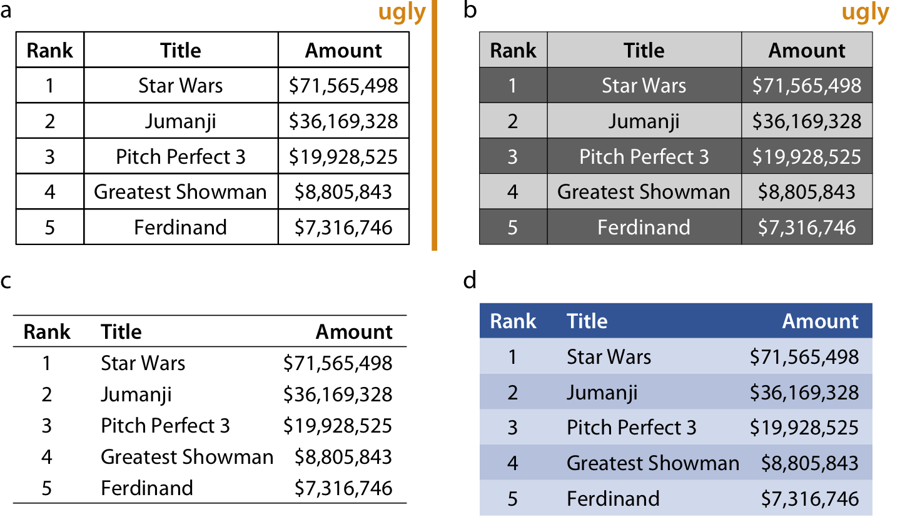

```
## Warning: package 'dplyr' was built under R version 3.5.2
```

# Titles, captions, and tables {#figure-titles-captions}

A data visualization is not a piece of art meant to be looked at only for its aesthetically pleasing features. Instead, its purpose is to convey information and make a point. To reliably achieve this goal when preparing visualizations, we have to place the data into context and provide accompanying titles, captions, and other annotations. In this chapter, I will discuss how to properly title and label figures. I will also discuss how to present data in table form.

## Figure titles and captions

One critical component of every figure is the figure title. Every figure needs the title. The job of the title is to accurately convey to the reader what the figure is about, what point it makes. However, the figure title may not necessarily appear where you were expecting to see it. Consider Figure \@ref(fig:corruption-development). It's title is "Corruption and human development: The most developed countries experience the least corruption." This title is not shown above the figure, however. Instead, the title is provided as the first part of the caption block, underneath the figure display. This is the style I am using throughout this book. I consistently show figures without integrated titles and with separate captions. (One exception are the stylized plot examples in Chapter \@ref(directory-of-visualizations), which instead have titles and no captions.)

(ref:corruption-development) Corruption and human development: The most developed countries experience the least corruption. This figure was inspired by a posting in @Economist-corruption. Data sources: Transparency International & UN Human Development Report

<div class="figure" style="text-align: center">

<p class="caption">(\#fig:corruption-development)(ref:corruption-development)</p>
</div>

Alternatively, I could incorporate the figure title---as well as other elements of the caption, such as the data source statement---into the main display (Figure \@ref(fig:corruption-development-infographic)). In a direct comparison, you may find Figure \@ref(fig:corruption-development-infographic) more attractive than Figure \@ref(fig:corruption-development), and you may wonder why I am choosing the latter style throughout this book. I do so because the two styles have different application areas, and figures with integrated titles are not appropriate for conventional book layouts. The underlying principle is that a figure can have only one title. Either the title is integrated into the actual figure display or it is provided as the first element of the caption underneath the figure. And, if a publication is laid out such that each figure has a regular caption block underneath the display item, then the title *must* be provided in that block of text. For this reason, in the context of conventional book or article publishing, we do not normally integrate titles into figures. Figures with integrated titles, subtitles, and data source statements are appropriate, however, if they are meant to be used as stand-alone infographics or to be posted on social media or on a web page without accompanying caption text.

(ref:corruption-development-infographic) Infographic version of Figure \@ref(fig:corruption-development). The title, subtitle, and data source statements have been incorporated into the figure. This figure could be posted on the web as is or otherwise used without separate caption block.

<div class="figure" style="text-align: center">

<p class="caption">(\#fig:corruption-development-infographic)(ref:corruption-development-infographic)</p>
</div>

<div class="rmdtip">
<p>If your document layout uses caption blocks underneath each figure, then place the figure titles as the first element of each caption block, not on top of the figures.</p>
</div>

One of the most common mistakes I see in figure captions is the omission of a proper figure title as the first element of the caption. Take a look back at the caption to Figure \@ref(fig:corruption-development). It begins with "Corruption and human development." It *does not* begin with "This figure shows how corruption is related to human development." The first part of the caption is always the title, not a description of the contents of the figure. A title does not have to be a complete sentence, though short sentences making a clear assertion can serve as titles. For example, for Figure \@ref(fig:corruption-development), a title such as "The most developed countries are the least corrupt" would have worked fine.

## Axis and legend titles

Just like every plot needs a title, axes and legends need titles as well. (Axis titles are often colloquially referred to as *axis labels*.) Axis and legend titles and labels explain what the displayed data values are and how they map to plot aesthetics.

To present an example of a plot where all axes and legends are appropriately labeled and titled, I have taken the blue jay dataset discussed at length in Chapter \@ref(visualizing-associations) and visualized it as a bubble plot (Figure \@ref(fig:blue-jays-scatter-bubbles2)). In this plot, the axis titles clearly indicate that the *x* axis shows body mass in grams and the *y* axis shows head length in milimeters. Similarly, the legend titles show that point coloring indicates the birds' sex and point size indicates the birds' skull size in milimeters. I emphasize that for all numerical variables (body mass, head length, and skull size) the relevant titles not only state the variables shown but also the units in which the variables are measured. This is good practice and should be done whenever possible. Categorical variables (such as sex) do not require units.

(ref:blue-jays-scatter-bubbles2) Head length versus body mass for 123 blue jays. The birds' sex is indicated by color, and the birds' skull size by symbol size. Head-length measurements include the length of the bill while skull-size measurements do not. Data source: Keith Tarvin, Oberlin College

<div class="figure" style="text-align: center">

<p class="caption">(\#fig:blue-jays-scatter-bubbles2)(ref:blue-jays-scatter-bubbles2)</p>
</div>

There are cases, however, when axis or legend titles can be omitted, namely when the labels themselves are fully explanatory. For example, a legend showing two differently colored dots labeled "female" and "male" clearly indicates that color encodes sex. The title "sex" is not required to clarify this fact, and indeed throughout this book I have often omitted the legend title for legends indicating sex or gender (see e.g. Figures \@ref(fig:titanic-passengers-by-class-sex), \@ref(fig:blue-jays-scatter-sex), or \@ref(fig:titanic-passenger-breakdown)). Similarly, country names will generally not require a title stating what they are (Figure \@ref(fig:Americas-life-expect)), nor will movie titles (Figure \@ref(fig:boxoffice-vertical)) or years (Figure \@ref(fig:tech-stocks-minimal-labeling)).

(ref:tech-stocks-minimal-labeling) Stock price over time for four major tech companies. The stock price for each company has been normalized to equal 100 in June 2012. This figure is a slightly modified version of Figure \@ref(fig:tech-stocks-good-legend) in Chapter \@ref(redundant-coding). Here, the *x* axis representing time does not have a title. It is clear from the context that the numbers 2013, 2014, etc. refer to years.

<div class="figure" style="text-align: center">

<p class="caption">(\#fig:tech-stocks-minimal-labeling)(ref:tech-stocks-minimal-labeling)</p>
</div>

However, we have to be careful when omitting axis or legend titles, because it is easy to misjudge what is and isn't obvious from the context. I frequently see graphs in the popular press that push omitting axis titles to a point that would make me uncomfortable. For example, some publications might produce a figure such as Figure \@ref(fig:tech-stocks-minimal-labeling-bad), assuming that the meaning of the axes is clear from the plot title and subtitle (here: "stock price over time for four major tech companies" and "the stock price for each company has been normalized to equal 100 in June 2012"). I disagree with the perspective that context clearly defines the axes. Because the caption typically doesn't include words such as "the *x*/*y* axis shows", some amount of guesswork is always required to interpret the figure. In my own experience, figures without properly labeled axes tend to leave me with a nagging feeling of uncertainty---even if I'm 95% certain I understand what is shown, I don't feel 100% certain. As a general principle, I think it is a bad practice to make your readers guess what you mean. Why would you want to create a feeling of uncertainty in your readers?

(ref:tech-stocks-minimal-labeling-bad) Stock price over time for four major tech companies. The stock price for each company has been normalized to equal 100 in June 2012. This variant of Figure \@ref(fig:tech-stocks-minimal-labeling) has been labeled as "bad" because the *y* axis now does not have a title either, and what the values shown along the *y* axis represent is not immediately obvious from the context.

<div class="figure" style="text-align: center">

<p class="caption">(\#fig:tech-stocks-minimal-labeling-bad)(ref:tech-stocks-minimal-labeling-bad)</p>
</div>

On the flip side, we can overdo the labeling. If the legend lists the names of four well-known companies, the legend title "company" is redundant and doesn't add anything useful (Figure \@ref(fig:tech-stocks-labeling-ugly)). Similarly, even though we generally should report units for all quantitative variables, if the *x* axis shows a few recent years titling it as "time (years AD)" is awkward (Figure \@ref(fig:tech-stocks-labeling-ugly)).

(ref:tech-stocks-labeling-ugly) Stock price over time for four major tech companies. The stock price for each company has been normalized to equal 100 in June 2012. This variant of Figure \@ref(fig:tech-stocks-minimal-labeling) has been labeled as "ugly" because it is labeled excessively. In particular, providing a unit ("years AD") for the values along the *x* axis is awkward.

<div class="figure" style="text-align: center">

<p class="caption">(\#fig:tech-stocks-labeling-ugly)(ref:tech-stocks-labeling-ugly)</p>
</div>

Finally, in some cases it is acceptable to omit not only the axis title but the entire axis.
Pie charts typically don't have explicit axes (e.g., Figure \@ref(fig:bundestag-pie)), and neither do treemaps (Figure \@ref(fig:bridges-treemap)). Mosaic plots or bar charts can be shown without one or both axes if the meaning of the plot is otherwise clear (Figures \@ref(fig:bridges-mosaic) and \@ref(fig:titanic-passengers-by-class-sex)). Omitting explicit axes with axis ticks and tick labels signals to the reader that the qualitative features of the graph are more important than the specific data values.

## Tables

Tables are an important tool for visualizing data. Yet because of their apparent simplicity, they may not always receive the attention they need. I have shown a handful of tables throughout this book, for example Tables \@ref(tab:boxoffice-gross), \@ref(tab:titanic-ages), and \@ref(tab:color-codes). Take a moment and locate these tables, look how they are formatted, and compare them to a table you or a colleague has recently made. In all likelihood, there are important differences. In my experience, absent proper training in table formatting, few people will instinctively make the right formatting choices. In self-published documents, poorly formatted tables are even more prevalent than poorly designed figures. Also, most software commonly used to create tables provides defaults that are not recommended. For example, my version of Microsoft Word provides 105 pre-defined table styles, and of these at least 70--80 violate some of the table rules I'm going to discuss here. So if you pick a Microsoft Word table layout at random, you have an 80% chance of picking one that has issues. And if you pick the default, you will end up with a poorly formatted table every time.

Some key rules for table layout are the following:

1. Do not use vertical lines.
2. Do not use horizontal lines between data rows. (Horizontal lines as separator between the title row and the first data row or as frame for the entire table are fine.) 
3. Text columns should be left aligned.
4. Number columns should be right aligned and should use the same number of decimal digits throughout.
5. Columns containing single characters are centered.
6. The header fields are aligned with their data, i.e., the heading for a text column will be left aligned and the heading for a number column will be right aligned. 

Figure \@ref(fig:table-examples) reproduces Table \@ref(tab:boxoffice-gross) from Chapter \@ref(visualizing-amounts) in four diferent ways, two of which (a, b) violate several of these rules and two of which (c, d) do not.

(ref:table-examples) Examples of poorly and appropriately formatted tables, using the data from Table \@ref(tab:boxoffice-gross) in Chapter \@ref(visualizing-amounts). (a) This table violates numerous conventions of proper table formatting, including using vertical lines, using horizontal lines between data rows, and using centered data columns. (b) This table suffers from all problems of Table (a), and in addition it creates additional visual noise by alternating between very dark and very light rows. Also, the table header is not strongly visually separated from the table body. (c) This is an appropriately formatted table with a minimal design. (d) Colors can be used effectively to group data into rows, but the color differences should be subtle. The table header can be set off by using a stronger color. Data source: Box Office Mojo (http://www.boxofficemojo.com/). Used with permission

<div class="figure" style="text-align: center">

<p class="caption">(\#fig:table-examples)(ref:table-examples)</p>
</div>

When authors draw tables with horizontal lines between data rows, the intent is usually to help the eye follow individual lines. However, unless the table is very wide and sparse, this visual aid is not normally needed. We don't draw horizontal lines between rows in a piece of regular text either. The cost of horizontal (or vertical) lines is visual clutter. Compare parts (a) and (c) of Figure \@ref(fig:table-examples). Part (c) is much easier to read than part (a). If we feel that a visual aid separating table rows is necessary, then alternating lighter and darker shading of rows tends to work well without creating much clutter (Figure \@ref(fig:table-examples)d).

Finally, there is a key distinction between figures and tables in where the caption is located relative to the display item. For figures, it is customary to place the caption underneath, whereas for tables it is customary to place it above. This caption placement is guided by the way in which readers process figures and tables. For figures, readers tend to first look at the graphical display and then read the caption for context, hence the caption makes sense below the figure. By contrast, tables tend to be processed like text, from top to bottom, and reading the table contents before reading the caption will frequently not be useful. Hence, captions are placed above the table.
