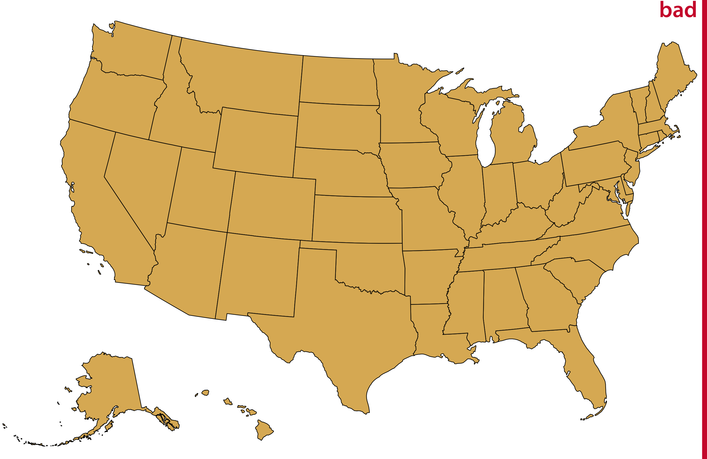

# Visualizing geospatial data {#geospatial-data}

Many datasets contain information linked to locations in the physical world. For example, in an ecological study, a dataset may list where specific plants or animals have been found. Similarly, in a socioeconomic or political context, a dataset may contain information about where people with specific attributes (such as income, age, or educational attainment) live, or where man-made objects (e.g., bridges, roads, buildings) have been constructed. In all these cases, it can be helpful to visualize the data in their proper geospatial context, i.e., to show the data on a realistic map or alternatively as a map-like diagram.

Maps tend to be intuitive to readers but they can be challenging to design. We need to think about concepts such as map projections and whether for our specific application the accurate representation of angles or areas is more critical. A common mapping technique, the *choropleth map,* consists of representing data values as differently colored spatial areas. Choropleth maps can at times be very useful and at other times highly misleading. As an alternative, we can construct map-like diagrams called *cartograms,* which may purposefully distort map areas or represent them in stylized form, for example as equal-sized squares.

## Projections

The earth is approximately a sphere (Figure \@ref(fig:world-orthographic)), and more precisely an oblate spheroid that is slightly flattened along its axis of rotation. The two locations where the axis of rotation intersects with the spheroid are called the *poles* (north pole and south pole). We separate the spheroid into two hemispheres, the northern and the southern hemisphere, by drawing a line equidistant to both poles around the spheroid. This line is called the *equator.* To uniquely specify a location on the earth, we need three pieces of information: where we are located along the direction of the equator (the longitude), how close we are to either pole when moving perpendicular to the equator (the latitude), and how far we are from the earth's center (the altitude). Longitude, latitude, and altitude are specified relative to a reference system called the *datum.* The datum specifies properties such as the shape and size of the earth, as well as the location of zero longitude, latitude, and altitude. One widely used datum is the World Geodetic System (WGS) 84, which is used by the Global Positioning System (GPS).

(ref:world-orthographic) Orthographic projection of the world, showing Europe and Northern Africa as they would be visible from space. The lines emanating from the north pole and runing south are called *meridians*, and the lines running orthogonal to the meridians are called *parallels.* All meridians have the same length but parallels become shorter the closer we are to either pole.

(\#fig:world-orthographic)(ref:world-orthographic)

While altitude is an important quantity in many geospatial applications, when visualizing geospatial data in the form of maps we are primarily concerned with the other two dimensions, longitude and latitude. Both longitude and latitude are angles, expressed in degrees. Degrees longitude measure how far east or west a location lies. Lines of equal longitude are referred to as *meridians*, and all meridians terminate at the two poles (Figure \@ref(fig:world-orthographic)). The prime meridian, corresponding to 0&deg; longitude, runs through the village of Greenwich in the United Kingdom. The meridian opposite to the prime meridian lies at 180&deg; longitude (also referred to as 180&deg;E), which is equivalent to -180&deg; longitude (also referred to as 180&deg;W), near the international date line. Degrees latitude measure how far north or south a location lies. The equator corresponds to 0&deg; latitude, the north pole corresponds to 90&deg; latitude (also referred to as 90&deg;N), and the south pole corresponds to -90&deg; latitude (also referred to as 90&deg;S). Lines of equal latitude are referred to as *parallels*, since they run parallel to the equator.  All meridians have the same length, corresponding to half of a great circle around the globe, whereas the length of parallels depends on their latitude (Figure \@ref(fig:world-orthographic)). The longest parallel is the equator, at 0&deg; latitude, and the shortest parallels lie at the north and south poles, 90&deg;N and 90&deg;S, and have length zero.

The challenge in map-making is that we need to take the spherical surface of the earth and flatten it out so we can display it on a map. This process, called *projection,* necessarily introduces distortions, because a curved surface cannot be projected exactly onto a flat surface. Specifically, the projection can preserve either angles or areas but not both. A projection that does the former is called *conformal* and a projection that does the latter is called *equal-area*. Other projections may preserve neither angles nor areas but instead preserve other quantities of interest, such as distances to some reference point or line. Finally, some projections attempt to strike a compromise between preserving angles and areas. These compromise projections are frequently used to display the entire world in an aesthetically pleasing manner, and they accept some amount of both angular and area distortion (Figure \@ref(fig:worldmap-four-projections)). To systematize and keep track of different ways of projecting parts or all of the earth for specific maps, various standards bodies and organizations, such as the EPSG (European Petroleum Survey Group) or the ESRI (Environmental Systems Research Institute), maintain registries of projections. For example, EPSG:4326 represents unprojected longitude and latitude values in the WGS 84 coordinate system used by GPS. Several websites provide convenient access to these registered projections, including http://spatialreference.org/ and https://epsg.io/.

One of the earliest map projections in use, the Mercator projection, was developed in the 16th century for nautical navigation. It is a conformal projection that accurately represents shapes but introduces severe area distortions near the poles (Figure \@ref(fig:world-mercator)). The Mercator projection maps the globe onto a cylinder and then unrolls the cylinder to arrive at a rectangular map. Meridians in this projection are evenly spaced vertical lines, whereas parallels are horizontal lines whose spacing increases the further we move away from the equator (Figure \@ref(fig:world-mercator)). The spacing between parallels increases in proportion to the extent to which they have to be stretched closer to the poles to keep meridians perfectly vertical.

(ref:world-mercator) Mercator projection of the world. In this projection, parallels are straight horizontal lines and meridians are straight vertical lines. It is a conformal projection preserving local angles, but it introduces severe distortions in areas near the poles. For example, Greenland appears to be bigger than Africa in this projection, when in reality Africa is fourteen times bigger than Greenland (see Figures \@ref(fig:world-orthographic) and \@ref(fig:world-goode)).

(\#fig:world-mercator)(ref:world-mercator)

Because of the severe area distortions it produces, the Mercator projection has fallen out of favor for maps of the entire world. However, variants of this projection continue to live on. For example, the transverse Mercator projection is routinely used for large-scale maps that show moderately small areas (spanning less than a few degrees in longitude) at large magnification. Another variant, the web Mercator projection, was introduced by Google for Google Maps and is used by several online mapping applications. 

A whole-world projection that is perfectly area-preserving is the Goode homolosine (Figure \@ref(fig:world-goode)). It is usually shown in its interrupted form, which has one cut in the northern hemisphere and three cuts in the southern hemisphere, carefully chosen so they don't interrupt major land masses (Figure \@ref(fig:world-goode)). The cuts allow the projection to both preserve areas and approximately preserve angles, at the cost of non-contiguous oceans, a cut through the middle of Greenland, and several cuts through Antarctica. While the interrupted Goode homolosine has an unusual aesthetic and a strange name, it is a good choice for mapping applications that require accurate reproduction of areas on a global scale.

(ref:world-goode) Interrupted Goode homolosine projection of the world. This projection accurately preserves areas while minimizing angular distortions, at the cost of showing oceans and some land masses (Greenland, Antarctica) in a non-contiguous way.

(\#fig:world-goode)(ref:world-goode)

Shape or area distortions due to map projections are particularly prominent when we're attempting to make a map of the whole world, but they can cause trouble even at the scale of individual continents or countries. As an example, consider the United States, which consist of the "lower 48" (which are 48 contiguous states), Alaska, and Hawaii (Figure \@ref(fig:usa-orthographic)). While the lower 48 alone are reasonably easy to project onto a map, Alaska and Hawaii are so distant from the lower 48 that projecting all 50 states onto one map becomes awkward.

(ref:usa-orthographic) Relative locations of Alaska, Hawaii, and the lower 48 states shown on a globe.

(\#fig:usa-orthographic)(ref:usa-orthographic)

Figure \@ref(fig:usa-true-albers) shows a map of all 50 states, made using an equal-area Albers projection. This projection provides a reasonable representation of the relative shapes, areas, and locations of the 50 states, but we notice some issues. First, Alaska seems weirdly stretched out compared to how it looks, for example, in Figures \@ref(fig:world-mercator) or \@ref(fig:usa-orthographic). Second, the map is dominated by ocean/empty space. It would be preferable if we could zoom in further, so that the lower 48 states take up a larger proportion of the map area.

(ref:usa-true-albers) Map of the United States of America, using an area-preserving Albers projection (ESRI:102003, commonly used to project the lower 48 states). Alaska and Hawaii are shown in their true locations.

(\#fig:usa-true-albers)(ref:usa-true-albers)

To address the problem of uninteresting empty space, it is common practice to project Alaska and Hawaii separately (to minimize shape distortions) and then move them so they are shown underneath the lower 48 (Figure \@ref(fig:usa-albers)). You may notice in Figure \@ref(fig:usa-albers) that Alaska looks much smaller relative to the lower 48 than it does in Figure \@ref(fig:usa-true-albers). The reason for this discrepancy is that Alaska has not only been moved, it also has been scaled so it looks comparable in size to typical midwestern or western states. This scaling, while common practice, is highly misleading, and therefore I have labeled the figure as "bad."

(ref:usa-albers) Visualization of the United States, with the states of Alaska and Hawaii moved to lie underneath the lower 48 states. Alaska also has been scaled so its linear extent is only 35% of the state's true size. (In other words, the state's area has been reduced to approximately 12% of its true size.) Such a scaling is frequently applied to Alaska, to make it visually appear to be of similar size as typical midwestern or western states. However, the scaling is highly misleading, and therefore the figure has been labeled as "bad".

(\#fig:usa-albers)(ref:usa-albers)

Instead of both moving and scaling Alaska, we could just move it without changing its scale (Figure \@ref(fig:usa-albers-revised)). This visualization clearly shows that Alaska is the largest state, over twice the size of Texas. We are not used to seeing the U.S. shown in this way, but in my mind it is a much more reasonable representation of the 50 states than is Figure \@ref(fig:usa-albers).

(ref:usa-albers-revised) Visualization of the United States, with the states of Alaska and Hawaii moved to lie underneath the lower 48 states.

(\#fig:usa-albers-revised)(ref:usa-albers-revised)

## Layers

To visualize geospatial data in the proper context, we usually create maps consisting of multiple layers showing different types of information. To demonstrate this concept, I will visualize the locations of wind turbines in the San Francisco Bay area. In the Bay Area, wind turbines are clustered in two locations. One location, which I will refer to as the Shiloh Wind Farm, lies near Rio Vista and the other lies east of Hayward near Tracy (Figure \@ref(fig:sfbay-overview)).

(ref:sfbay-overview) Wind turbines in the San Francisco Bay Area. Individual wind turbines are shown as purple-colored dots. Two regions with a high concentration of wind turbines are highlighted with black rectangles. I refer to the wind turbines near Rio Vista collectively as the Shiloh Wind Farm. Map tiles by Stamen Design, under CC BY 3.0. Map data by OpenStreetMap, under ODbL. Wind turbine data: United States Wind Turbine Database

(\#fig:sfbay-overview)(ref:sfbay-overview)

Figure \@ref(fig:sfbay-overview) consists of four separate layers. At the bottom, we have the terrain layer, which shows hills, valleys, and water. The next layer shows the road network. On top of the road layer, I have placed a layer indicating the location of individual wind turbines. This layer also contains the two rectangles highlighting the majority of the wind turbines. Finally, the top layer adds the locations and names of cities. These four layers are shown separately in Figure \@ref(fig:sfbay-layers). For any given map we want to make, we may want to add or remove some of these layers. For example, if we wanted to draw a map of voting districts, we might consider terrain information to be irrelevant and distracting. Alternatively, if we wanted to draw a map of exposed or covered roof areas to assess potential for solar power generation, we might want to replace terrain information with satellite imagery that shows individual roofs and actual vegetation. You can interactively try these different types of layers in most online map applications, such as Google Maps. I would like to emphasize that regardless of which layers we decide to keep or remove, it is generally recommended to add a scale bar and a north arrow. The scale bar helps readers understand the size of the spatial features shown in the map, while the north arrow clarifies the map's orientation.

(ref:sfbay-layers) The individual layers of Figure \@ref(fig:sfbay-overview). From bottom to top, the figure consists of a terrain layer, a roads layer, a layer showning the wind turbines, and a layer labeling cities and adding a scale bar and north arrow. Map tiles by Stamen Design, under CC BY 3.0. Map data by OpenStreetMap, under ODbL. Wind turbine data source: United States Wind Turbine Database

(\#fig:sfbay-layers)(ref:sfbay-layers) 

All the concepts discussed in Chapter \@ref(aesthetic-mapping) of mapping data onto aesthetics carry over to maps. We can place data points into their geographic context and show other data dimensions via aesthetics such as color or shape. For example, Figure \@ref(fig:shiloh-map) provides a zoomed-in view of the rectangle labeled "Shiloh Wind Farm" in Figure \@ref(fig:sfbay-overview). Individual wind turbines are shown as dots, with the color of the dots representing when a specific turbine was built and the shape representing the project to which the wind turbine belongs. A map such as this one can provide a quick overview of how an area was developed. E.g., here we see that EDF Renewables is a relatively small project built before 2000, High Winds is a moderately sized project build between 2000 and 2004, and Shiloh and Solano are the largest two projects in the area, both built over an extended period of time.

(ref:shiloh-map) Location of individual wind turbines in the Shiloh Wind Farm. Each dot highlights the location of one wind turbine. The map area corresponds to the rectangle in Figure \@ref(fig:sfbay-overview). Dots are colored by when the wind turbine was built, and the shape of the dots represents the various projects to which the individual wind turbines belong. Map tiles by Stamen Design, under CC BY 3.0. Map data by OpenStreetMap, under ODbL. Wind turbine data source: United States Wind Turbine Database

(\#fig:shiloh-map)(ref:shiloh-map)

## Choropleth mapping {#choropleth-mapping}

We frequently want to show how some quantity varies across locations. We can do so by coloring individual regions in a map according to the data dimension we want to display. Such maps are called *choropleth maps.*

As a simple example, consider the population density (persons per square kilometer) across the United States. We take the population number for each county in the U.S., divide it by the county's surface area, and then draw a map where the color of each county corresponds to the ratio between population number and area (Figure \@ref(fig:population-density-counties)). We can see how the the major cities on the east and the west coast are the most populated areas of the U.S., the great plains and western states have low population densities, and the state of Alaska is the least populated of all.

(ref:population-density-counties) Population density in every U.S. county, shown as a choropleth map. Population density is reported as persons per square kilometer. Data source: 2015 Five-Year American Community Survey

(\#fig:population-density-counties)(ref:population-density-counties)

Figure \@ref(fig:population-density-counties) uses light colors to represent low population densities and dark colors to represent high densities, so that high-density metropolitan areas stand out as dark colors on a background of light colors. We tend to associate darker colors with higher intensities when the background color of the figure is light. However, we can also pick a color scale where high values light up on a dark background (Figure \@ref(fig:population-density-counties2)). As longs as the lighter colors fall into the red-yellow spectrum, so that they appear to be glowing, they can be perceived as representing higher intensities. As a general principle, when figures are meant to be printed on white paper then light-colored background areas (as in Figure \@ref(fig:population-density-counties)) will typically work better. For online viewing or on a dark background, dark-colored background areas (as in Figure \@ref(fig:population-density-counties2)) may be preferable.

(ref:population-density-counties2) Population density in every U.S. county, shown as a choropleth map. This map is identical to Figure \@ref(fig:population-density-counties) except that now the color scale uses light colors for high population densities and dark colors for low population densities. Data source: 2015 Five-Year American Community Survey

(\#fig:population-density-counties2)(ref:population-density-counties2)

(ref:median-income-counties) Median income in every U.S. county, shown as a choropleth map. Data source: 2015 Five-Year American Community Survey

Choropleths work best when the coloring represents a density (i.e., some quantity divided by surface area, as in Figures \@ref(fig:population-density-counties) and \@ref(fig:population-density-counties2)). We perceive larger areas as corresponding to larger amounts than smaller areas (see also the chapter on proportional ink, Chapter \@ref(proportional-ink)), and shading by density corrects for this effect. However, in practice, we often see choropleths colored according to some quantity that is not a density. For example, in Figure \@ref(fig:map-Texas-income) I showed a choropleth of median annual income in Texas counties. Such choropleth maps can be appropriate when they are prepared with caution. There are two conditions under which we can color-map quantities that are not densities: First, if all the individual areas we color have approximately the same size and shape, then we don't have to worry about some areas drawing disproportionate attention solely due to their size. Second, if the individual areas we color are relatively small compared to the overall size of the map and if the quantity that color represents changes on a scale larger than the individual colored areas, then again we don't have to worry about some areas drawing disproportionate attention solely due to their size. Both of these conditions are approximately met in Figure \@ref(fig:map-Texas-income).

It is also important to consider the effect of continuous versus discrete color scales in choropleth mapping. While continuous color scales tend to look visually appealing (e.g., Figures \@ref(fig:population-density-counties) and \@ref(fig:population-density-counties2)), they can be difficult to read. We are not very good at recognizing a specific color value and matching it against a continuous scale. Therefore, it is often appropriate to bin the data values into discrete groups that are represented with distinct colors. On the order of four to six bins is a good choice. The binning sacrifices some information, but on the flip side the binned colors can be uniquely recognized. As an example, Figure \@ref(fig:median-income-counties-binned) expands the map of median income in Texas counties (Figure \@ref(fig:map-Texas-income)) to all counties in the U.S., and it uses a color scale consisting of five distinct income bins. 

(ref:median-income-counties-binned) Median income in every U.S. county, shown as a choropleth map. The median income values have been binned into five distinct groups, because binned color scales are generally easier to read than continuous color scales. Data source: 2015 Five-Year American Community Survey

(\#fig:median-income-counties-binned)(ref:median-income-counties-binned)

Even though counties are not quite as equal-sized and even-shaped across the entire U.S. as they are just within Texas, I think Figure \@ref(fig:median-income-counties-binned) still works as a choropleth map. No individidual county overly dominates the map. However, things look different when we draw a comparable map at the state level (Figure \@ref(fig:median-income-states)). Then Alaska dominates the choropleth and, because of its size, suggests that median incomes above \$70,000 are common. Yet Alaska is very sparsely populated (see Figures \@ref(fig:population-density-counties) and \@ref(fig:population-density-counties2)), and thus the income levels in Alaska apply only to a small portion of the U.S. population. The vast majority of U.S. counties, which are nearly all more populous than counties in Alaska, have a median income of below \$60,000.

(ref:median-income-states) Median income in every U.S. state, shown as a choropleth map. This map is visually dominated by the state of Alaska, which has a high median income but very low population density. At the same time, the densely populated high-income states on the East Coast do not appear very prominent on this map. In aggregate, this map provides a poor visualization of the income distribution in the U.S., and therefore I have labeled it as "bad." Data source: 2015 Five-Year American Community Survey

(\#fig:median-income-states)(ref:median-income-states)

## Cartograms

Not every map-like visualization has to be geographically accurate to be useful. For example, the problem with Figure \@ref(fig:median-income-states) is that some states take up a comparatively large area but are sparsely populated while others take up a small area yet have a large number of inhabitants. What if we deformed the states so their size was proportional to their number of inhabitants? Such a modified map is called a *cartogram*, and Figure \@ref(fig:median-income-cartogram) shows what it can look like for the median income dataset. We can still recognize individual states, yet we also see how the adjustment for population numbers has introduced important modifications. The east coast states, Florida, and California have grown a lot in size, whereas the other western states and Alaska have collapsed.

(ref:median-income-cartogram) Median income in every U.S. state, shown as a cartogram. The shapes of individual states have been modified such that their area is proportional to their number of inhabitants. Data source: 2015 Five-Year American Community Survey

(\#fig:median-income-cartogram)(ref:median-income-cartogram)

As an alternative to a cartogram with distorted shapes, we can also draw a much simpler *cartogram heatmap,* where each state is represented by a colored square (Figure \@ref(fig:median-income-statebins)). While this representation does not correct for the population number in each state, and thus underrepresents more populous states and overrepresents less populous states, at least it treats all states equally and doesn't weigh them arbitrarily by their shape or size.

(ref:median-income-statebins) Median income in every U.S. state, shown as a cartogram heatmap. Each state is represented by an equally sized square, and the squares are arranged according to the approximate position of each state relative to the other states. This representation gives the same visual weight to each state. Data source: 2015 Five-Year American Community Survey

(\#fig:median-income-statebins)(ref:median-income-statebins)

Finally, we can draw more complex cartograms by placing individual plots at the location of each state. For example, if we want to visualize the evolution of the unemployment rate over time for each state, it can help to draw an individual graph for each state and then arrange the graphs based on the approximate relative position of the states to each other (Figure \@ref(fig:unemployment-geofacet)). For somebody who is familiar with the geography of the United States, this arrangement may make it easier to find the graphs for specific states than arranging them, for example, in alphabetical order. Furthermore, one would expect neighboring states to display similar patterns, and Figure \@ref(fig:unemployment-geofacet) shows that this is indeed the case. 

(ref:unemployment-geofacet) Unemployment rate leading up to and following the 2008 financial crisis, by state. Each panel shows the unemployment rate for one state, including the District of Columbia (DC), from January 2007 through May 2013. Vertical grid lines mark January of 2008, 2010, and 2012. States that are geographically close tend to show similar trends in the unemployment rate. Data source: U.S. Bureau of Labor Statistics

(\#fig:unemployment-geofacet)(ref:unemployment-geofacet)

