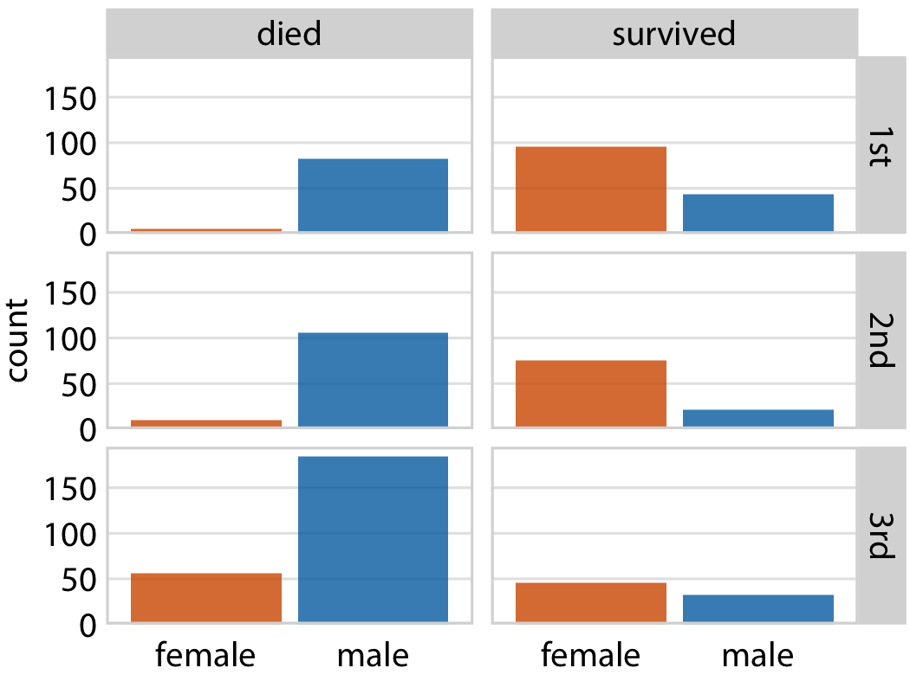
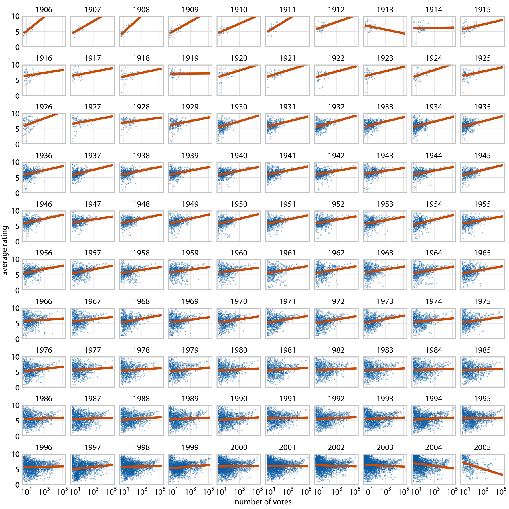
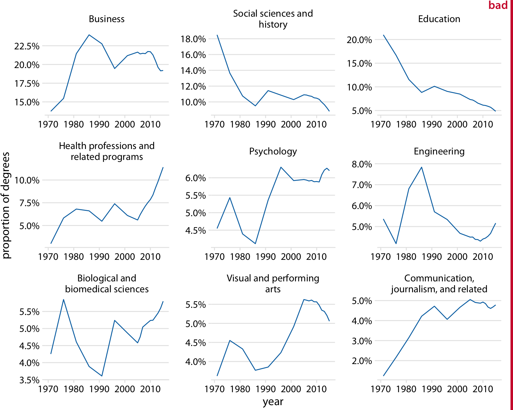
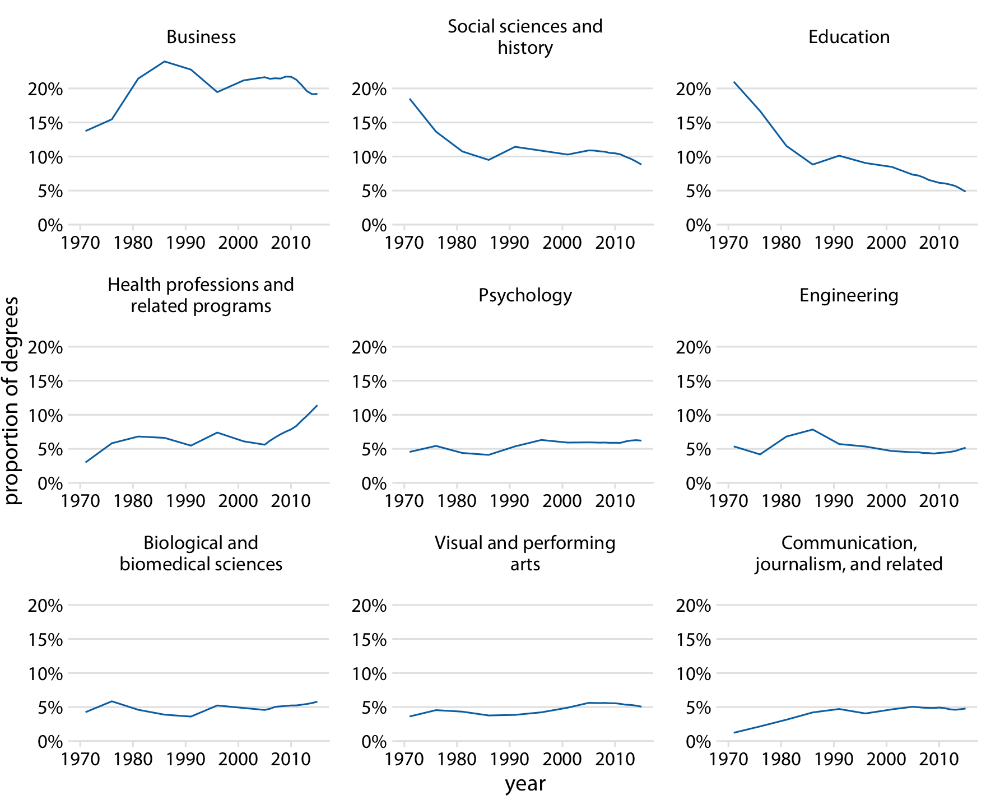
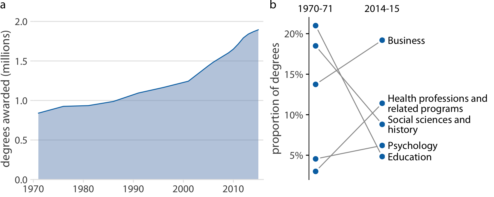
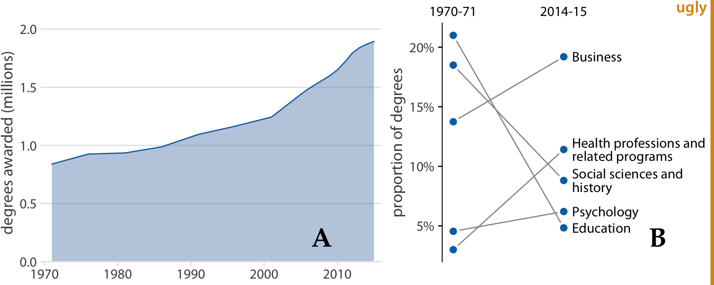
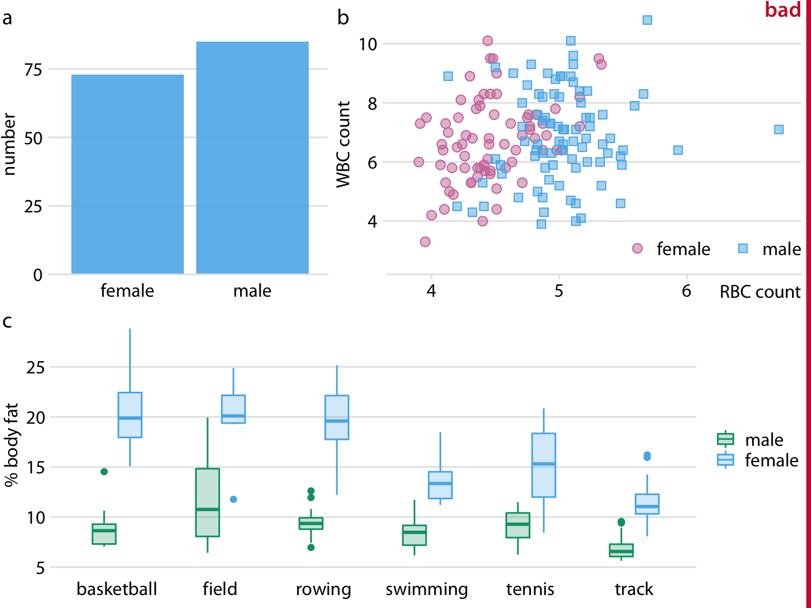
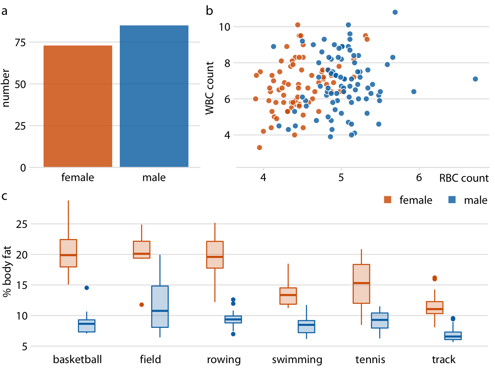
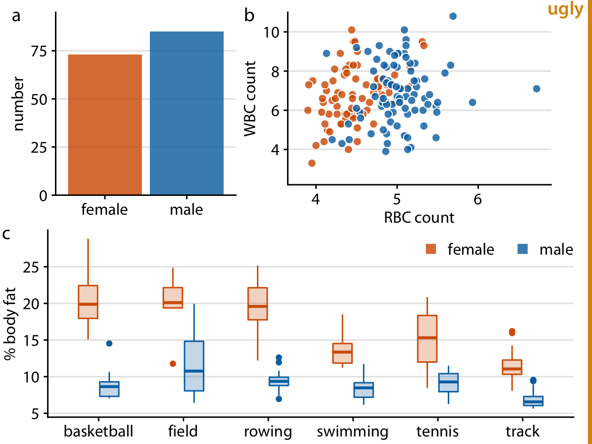

# Multi-panel figures {#multi-panel-figures}

When datasets become large and complex, they often contain much more information than can reasonably be shown in a single figure panel. To visualize such datasets, it can be helpful to create multi-panel figures. These are figures that consist of multiple figure panels where each one shows some subset of the data. There are two distinct categories of such figures: 1. Small multiples are plots consisting of multiple panels arranged in a regular grid. Each panel shows a different subset of the data but all panels use the same type of visualization. 2. Compound figures consist of separate figure panels assembled in an arbitrary arrangement (which may or may not be grid based) and showing entirely different visualizations, or possibly even different datasets. 

We have encountered both types of multi-panel figures in many places throughout this book. In general, these figures are intuitive and straightforward to interpret. However, when preparing such figures, there are a few issues we need to pay attention to, such as appropriate axis scaling, alignment, and consistency between separate panels.

## Small multiples

The term "small multiple" was popularized by @TufteEnvisioning. An alternative term, "trellis plot", was popularized around the same time by Cleveland, Becker, and colleagues at Bell Labs [@Cleveland1993; @Becker-Cleveland-Shyu-1996]. Regardless of terminology, the key idea is to slice the data into parts according to one or more data dimensions, visualize each data slice separately, and then arrange the individual visualizations into a grid. Columns, rows, or individual panels in the grid are labeled by the values of the data dimensions that define the data slices. More recently, this technique is also sometimes referred to as "faceting", named after the methods that create such plots in the widely used ggplot2 plot library (e.g., `facet_grid()`, see @Wickham2016).

As a first example, we will apply this technique to the dataset of Titanic passengers. We can subdivide this dataset by the class in which each passenger travelled and by whether a passenger survived or not. Within each of these six slices of data, there are both male and female passengers, and we can visualize their numbers using bars. The result is six bar plots, which we arrange in two columns (one for passengers who died and one for those who survived) of three rows (one for each class) (Figure \@ref(fig:titanic-passenger-breakdown)). The columns and rows are labeled, so it is immediately clear which of the six plots corresponds to which combination of survival status and class.

(ref:titanic-passenger-breakdown) Breakdown of passengers on the Titanic by gender, survival, and class in which they traveled (1st, 2nd, or 3rd).

(\#fig:titanic-passenger-breakdown)(ref:titanic-passenger-breakdown)

This visualization provides an intuitive and highly interpretable visualization of the fate of the Titanic passengers. We see clearly that most men died and most women survived. Further, and among the women who died nearly all were traveling in 3rd class.

Small multiples are a powerful tool to visualize very large amounts of data at once. Figure \@ref(fig:titanic-passenger-breakdown) uses six separate panels, but we can use many more. Figure \@ref(fig:movie-rankings) shows the relationship between the average ranking of a movie on the Internet Movie Database (IMDB) and the number of votes the movie has received, separately for movies released over a 100 year time period. Here, the dataset is sliced by only one dimension, the year, and panels for each year are arranged in rows from top left to bottom right. This visualization shows that there is an overall relationship between average ranking and number of votes, such that movies with more votes tend to have higher rankings. However, the strength of this trend varies with year, and for movies released in the early 2000s there is no relationship or even a negative one.

(ref:movie-rankings) Average movie rankings versus number of votes, for movies from 1906 to 2005. Dots represent individual movies, and lines represent the linear regression of the average ranking of each movie versus the logarithm of the number of votes the movie has received. In most years, movies with a higher number of votes have, on average, a higher average ranking. However, this trend has weakend towards the end of the 20th century, and a negative relationship can be seen for movies released in the early 2000s. Data Source: Internet Movie Database (IMDB, http://imdb.com/)

(\#fig:movie-rankings)(ref:movie-rankings)

For such large plots to be easily understandable, it is important that each panel uses the same axis ranges and scalings. The human mind expects this to be the case. When it is not, there is a good chance that a reader will mis-interpret what the figure shows. For example, consider Figure \@ref(fig:BA-degrees-variable-y-lims), which presents how the proportion of Bachelor's degrees in different degree areas has changed over time. The figure shows the nine degree areas that have represented, on average, more than 4% of all degrees between 1971 to 2015. The *y* axis of panel is scaled such that the curve for each degree field covers the entire *y*-axis range. As a consequence, a cursory examination of Figure \@ref(fig:BA-degrees-variable-y-lims) suggests that the nine degree areas are all equally popular and have all experienced variation in popularity of a similar magnitude.

(ref:BA-degrees-variable-y-lims) Trends in Bachelor's degrees conferred by U.S. institutions of higher learning. Shown are all degree areas that represent, on average, more than 4% of all degrees. This figure is labeled as "bad" because all panels use different *y*-axis ranges. This choice obscures the relative sizes of the different degree areas and it over-exagerates the changes that have happened in some of the degree areas. Data Source: National Center for Education Statistics

(\#fig:BA-degrees-variable-y-lims)(ref:BA-degrees-variable-y-lims)

Placing all panels onto the same *y* axis reveals, however, that this interpretation is highly misleading (Figure \@ref(fig:BA-degrees-fixed-y-lims)). Some degree areas are much more popular than others, and similarly some areas have grown or shrunk much more than others. For example, education has declined a lot, whereas visual and performing arts have remained approximately constant or maybe seen a small increase.

(ref:BA-degrees-fixed-y-lims) Trends in Bachelor's degrees conferred by U.S. institutions of higher learning. Shown are all degree areas that represent, on average, more than 4% of all degrees. Data Source: National Center for Education Statistics

(\#fig:BA-degrees-fixed-y-lims)(ref:BA-degrees-fixed-y-lims)

I generally recommend against using different axis scalings in separate panels of a small multiples plot. However, on occasion, this problem truly cannot be avoided. If you encounter such a scenario, then I think at a minimum you need to draw the reader's attention to this issue in the figure caption. For example, you could add a sentence such as: "Notice that the *y*-axis scalings differ among the different panels of this figure."

It is also important to think about the ordering of the individual panels in a small multiples plot. The plot will be easier to interpret if the ordering follows some logical principle. In Figure \@ref(fig:titanic-passenger-breakdown), I arranged the rows from the highest class (1st class) to the lowest class (3rd class). In Figure \@ref(fig:movie-rankings), I arranged the panels by increasing years from the top left to the bottom right. In Figure \@ref(fig:BA-degrees-fixed-y-lims), I arranged the panels by decreasing average degree popularity, such that the most popular degrees are in the top row and/or to the left and the least popular degrees are in the bottom row and/or to the right.

Always arrange the panels in a small multiples plot in a meaningful and logical order.

## Compound figures {#compound-figures}

Not every figure with multiple panels fits the pattern of small multiples. Sometimes we simply want to combine several independent panels into a combined figure that conveys one overarching point. In this case, we can take the indivdiual plots and arrange them in rows, columns, or other, more complex arrangements, and call the entire arrangement one figure. For an example, see Figure \@ref(fig:BA-degrees-compound), which continues the analysis of trends in Bachelor's degrees converred by U.S. institutions of higher learning. Panel (a) of Figure \@ref(fig:BA-degrees-compound) shows the growth in total number of degrees awarded from 1971 to 2015, a time span during which the number of degrees awarded approximately doubled. Panel (b) instead shows the change in the percent of degrees awarded over the same time period in the five most popular degree areas. We can see that social sciences, history, and education have experienced massive declines from 1971 to 2015, whereas business and health professions have seen substantial growth.

Notice how unlike in my small multiples examples, the individual panels of the compound figure are labeled alphabetically. It is conventional to use lower or upper case letters from the Latin alphabet. The labeling is needed to uniquely specify a particular panel. For example, when I want to talk about the part of Figure \@ref(fig:BA-degrees-compound) showing the changes in percent of degrees awarded, I can refer to panel (b) of that figure or simply to Figure \@ref(fig:BA-degrees-compound)b. Without labeling, I would have to awkwardly talk about the "right panel" or the "left panel" of Figure \@ref(fig:BA-degrees-compound), and referring to specific panels would be even more awkward for more complex panel arrangements. Labeling is not needed and not normally done for small multiples because there each panel is uniquely specified by the faceting variable(s) that are provided as figure labels.

(ref:BA-degrees-compound) Trends in Bachelor's Degrees conferred by U.S. institutions of higher learning. (a) From 1970 to 2015, the total number of degrees nearly doubled. (b) Among the most popular degree areas, social sciences, history, and education experienced a major decline, while business and health professions grew. Data Source: National Center for Education Statistics

(\#fig:BA-degrees-compound)(ref:BA-degrees-compound)

When labeling the different panels of a compound figure, pay attention to how the labels fit into the overall figure design. I often see figures where the labels look like they were slapped onto the figure after the fact by a different person. It's not uncommon to see labels made overly large and prominent, placed in an awkward location, or typeset in a different font than the rest of the figure. (See Figure \@ref(fig:BA-degrees-compound-bad) for an example.) The labels should not be the first thing you see when you look at a compound figure. In fact, they don't need to stand out at all. We generally know which figure panel has which label, since the  convention is to start in the top-left corner with "a" and label consecutively left to right and top to bottom. I think of these labels as equivalent to page numbers. You don't normally read the page numbers, and there is no surprise in which page has which number, but on occasion it can be helpful to use page numbers to refer to a particular place in a book or article.

(ref:BA-degrees-compound-bad) Variation of Figure \@ref(fig:BA-degrees-compound) with poor labeling. The labels are too large and thick, they are in the wrong font, and they are placed in an awkward location. Also, while labeling with capital letters is fine and is in fact quite common, labeling needs to be consistent across all figures in a document. In this book, the convention is that multi-panel figures use lower lower-case labels, and thus this figure is inconsistent with the other figures in this book.

(\#fig:BA-degrees-compound-bad)(ref:BA-degrees-compound-bad)

We also need to pay attention to how the individual panels of a compound figure fit together. It is possible to make a set of figure panels that individually are fine but jointly don't work. In particular, we need to employ a consistent visual language. By "visual language," I mean the colors, symbols, fonts, and so on that we use to display the data. And keeping the language consistent means, in a nutshell, that the same things look the same or at least substantively similar across figures.

Let's look at an example that violates this principle. Figure \@ref(fig:athletes-composite-inconsistent) is a three-panel figure visualizing a dataset about the physiology and body-composition of male and female athletes. Panel (a) shows the number of men and women in the dataset, panel (b) shows the counts of red and white blood cells for men and women, and panel (c) shows the body fat percentage of men and women, broken down by sport. Each panel individually is an acceptable figure. However, in combination the three panels do not work, because they don't share a common visual language. First, panel (a) uses the same blue color for both male and female athletes, panel (b) uses it only for male athletes, and panel (c) uses it for female athletes. Moreover, panels (b) and (c) introduce additional colors, but these colors differ between the two panels. It would have been better to use the same two colors consistently for male and female athletes, and to apply the same coloring scheme to panel (a) as well. Second, in panels (a) and (b) women are on the left and men on the right, but in panel (c) the order is reversed. The order of the boxplots in panel (c) should be switched so it matches panels (a) and (b).

(ref:athletes-composite-inconsistent) Physiology and body-composition of male and female athletes. (a) The data set encompasses 73 female and 85 male professional athletes. (b) Male athletes tend to have higher red blood cell (RBC, reported in units of $10^{12}$ per liter) counts than female athletes, but there are no such differences for white blood cell counts (WBC, reported in units of $10^{9}$ per liter). (c) Male athletes tend to have a lower body fat percentage than female athletes performing in the same sport. Data source: @Telford-Cunningham-1991

(\#fig:athletes-composite-inconsistent)(ref:athletes-composite-inconsistent)

Figure \@ref(fig:athletes-composite-good) fixes all these issues. In this figure, female athletes are consistently shown in orange and to the left of male athletes, who are shown in blue. Notice how much easier it is to read this figure than Figure \@ref(fig:athletes-composite-inconsistent). When we use a consistent visual language, it doesn't take much mental effort to determine which visual elements in the different panels represent women and which men. Figure \@ref(fig:athletes-composite-inconsistent), on the other hand, can be quite confusing. In particular, on first glance it may generate the impression that men tend to have higher body fat percentages than women. Notice also that we need only a single legend in Figure \@ref(fig:athletes-composite-good) but needed two in Figure \@ref(fig:athletes-composite-inconsistent). Since the visual language is consistent, the same legend works for panels (b) and (c).

(ref:athletes-composite-good) Physiology and body-composition of male and female athletes. This figure shows the exact same data as Figure \@ref(fig:athletes-composite-inconsistent), but now using a consistent visual language. Data for female athletes is always shown to the left of the corresponding data for male athletes, and genders are consistently color-coded throughout all elements of the figure. Data source: @Telford-Cunningham-1991

(\#fig:athletes-composite-good)(ref:athletes-composite-good)

Finally, we need to pay attention to the alignment of individual figure panels in a compound figure. The axes and other graphical elements of the individual panels should all be aligned to each other. Getting the alignment right can be quite tricky, in particular if individual panels are prepared separately, possibly by different people and/or in different programs, and then pasted together in an image manipulation program. To draw your attention to such alignment issues, Figure \@ref(fig:athletes-composite-misaligned) shows a variation of Figure \@ref(fig:athletes-composite-good) where now all figure elements are slightly out of alignment. I have added axis lines to all panels of Figure \@ref(fig:athletes-composite-misaligned) to emphasize these alignment problems. Notice how no axis line is aligned with any other axis line for any other panel of the figure.

(ref:athletes-composite-misaligned) Variation of Figure \@ref(fig:athletes-composite-good) where all figure panels are slightly misaligned. Misalignments are ugly and should be avoided.

(\#fig:athletes-composite-misaligned)(ref:athletes-composite-misaligned)

