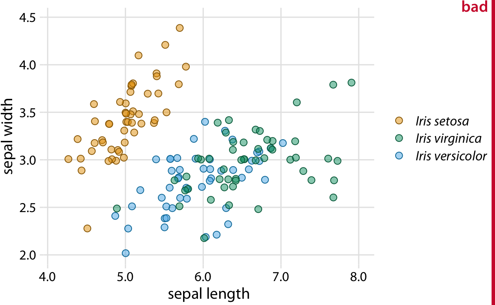
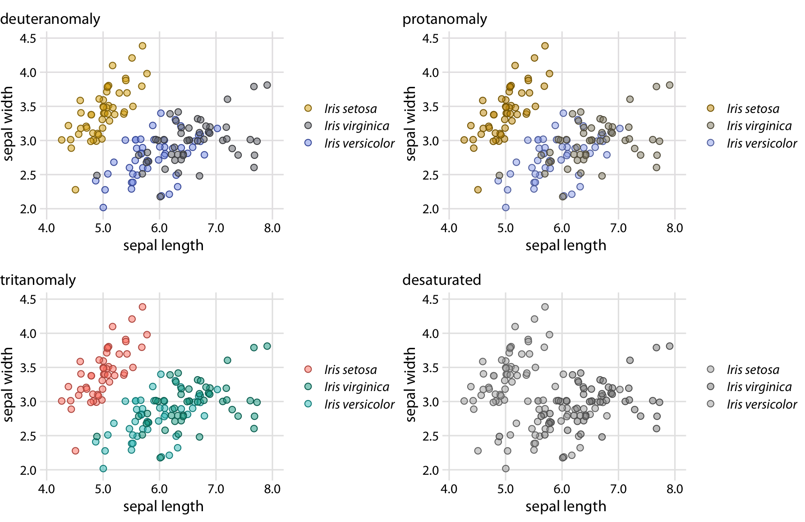
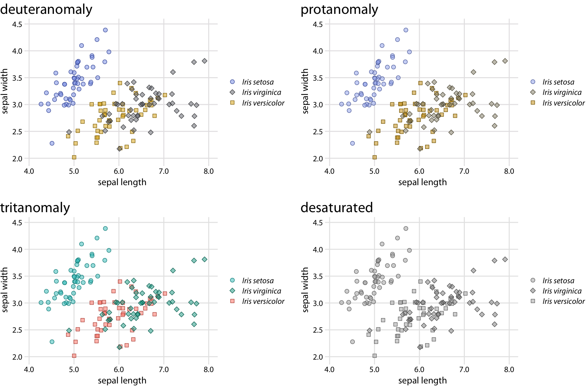
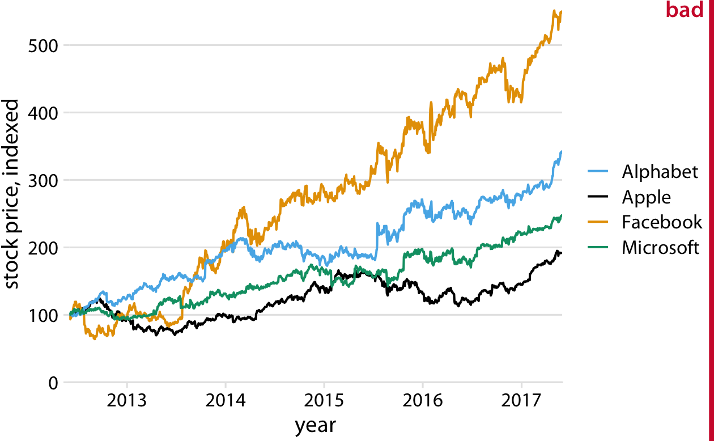
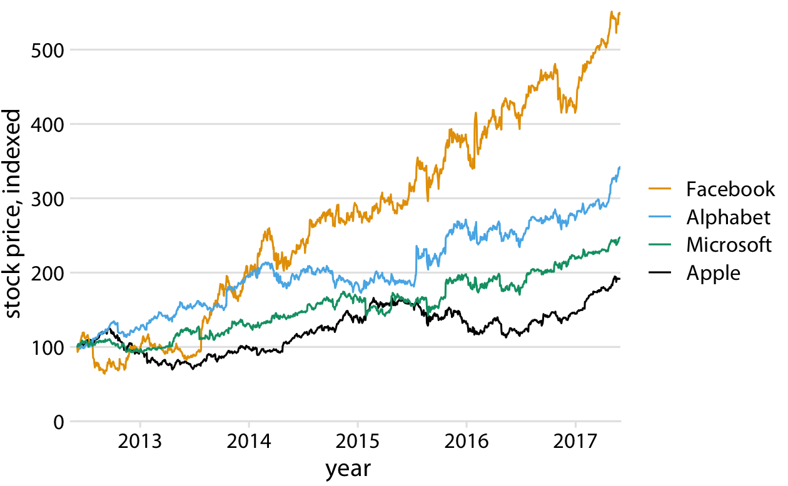
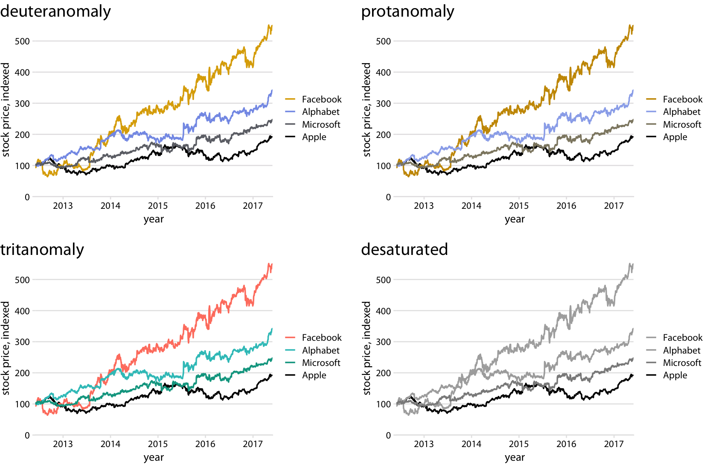
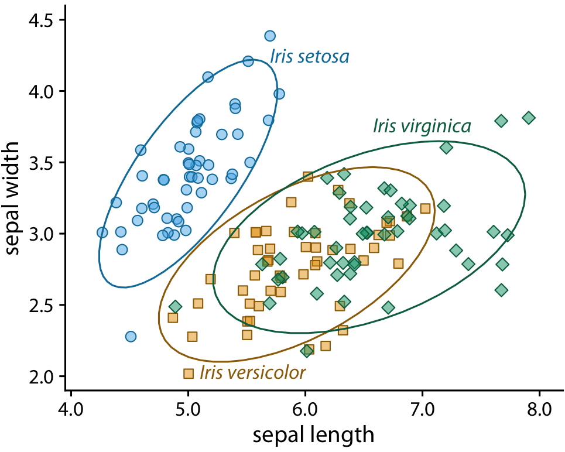
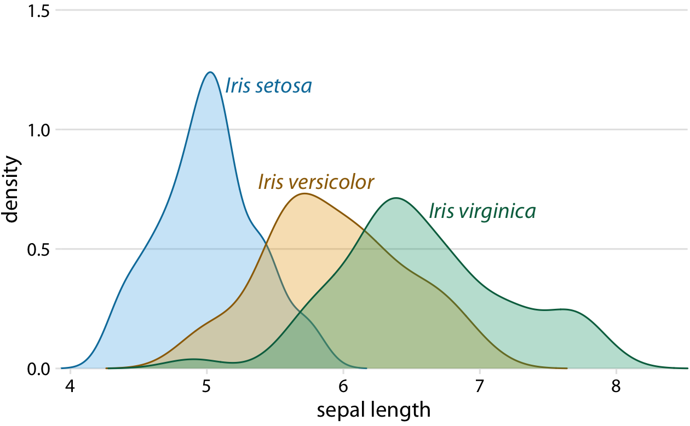
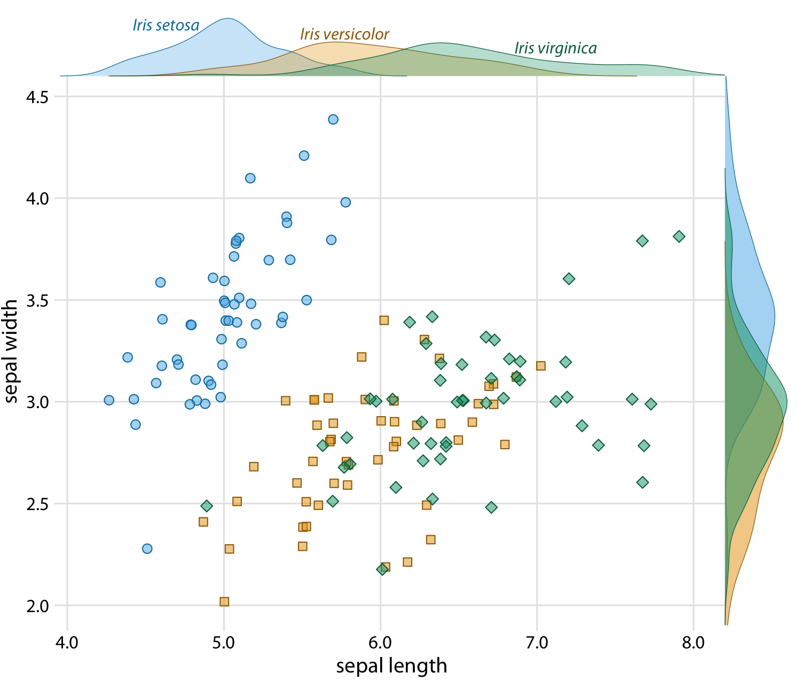
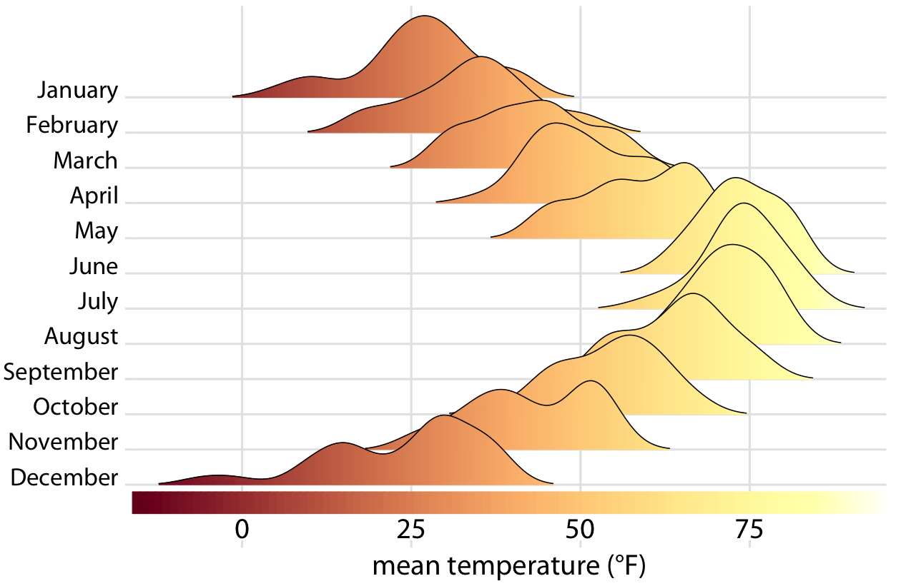

```
## Warning: package 'dplyr' was built under R version 3.5.2
```


# Redundant coding {#redundant-coding}

In Chapter \@ref(color-pitfalls), we have seen that color cannot always convey information as effectively as we might wish. If we have many different items we want to identify, doing so by color may not work. It will be difficult to match the colors in the plot to the colors in the legend (Figure \@ref(fig:popgrowth-vs-popsize-colored)). And even if we only need to distinguish two to three different items, color may fail if the colored items are very small (Figure \@ref(fig:colors-thin-lines)) and/or the colors look similar for people suffering from color-vision deficiency (Figures \@ref(fig:red-green-cvd-sim) and \@ref(fig:blue-green-cvd-sim)). The general solution in all these scenarios is to use color to enhance the visual appearance of the figure without relying entirely on color to convey key information. I refer to this design principle as *redundant coding*, because it prompts us to encode data redundantly, using multiple different aesthetic dimensions.

## Designing legends with redundant coding 

Scatter plots of several groups of data are frequently designed such that the points representing different groups differ only in their color. As an example, consider Figure \@ref(fig:iris-scatter-one-shape), which shows the sepal width versus the sepal length of three different *Iris* species. (Sepals are the outer leafs of flowers in flowering plants.) The points representing the different species differ in their colors, but otherwise all points look exactly the same. Even though this figure contains only three distinct groups of points, it is difficult to read even for people with normal color vision. The problem arises because the data points for the two species *Iris virginica* and *Iris versicolor* intermingle, and their two respective colors, green and blue, are not particularly distinct from each other.

(ref:iris-scatter-one-shape) Sepal width versus sepal length for three different iris species (*Iris setosa*, *Iris virginica*, and *Iris versicolor*). Each point represents the measurements for one plant sample. A small amount of jitter has been applied to all point positions to prevent overplotting. The figure is labeled "bad" because the *virginica* points in green and the *versicolor* points in blue are difficult to distinguish from each other.

<div class="figure" style="text-align: center">

<p class="caption">(\#fig:iris-scatter-one-shape)(ref:iris-scatter-one-shape)</p>
</div>

Surprisingly, the green and blue points look more distinct for people with red--green color-vision-deficiency (deuteranomaly or protanomaly) than for people with normal color vision (compare Figure \@ref(fig:iris-scatter-one-shape-cvd), top row, to Figure \@ref(fig:iris-scatter-one-shape)). On the other hand, for people with blue--yellow deficiency (tritanomaly) the blue and green points look very similar (Figure \@ref(fig:iris-scatter-one-shape-cvd), bottom left). And if we print out the figure in gray-scale (i.e., we *desaturate* the figure), we cannot distinguish any of the iris species (Figure \@ref(fig:iris-scatter-one-shape-cvd), bottom right).

(ref:iris-scatter-one-shape-cvd) Color-vision-deficiency simulation of Figure \@ref(fig:iris-scatter-one-shape).

<div class="figure" style="text-align: center">

<p class="caption">(\#fig:iris-scatter-one-shape-cvd)(ref:iris-scatter-one-shape-cvd)</p>
</div>

There are two simple improvements we can make to Figure \@ref(fig:iris-scatter-one-shape) to alleviate these issues. First, we can swap the colors used for *Iris setosa* and *Iris versicolor*, so that the blue is no longer directly next to the green (Figure \@ref(fig:iris-scatter-three-shapes)). Second, we can use three different symbol shapes, so that the points all look different. With these two changes, both the original version of the figure (Figure \@ref(fig:iris-scatter-three-shapes)) and the versions under color-vision-deficiency and in grayscale (Figure \@ref(fig:iris-scatter-three-shapes-cvd)) become legible.

(ref:iris-scatter-three-shapes) Sepal width versus sepal length for three different iris species. Compared to Figure \@ref(fig:iris-scatter-one-shape), we have swapped the colors for *Iris setosa* and *Iris versicolor* and we have given each iris species its own point shape.

<div class="figure" style="text-align: center">

<p class="caption">(\#fig:iris-scatter-three-shapes)(ref:iris-scatter-three-shapes)</p>
</div>


(ref:iris-scatter-three-shapes-cvd) Color-vision-deficiency simulation of Figure \@ref(fig:iris-scatter-three-shapes). Because of the use of different point shapes, even the fully desaturated gray-scale version of the figure is legible.

<div class="figure" style="text-align: center">

<p class="caption">(\#fig:iris-scatter-three-shapes-cvd)(ref:iris-scatter-three-shapes-cvd)</p>
</div>

Changing the point shape is a simple strategy for scatter plots but it doesn't necessarily work for other types of plots. In line plots, we could change the line type (solid, dashed, dotted, etc., see also Figure \@ref(fig:common-aesthetics)), but using dashed or dotted lines often yields sub-optimal results. In particular, dashed or dotted lines usually don't look good unless they are perfectly straight or only gently curved, and in either case they create visual noise. Also, it frequently requires significant mental effort to match different types of dash or dot--dash patterns from the plot to the legend. So what do we do with a visualization such as Figure \@ref(fig:tech-stocks-bad-legend), which uses lines to show the change in stock price over time for four different major tech companies?

(ref:tech-stocks-bad-legend) Stock price over time for four major tech companies. The stock price for each company has been normalized to equal 100 in June 2012. This figure is labeled as "bad" because it takes considerable mental energy to match the company names in the legend to the data curves. Data source: Yahoo Finance

<div class="figure" style="text-align: center">

<p class="caption">(\#fig:tech-stocks-bad-legend)(ref:tech-stocks-bad-legend)</p>
</div>


The figure contains four lines representing the stock prices of the four different companies. The lines are color coded using a colorblind-friendly color scale. So it should be relatively straightfoward to associate each line with the corresponding company. Yet it is not. The problem here is that the data lines have a clear visual order. The yellow line, representing Facebook, is clearly the highest line, and the black line, representing Apple, is clearly the lowest, with Alphabet and Microsoft in between, in that order. Yet the order of the four companies in the legend is Alphabet, Apple, Facebook, Microsoft (alphabetic order). Thus, the perceived order of the data lines differs from the order of the companies in the legend, and it takes a surprising amount of mental effort to match data lines with company names.

This problem arises commonly with plotting software that autogenerates legends. The plotting software has no concept of the visual order the viewer will perceive. Instead, the software sorts the legend by some other order, most commonly alphabetical. We can fix this problem by manually reordering the entries in the legend so they match the preceived ordering in the data (Figure \@ref(fig:tech-stocks-good-legend)). The result is a figure that makes it much easier to match the legend to the data.

(ref:tech-stocks-good-legend) Stock price over time for four major tech companies. The stock price for each company has been normalized to equal 100 in June 2012. Data source: Yahoo Finance

<div class="figure" style="text-align: center">

<p class="caption">(\#fig:tech-stocks-good-legend)(ref:tech-stocks-good-legend)</p>
</div>

<div class="rmdtip">
<p>If there is a clear visual ordering in your data, make sure to match it in the legend.</p>
</div>


Matching the legend order to the data order is always helpful, but the benefits are particularly obvious under color-vision deficiency simulation (Figure \@ref(fig:tech-stocks-good-legend-cvd)). For example, it helps in the tritanomaly version of the figure, where the blue and the green become difficult to distinguish (Figure \@ref(fig:tech-stocks-good-legend-cvd), bottom left). It also helps in the grayscale version (Figure \@ref(fig:tech-stocks-good-legend-cvd), bottom right). Even though the two colors for Facebook and Alphabet have virtually the same gray value, we can see that Microsoft and Apple are represented by darker colors and take the bottom two spots. Therefore, we correctly assume that the highest line corresponds to Facebook and the second-highest line to Alphabet.

(ref:tech-stocks-good-legend-cvd) Color-vision-deficiency simulation of Figure \@ref(fig:tech-stocks-good-legend).

<div class="figure" style="text-align: center">

<p class="caption">(\#fig:tech-stocks-good-legend-cvd)(ref:tech-stocks-good-legend-cvd)</p>
</div>


## Designing figures without legends

Even though legend legibility can be improved by encoding data redundantly, in multiple aesthetics, legends always put an extra mental burden on the reader. In reading a legend, the reader needs to pick up information in one part of the visualization and then transfer it over to a different part. We can typically make our readers' lives easier if we eliminate the legend altogether. Eliminating the legend does not mean, however, that we simply not provide one and instead write sentences such as "The yellow dots represent *Iris versicolor*" in the figure caption. Eliminating the legend means that we design the figure in such a way that it is immediately obvious what the various graphical elements represent, even if no explicit legend is present.

The general strategy we can employ is called *direct labeling*, whereby we place appropriate text labels or other visual elements that serve as guideposts to the rest of the figure. We have previously encountered direct labeling in Chapter \@ref(color-pitfalls) (Figure \@ref(fig:popgrowth-vs-popsize-bw)), as an alternative to drawing a legend with over 50 distinct colors. To apply the direct labeling concept to the stock-price figure, we place the name of each company right next to the end of its respective data line (Figure \@ref(fig:tech-stocks-good-no-legend)). 

(ref:tech-stocks-good-no-legend) Stock price over time for four major tech companies. The stock price for each company has been normalized to equal 100 in June 2012. Data source: Yahoo Finance

<div class="figure" style="text-align: center">

<p class="caption">(\#fig:tech-stocks-good-no-legend)(ref:tech-stocks-good-no-legend)</p>
</div>


<div class="rmdtip">
<p>Whenever possible, design your figures so they don't need a legend.</p>
</div>

We can also apply the direct labeling concept to the iris data from the beginning of this chapter, specifically Figure \@ref(fig:iris-scatter-three-shapes). Because it is a scatter plot of many points that separate into three different groups, we need to direct label the groups rather than the individual points. One solution is to draw ellipses that enclose the majority of the points and then label the ellipses (Figure \@ref(fig:iris-scatter-with-ellipses)).

(ref:iris-scatter-with-ellipses) Sepal width versus sepal length for three different iris species. I have removed the background grid from this figure because otherwise the figure was becoming too busy.

<div class="figure" style="text-align: center">

<p class="caption">(\#fig:iris-scatter-with-ellipses)(ref:iris-scatter-with-ellipses)</p>
</div>

For density plots, we can similarly direct-label the curves rather than providing a color-coded legend (Figure \@ref(fig:iris-densities-direct-label)). In both Figures \@ref(fig:iris-scatter-with-ellipses) and \@ref(fig:iris-densities-direct-label), I have colored the text labels in the same colors as the data. Colored labels can greatly enhance the direct labeling effect, but they can also turn out very poorly. If the text labels are printed in a color that is too light, then the labels become difficult to read. And, because text consists of very thin lines, colored text often appears to be lighter than an adjacent filled area of the same color. I generally circumvent these issues by using two different shades of each color, a light one for filled areas and a dark one for lines, outlines, and text. If you carefully inspect Figure \@ref(fig:iris-scatter-with-ellipses) or \@ref(fig:iris-densities-direct-label), you will see how each data point or shaded area is filled with a light color and has an outline drawn in a darker color of the same hue. And the text labels are drawn in the same darker colors. 

(ref:iris-densities-direct-label) Density estimates of the sepal lengths of three different iris species. Each density estimate is directly labeled with the respective species name.

<div class="figure" style="text-align: center">

<p class="caption">(\#fig:iris-densities-direct-label)(ref:iris-densities-direct-label)</p>
</div>

We can also use density plots such as the one in Figure \@ref(fig:iris-densities-direct-label) as a legend replacement, by placing the density plots into the margins of a scatter plot (Figure \@ref(fig:iris-scatter-dens)). This allows us to direct-label the marginal density plots rather than the central scatter plot and hence results in a figure that is somewhat less cluttered than Figure \@ref(fig:iris-scatter-with-ellipses) with directly-labeled ellipses.

(ref:iris-scatter-dens) Sepal width versus sepal length for three different iris species, with marginal density estimates of each variable for each species.

<div class="figure" style="text-align: center">

<p class="caption">(\#fig:iris-scatter-dens)(ref:iris-scatter-dens)</p>
</div>

And finally, whenever we encode a single variable in multiple aesthetics, we don't normally want multiple separate legends for the different aesthetics. Instead, there should be only a single legend-like visual element that conveys all mappings at once. In the case where we map the same variable onto a position along a major axis and onto color, this implies that the reference color bar should run along and be integrated into the same axis. Figure \@ref(fig:temp-ridgeline-colorbar) shows a case where we map temperature to both a position along the *x* axis and onto color, and where we therefore have integrated the color legend into the *x* axis.

(ref:temp-ridgeline-colorbar) Temperatures in Lincoln, Nebraska, in 2016. This figure is a variation of Figure \@ref(fig:temp-ridgeline). Temperature is now shown both by location along the *x* axis and by color, and a color bar along the *x* axis visualizes the scale that converts temperatures into colors.

<div class="figure" style="text-align: center">

<p class="caption">(\#fig:temp-ridgeline-colorbar)(ref:temp-ridgeline-colorbar)</p>
</div>
