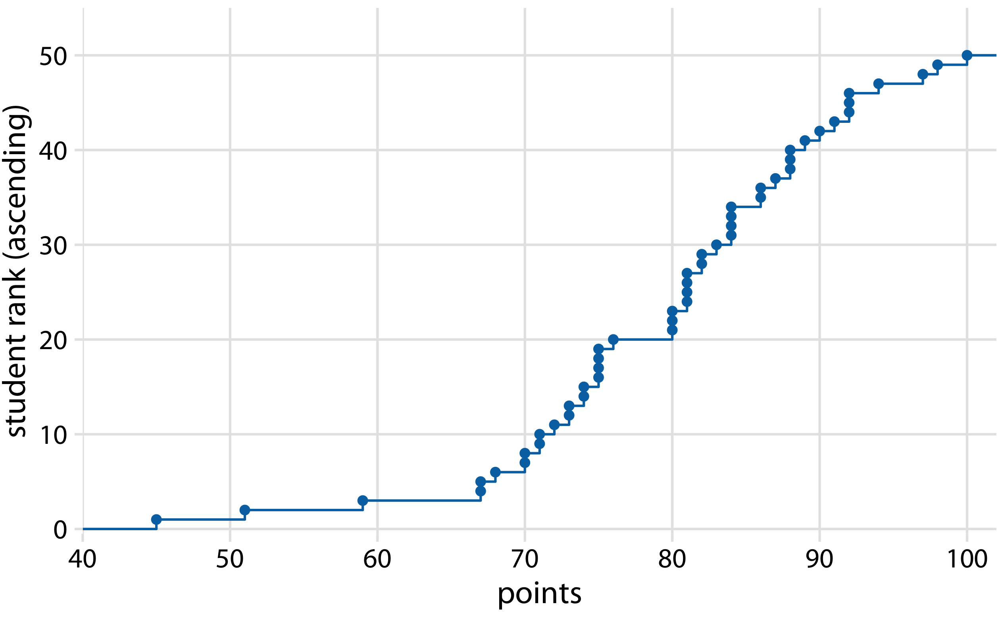
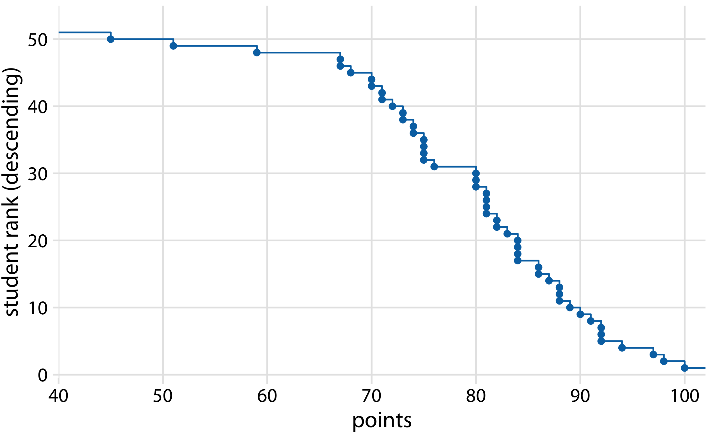
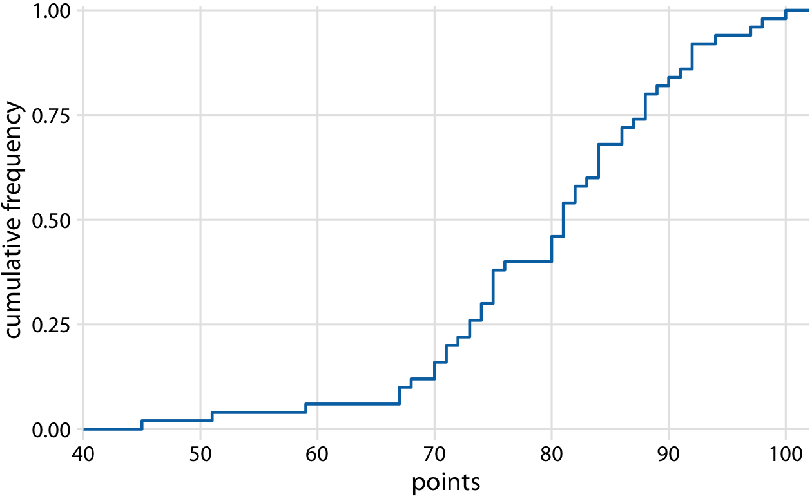
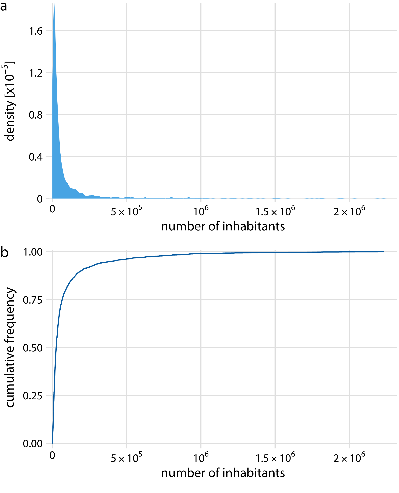
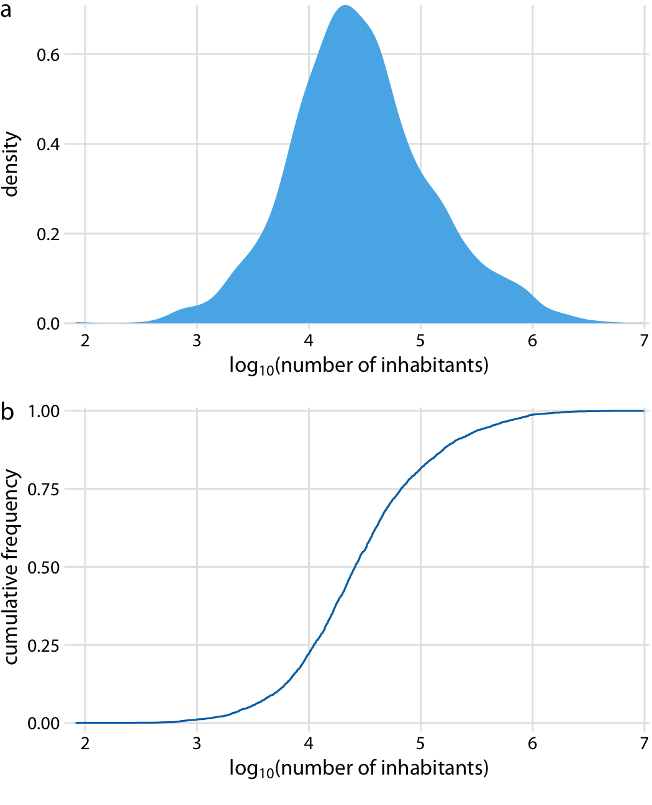
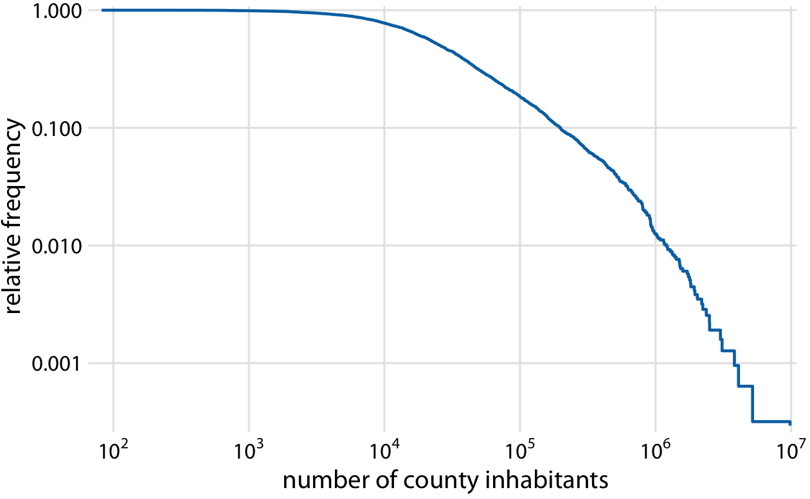
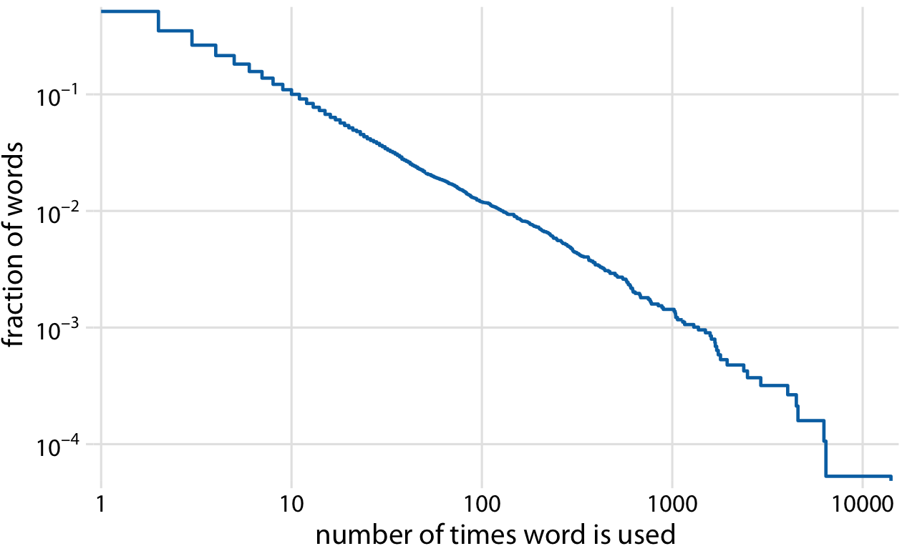
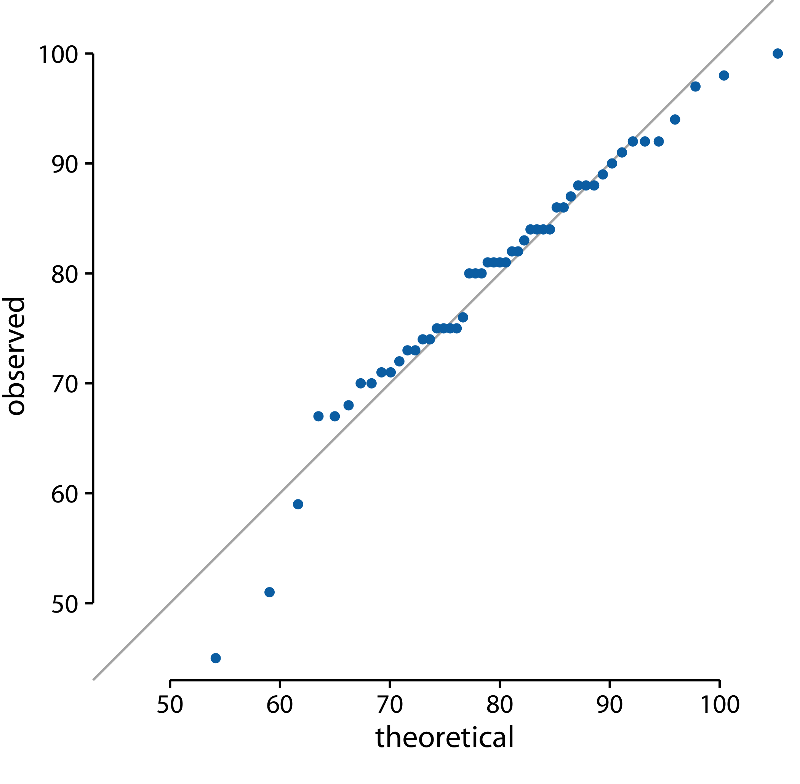
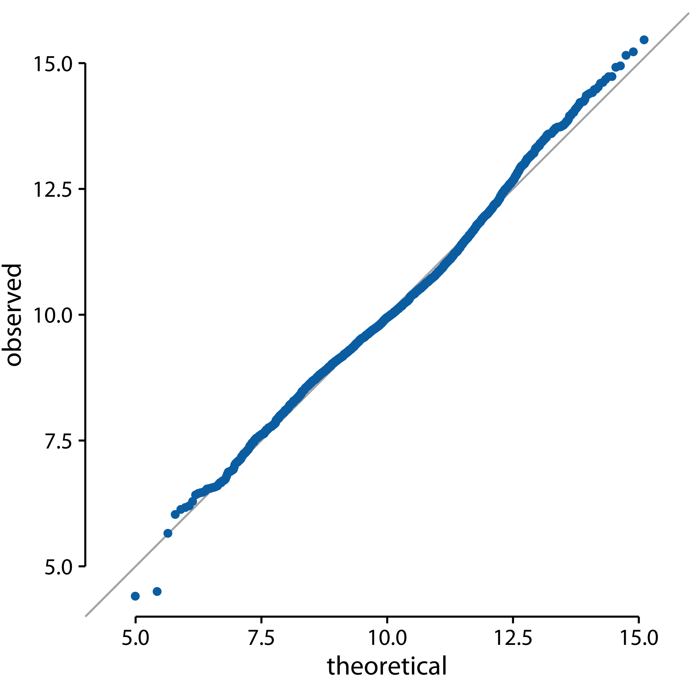

```
## Warning: package 'dplyr' was built under R version 3.5.2
```


# Visualizing distributions: Empirical cumulative distribution functions and q-q plots {#ecdf-qq}

In Chapter \@ref(histograms-density-plots), I described how we can visualize distributions with histograms or density plots. Both of these approaches are highly intuitive and visually appealing. However, as discussed in that chapter, they both share the limitation that the resulting figure depends to a substantial degree on parameters the user has to choose, such as the bin width for histograms and the bandwidth for density plots. As a result, both have to be considered as an interpretation of the data rather than a direct visualization of the data itself.

As an alternative to using histograms or density plots, we could simply show all the data points individually, as a point cloud. However, this approach becomes unwieldy for very large datasets, and in any case there is value in aggregate methods that highlight properties of the distribution rather than the individual data points. To solve this problem, statisticians have invented empirical cumulative distribution functions (ecdfs) and quantile--quantile (q-q) plots. These types of visualizations require no arbitrary parameter choices, and they show all of the data at once. Unfortunately, they are a little less intuitive than a histogram or a density plot is, and I don't see them used frequently outside of highly technical publications. They are quite popular among statisticians, though, and I think anybody interested in data visualization should be familiar with these techniques.


## Empirical cumulative distribution functions

To illustrate cumulative empirical distribution functions, I will begin with a hypothetical example that is closely modeled after something I deal with a lot as a professor in the classroom: a dataset of student grades. Assume our hypothetical class has 50 students, and the students just completed an exam on which they could score between 0 and 100 points. How can we best visualize the class performance, for example to determine appropriate grade boundaries?

We can plot the total number of students that have received at most a certain number of points versus all possible point scores. This plot will be an ascending function, starting at 0 for 0 points and ending at 50 for 100 points. A different way of thinking about this visualization is the following: We can rank all students by the number of points they obtained, in ascending order (so the student with the fewest points receives the lowest rank and the student with the most points the highest), and then plot the rank versus the actual points obtained. The result is an *empirical cumulative distribution function* (ecdf) or simply *cumulative distribution.* Each dot represents one student, and the lines visualize the highest student rank observed for any possible point value (Figure \@ref(fig:student-grades)).

(ref:student-grades) Empirical cumulative distribution function of student grades for a hypothetical class of 50 students.

<div class="figure" style="text-align: center">

<p class="caption">(\#fig:student-grades)(ref:student-grades)</p>
</div>


You may wonder what happens if we rank the students the other way round, in descending order. This ranking simply flips the function on its head. The result is still an empirical cumulative distribution function, but the lines now represent the lowest student rank observed for any possible point value (Figure \@ref(fig:student-grades-desc)). 

(ref:student-grades-desc) Distribution of student grades plotted as a descending ecdf.

<div class="figure" style="text-align: center">

<p class="caption">(\#fig:student-grades-desc)(ref:student-grades-desc)</p>
</div>

Ascending cumulative distribution functions are more widely known and more commonly used than descending ones, but both have important applications. Descending cumulative distribution functions are critical when we want to visualize highly skewed distributions (see Section \@ref(skewed-distributions)).

In practical applications, it is quite common to draw the ecdf without highlighting the individual points and to normalize the ranks by the maximum rank, so that the *y* axis represents the cumulative frequency (Figure \@ref(fig:student-grades-normalized)). 

(ref:student-grades-normalized) Ecdf of student grades. The student ranks have been normalized to the total number of students, such that the *y* values plotted correspond to the fraction of students in the class with at most that many points.

<div class="figure" style="text-align: center">

<p class="caption">(\#fig:student-grades-normalized)(ref:student-grades-normalized)</p>
</div>

We can directly read off key properties of the student grade distribution from this plot. For example, approximately a quarter of the students (25%) received less than 75 points. The median point value (corresponding to a cumulative frequency of 0.5) is 81. Approximately 20% of the students received 90 points or more.

I find ecdfs handy for assigning grade boundaries because they help me locate the exact cutoffs that minimize student unhappiness. For example, in this example, there's a fairly long horizontal line right below 80 points, followed by a steep rise right at 80. This feature is caused by three students receiving 80 points on their exam while the next poorer performing student received only 76. In this scenario, I might decide that everybody with a point score of 80 or more receives a B and everybody with 79 or less receives a C. The three students with 80 points are happy that they just made a B, and the student with 76 realizes that they would have had to perform much better to not receive a C. If I had set the cutoff at 77, the distribution of letter grades would have been exactly the same, but I might find the student with 76 points visiting my office hoping to negotiate their grade up. Likewise, if I had set the cutoff at 81, I would likely have had three students in my office trying to negotiate their grade.

## Highly skewed distributions {#skewed-distributions}

Many empirical datasets display highly skewed distributions, in particular with heavy tails to the right, and these distributions can be challenging to visualize. Examples of such distributions include the number of people living in different cities or counties, the number of contacts in a social network, the frequency with which individual words appear in a book, the number of academic papers written by different authors, the net worth of individuals, and the number of interaction partners of individual proteins in protein--protein interaction networks (@Clauset-et-al-2009). All these distributions have in common that their right tail decays slower than an exponential function. In practice, this means that very large values are not that rare, even if the mean of the distribution is small. An important class of such distributions are *power-law* distributions, where the likelihood to observe a value that is *x* times larger than some reference point declines as a power of *x*. To give a concrete example, consider net worth in the US, which is distributed according to a power law with exponent 2. At any given level of net worth (say, $1 million), people with half that net worth are four times as frequent, and people with twice that net worth are one-fourth as frequent. Importantly, the same relationship holds if we use $10,000 as reference point or if we use $100 million. For this reason, power-law distributions are also called *scale-free* distributions.

Here, I will first discuss the number of people living in different US counties according to the 2010 US Census. This distribution has a very long tail to the right. Even though most counties have relatively small numbers of inhabitants (the median is 25,857), a few counties have extremely large numbers of inhabitants (e.g., Los Angeles County, with 9,818,605 inhabitants). If we try to visualize the distribution of population counts as either a density plot or an ecdf, we obtain figures that are essentially useless (Figure \@ref(fig:county-populations)).

(ref:county-populations) Distribution of the number of inhabitants in US counties, according to the 2010 US Census. (a) Density plot. (b) Empirical cumulative distribution function.

<div class="figure" style="text-align: center">

<p class="caption">(\#fig:county-populations)(ref:county-populations)</p>
</div>

The density plot (Figure \@ref(fig:county-populations)a) shows a sharp peak right at 0 and virtually no details of the distribution are visible. Similarly, the ecdf (Figure \@ref(fig:county-populations)b) shows a rapid rise near 0 and again no details of the distribution are visible. For this particular dataset, we can log-transform the data and visualize the distribution of the log-transformed values. This transformation works here because the population numbers in counties is not actually a power law, but instead follow a nearly perfect log-normal distribution (see Section \@ref(qq-plots)). Indeed, the density plot of the log-transformed values shows a nice bell curve and the corresponding ecdf shows a nice sigmoidal shape (Figure \@ref(fig:county-populations-log)).

(ref:county-populations-log) Distribution of the logarithm of the number of inhabitants in US counties. (a) Density plot. (b) Empirical cumulative distribution function.

<div class="figure" style="text-align: center">

<p class="caption">(\#fig:county-populations-log)(ref:county-populations-log)</p>
</div>

To see that this distribution is not a power law, we plot it as a descending ecdf with logarithmic *x* and *y* axes. In this visualization, a power law appears as a perfect straight line. For the population counts in counties, the right tail forms almost but not quite a straight line on the descending log-log ecdf plot (Figure \@ref(fig:county-populations-tail-log-log)).

(ref:county-populations-tail-log-log) Relative frequency of counties with at least that many inhabitants versus the number of county inhabitants.

<div class="figure" style="text-align: center">

<p class="caption">(\#fig:county-populations-tail-log-log)(ref:county-populations-tail-log-log)</p>
</div>

As a second example, I will use the distribution of word frequencies for all words that appear in the novel Moby Dick. This distribution follows a perfect power law. When plotted as descending ecdf with logarithmic axes, we see a nearly perfect straight line (Figure \@ref(fig:word-counts-tail-log-log)).

(ref:word-counts-tail-log-log) Distribution of word counts in the novel Moby Dick. Shown is the relative frequency of words that occur at least that many times in the novel versus the number of times words are used.

<div class="figure" style="text-align: center">

<p class="caption">(\#fig:word-counts-tail-log-log)(ref:word-counts-tail-log-log)</p>
</div>

## Quantile--quantile plots {#qq-plots}

Quantile--quantile (q-q) plots are a useful visualization when we want to determine to what extent the observed data points do or do not follow a given distribution. Just like ecdfs, q-q plots are also based on ranking the data and visualizing the relationship between ranks and actual values. However, in q-q plots we don't plot the ranks directly, we use them to predict where a given data point should fall if the data were distributed according to a specified reference distribution. Most commonly, q-q plots are constructed using a normal distribution as the reference. To give a concrete example, assume the actual data values have a mean of 10 and a standard deviation of 3. Then, assuming a normal distribution, we would expect a data point ranked at the 50th percentile to lie at position 10 (the mean), a data point at the 84th percentile to lie at position 13 (one standard deviation above from the mean), and a data point at the 2.3rd percentile to lie at position 4 (two standard deviations below the mean). We can carry out this calculation for all points in the dataset and then plot the observed values (i.e., values in the dataset) against the theoretical values (i.e., values expected given each data point's rank and the assumed reference distribution).

When we perform this procedure for the student grades distribution from the beginning of this chapter, we obtain Figure \@ref(fig:student-grades-qq).

(ref:student-grades-qq) q-q plot of student grades.

<div class="figure" style="text-align: center">

<p class="caption">(\#fig:student-grades-qq)(ref:student-grades-qq)</p>
</div>

The solid line here is not a regression line but indicates the points where *x* equals *y*, i.e., where the observed values equal the theoretical ones. To the extent that points fall onto that line, the data follow the assumed distribution (here, normal). We see that the student grades follow mostly a normal distribution, with a few deviations at the bottom and at the top (a few students performed worse than expected on either end). The deviations from the distribution at the top end are caused by the maximum point value of 100 in the hypothetical exam; regardless of how good the best student is, he or she could at most obtain 100 points.


We can also use a q-q plot to test my assertion from earlier in this chapter that the population counts in US counties follow a log-normal distribution. If these counts are log-normally distributed, then their log-transformed values are normally distributed and hence should fall right onto the *x* = *y* line. When making this plot, we see that the agreement between the observed and the theoretical values is exceptional (Figure \@ref(fig:county-populations-qq)). This demonstrates that the distribution of population counts among counties is indeed log-normal.

(ref:county-populations-qq) q-q plot of the logarithm of the number of inhabitants in US counties.

<div class="figure" style="text-align: center">

<p class="caption">(\#fig:county-populations-qq)(ref:county-populations-qq)</p>
</div>


