# Visualizing uncertainty {#visualizing-uncertainty}

One of the most challenging aspects of data visualization is the visualization of uncertainty. When we see a data point drawn in a specific location, we tend to interpret it as a precise representation of the true data value. It is difficult to conceive that a data point could actually lie somewhere it hasn't been drawn. Yet this scenario is ubiquitous in data visualization. Nearly every data set we work with has some uncertainty, and whether and how we choose to represent this uncertainty can make a major difference in how accurately our audience perceives the meaning of the data. 

Two commonly used approaches to indicate uncertainty are error bars and confidence bands. These approaches were developed in the context of scientific publications, and they require some amount of expert knowledge to be interpreted correctly. Yet they are precise and space efficient. By using error bars, for example, we can show the uncertainties of many different parameter estimates in a single graph. For a lay audience, however, visualization strategies that create a strong intuitive impression of the uncertainty will be preferable, even if they come at the cost of either reduced visualization accuracy or less data-dense displays. Options here include frequency framing, where we explicitly draw different possible scenarios in approximate proportions, or animations that cycle through different possible scenarios.

## Framing probabilities as frequencies {#frequency-framing}

Before we can discuss how to visualize uncertainty, we need to define what it actually is. We can intuitively grasp the concept of uncertainty most easily in the context of future events. If I am going to flip a coin I don't know ahead of time what the outcome will be. The eventual outcome is uncertain. I can also be uncertain about events in the past, however. If yesterday I looked out of my kitchen window exactly twice, once at 8am and once at 4pm, and I saw a red car parked across the street at 8am but not at 4pm, then I can conclude the car left at some point during the eight-hour window but I don't know exactly when. It could have been 8:01am, 9:30am, 2pm, or any other time during those eight hours.

Mathematically, we deal with uncertainty by employing the concept of probability. A precise definition of probability is complicated and far beyond the scope of this book. Yet we can successfully reason about probabilities without understanding all the mathematical intricacies. For many problems of practical relevance it is sufficient to think about relative frequencies. Assume you perform some sort of random trial, such as a coin flip or rolling a die, and look for a particular outcome (e.g., heads or rolling a six). You can call this outcome *success,* and any other outcome *failure.* Then, the probability of success is approximately given by the fraction of times you'd see that outcome if you repeated the random trial over and over again. For instance, if a particular outcome occurs with a probability of 10%, then we expect that among many repeated trials that outcome will be seen in approximately one out of ten cases.

Visualizing a single probability is difficult. How would you visualize the chance of winning in the lottery, or the chance of rolling a six with a fair die? In both cases, the probability is a single number. We could treat that number as an amount and display it using any of the techniques discussed in Chapter \@ref(visualizing-amounts), such as a bar graph or a dot plot, but the result would not be very useful. Most people lack an intuitive understanding of how a probability value translates into experienced reality. Showing the probability value as a bar or as a dot placed on a line does not help with this problem.

We can make the concept of probability tangible by creating a graph that emphasizes both the frequency aspect and the unpredictability of a random trial, for example by drawing squares of different colors in a random arrangement. In Figure \@ref(fig:probability-waffle), I use this technique to visualize three different probabilities, a 1% chance of success, a 10% chance of success, and a 40% chance of success. To read this figure, imagine you are given the task of picking a dark square by choosing a square before you can see which of the squares will be dark and which ones will be light. (If you will, you can think of picking a square with your eyes closed.) Intuitively, you will probably understand that it would be unlikely to select the one dark square in the 1%-chance case. Similarly, it would still be fairly unlikely to select a dark square in the 10%-chance case. However, in the 40%-chance case the odds don't look so bad. This style of visualization, where we show specific potential outcomes, is called a *discrete outcome visualization,* and the act of visualizing a probability as a frequency is called *frequency framing.* We are framing the probabilistic nature of a result in terms of easily understood frequencies of outcomes.

(ref:probability-waffle) Visualizing probability as frequency. There are 100 squares in each grid, and each square represents either success of failure in some random trial. A 1% chance of success corresponds to one dark and 99 light squares, a 10% chance of success corresponds to ten dark and 90 light squares, and a 40% chance of success corresponds to 40 dark and 60 light squares. By randomly placing the dark squares among the light squares, we can create a visual impression of randomness that emphasizes the uncertainty of the outcome of a single trial.

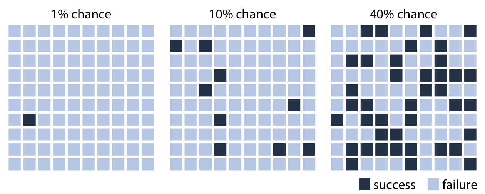

(\#fig:probability-waffle)(ref:probability-waffle)

If we are only interested in two discrete outcomes, success or failure, then a visualization such as Figure \@ref(fig:probability-waffle) works fine. However, often we are dealing with more complex scenarios where the outcome of a random trial is a numeric variable. One common scenario is that of election predictions, where we are interested not only in who will win but also by how much. Let's consider a hypothetical example of an upcoming election with two parties, the yellow party and the blue party. Assume you hear on the radio that the blue party is predicted to have a one percentage point advantage over the yellow party, with a margin of error of 1.76 percentage points. What does this information tell you about the likely outcome of the election? It is human nature to hear "the blue party will win," but reality is more complicated. First, and most importantly, there is a range of different possible outcomes. The blue party could end up winning with a lead of two percentage points or the yellow party could end up winning with a lead of half a percentage point. The range of possible outcomes with their associated likelihoods is called a probability distribution, and we can draw it as a smooth curve that rises and then falls over the range of possible outcomes (Figure \@ref(fig:election-prediction)). The higher the curve for a specific outcome, the more likely that outcome is. Probability distributions are closely related to the histograms and kernel densities discussed in Chapter \@ref(histograms-density-plots), and you may want to re-read that chapter to refresh your memory.

(ref:election-prediction) Hypothetical prediction of an election outcome. The blue party is predicted to win over the yellow party by approximately one percentage point (labeled "best estimate"), but that prediction has a margin of error (here drawn so it covers 95% of the likely outcomes, 1.76 percentage points in either direction from the best estimate). The area shaded in blue, corresponding to 87.1% of the total, represents all outcomes under which blue would win. Likewise, the area shaded in yellow, corresponding to 12.9% of the total, represents all outcomes under which yellow would win. In this example, blue has an 87% chance of winning the election.

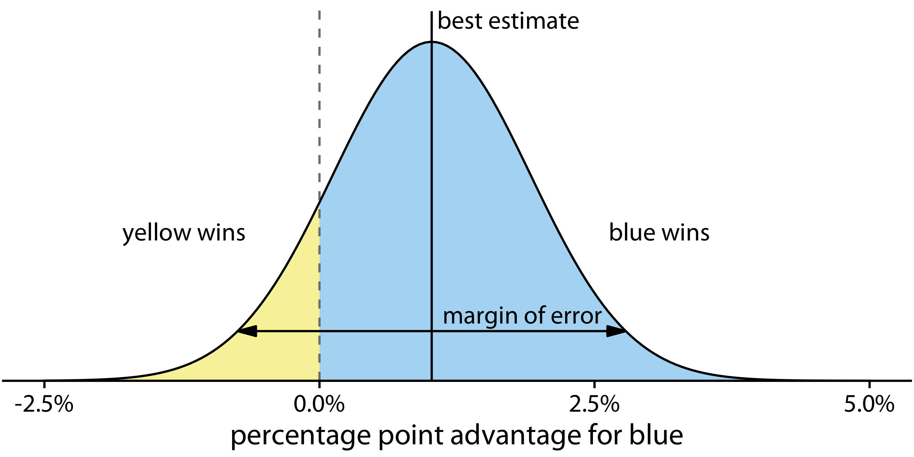

(\#fig:election-prediction)(ref:election-prediction)

By doing some math, we can calculate that for our made-up example, the chance of the yellow party winning is 12.9%. So the chance of yellow winning is a tad better than the 10% chance scenario shown in Figure \@ref(fig:probability-waffle). If you favor the blue party, you may not be overly worried, but the yellow party has enough of a chance of winning that they might just be successful. If you compare Figure \@ref(fig:election-prediction) to Figure \@ref(fig:probability-waffle), you may find that Figure \@ref(fig:probability-waffle) creates a much better sense of the uncertainty in outcome, even though the shaded areas in Figure \@ref(fig:election-prediction) accurately represent the probabilities of blue or yellow winning. This is the power of a discrete outcome visualization. Research in human perception shows that we are much better at perceiving, counting, and judging the relative frequencies of discrete objects---as long as their total number is not too large---than we are at judging the relative sizes of different areas.

We can combine the discrete outcome nature of Figure \@ref(fig:probability-waffle) with a continuous distribution as in Figure \@ref(fig:election-prediction) by drawing a quantile dotplot [@Kay_et_al_2016]. In the quantile dotplot, we subdivide the total area under the curve into evenly sized units and draw each unit as a circle. We then stack the circles such that their arrangement approximately represents the original distribution curve (Figure \@ref(fig:election-quantile-dot)).

(ref:election-quantile-dot) Quantile dotplot representations of the election outcome distribution of Figure \@ref(fig:election-prediction). (a) The smooth distribution is approximated with 50 dots representing a 2% chance each. The six yellow dots thus correspond to a 12% chance, reasonably close to the true value of 12.9%. (b) The smooth distribution is approximated with 10 dots representing a 10% chance each. The one yellow dot thus corresponds to a 10% chance, still close to the true value. Quantile dot plots with a smaller number of dots tend to be easier to read, so in this example, the 10-dot version might be preferable to the 50-dot version.

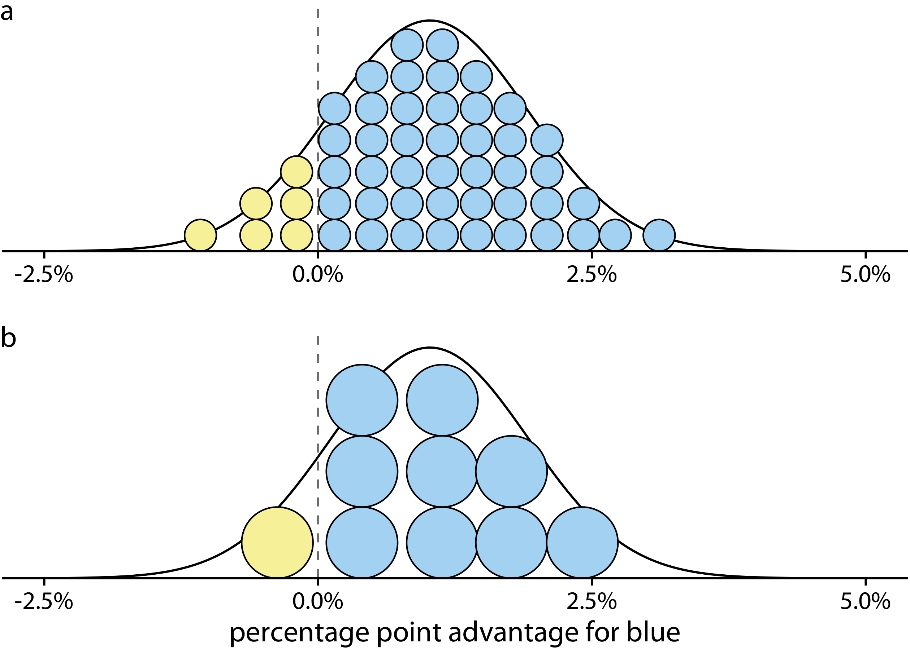

(\#fig:election-quantile-dot)(ref:election-quantile-dot)

As a general principle, quantile dotplots should use a small to moderate number of dots. If there are too many dots, then we tend to perceive them as a continuum rather than as individual, discrete units. This negates the advantages of the discrete plots. Figure \@ref(fig:election-quantile-dot) shows variants with 50 dots (Figure \@ref(fig:election-quantile-dot)a) and with ten dots (Figure \@ref(fig:election-quantile-dot)b). While the version with 50 dots more accurately captures the true probability distribution, the number of dots is too large to easily discriminate individual ones. The version with ten dots more immediately conveys the relative chances of blue or yellow winning. One objection to the ten-dot version might be that it is not very precise. We are underrepresenting the chance of yellow winning by 2.9 percentage points. However, it is often worthwhile to trade some mathematical precision for more accurate human perception of the resulting visualization, in particular when communicating to a lay audience. A visualization that is mathematically correct but not properly perceived is not that useful in practice.

## Visualizing the uncertainty of point estimates

In Figure \@ref(fig:election-prediction), I showed a "best estimate" and a "margin of error," but I didn't explain what exactly these quantities are or how they might be obtained. To understand them better, we need to take a quick detour into basic concepts of statistical sampling. In statistics, our overarching goal is to learn something about the world by looking at a small portion of it. To continue with the election example, assume there are many different electoral districts and the citizens of each district are going to vote for either the blue or the yellow party. We might want to predict how each district is going to vote, as well as the overall vote average across districts (the *mean*). To make a prediction before the election, we cannot poll each individual citizen in each district about how they are going to vote. Instead, we have to poll a subset of citizens in a subset of districts and use that data to arrive at a best guess. In statistical language, the total set of possible votes of all citizens in all districts is called the *population,* and the subset of citizens and/or districts we poll is the *sample.* The population represents the underlying, true state of the world and the sample is our window into that world.

We are normally interested in specific quantities that summarize important properties of the population. In the election example, these could be the mean vote outcome across districts or the standard deviation among district outcomes. Quantities that describe the population are called *parameters,* and they are generally not knowable. However, we can use a sample to make a guess about the true parameter values, and statisticians refer to such guesses as *estimates.* The sample mean (or average) is an estimate for the population mean, which is a parameter. The estimates of individual parameter values are also called *point estimates,* since each can be represented by a point on a line.

Figure \@ref(fig:sampling-schematic) shows how these key concepts are related to each other. The variable of interest (e.g., vote outcome in each district) has some distribution in the population, with a population mean and a population standard deviation. A sample will consist of a set of specific observations. The number of the individual observations in the sample is called the *sample size.* From the sample we can calculate a sample mean and a sample standard deviation, and these will generally differ from the population mean and standard deviation. Finally, we can define a *sampling distribution,* which is the distribution of estimates we would obtain if we repeated the sampling process many times. The width of the sampling distribution is called the *standard error,* and it tells us how precise our estimates are. In other words, the standard error provides a measure of the uncertainty associated with our parameter estimate. As a generaly rule, the larger the sample size, the smaller the standard error and thus the less uncertain the estimate.

(ref:sampling-schematic) Key concepts of statistical sampling. The variable of interest that we are studying has some true distribution in the population, with a true population mean and standard deviation. Any finite sample of that variable will have a sample mean and standard deviation that differ from the population parameters. If we sampled repeatedly and calculated a mean each time, then the resulting means would be distributed according to the sampling distribution of the mean. The standard error provides information about the width of the sampling distribution, which informs us about how precisely we are estimating the parameter of interest (here, the population mean).

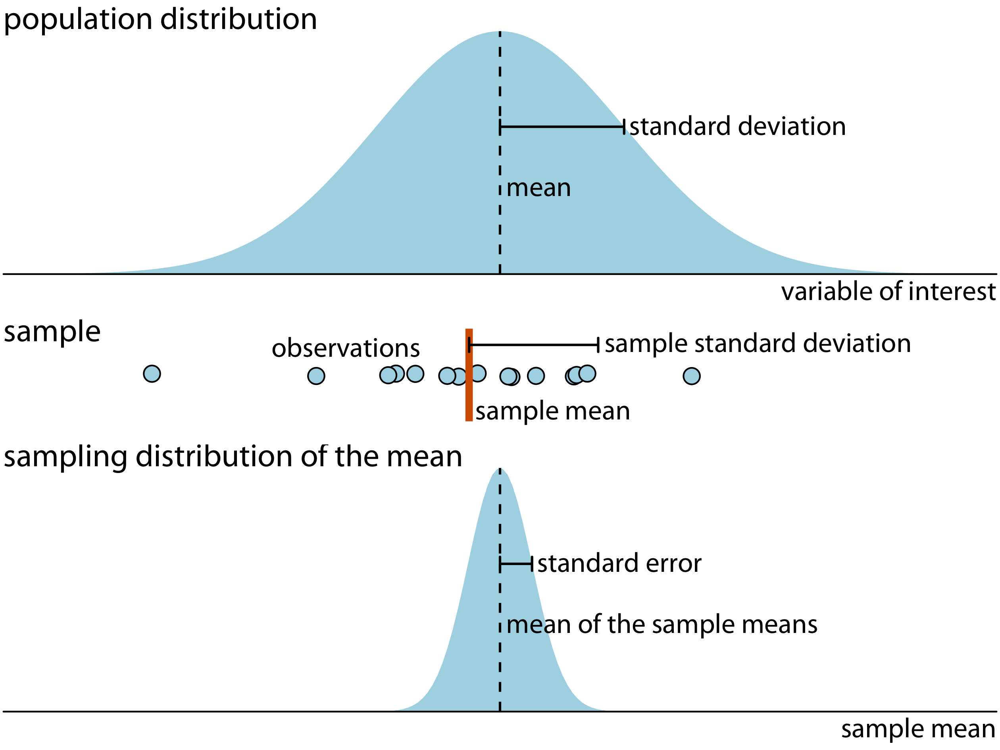

(\#fig:sampling-schematic)(ref:sampling-schematic)

It is critical that we don't confuse the standard deviation and the standard error. The standard deviation is a property of the population. It tells us how much spread there is among individual observations we could make. For example, if we consider the population of voting districts, the standard deviation tells us how different different districts are from one another. By contrast, the standard error tells us how precisely we have determined a parameter estimate. If we wanted to estimate the mean voting outcome over all districts, the standard error would tells us how accurate our estimate for the mean is.

All statisticians use samples to calculate parameter estimates and their uncertainties. However, they are divided in how they approach these calculations, into Bayesians and frequentists. Bayesians assume that they have some prior knowledge about the world, and they use the sample to update this knowledge. By contrast, frequentists attempt to make precise statements about the world without having any prior knowledge in hand. Fortunately, when it comes to visualizing uncertainty, Bayesians and frequentists can generally employ the same types of strategies. Here, I will first discuss the frequentist approach and then describe a few specific issues unique to the Bayesian context.

Frequentists most commonly visualize uncertainty with error bars. While error bars can be useful as a visualization of uncertainty, they are not without problems, as I already alluded to in Chapter \@ref(boxplots-violins) (see Figure \@ref(fig:lincoln-temp-points-errorbars)). It is easy for readers to be confused about what an error bar represents. To highlight this problem, in Figure \@ref(fig:cocoa-data-vs-CI) I show five different uses of error bars for the same dataset. The dataset contains expert ratings of chocolate bars, rated on a scale from 1 to 5, for chocolate bars manufactured in a number of different countries. For Figure \@ref(fig:cocoa-data-vs-CI) I have extracted all ratings for chocolate bars manufactured in Canada. Underneath the sample, which is shown as a strip chart of jittered dots, we see the sample mean plus/minus the standard deviation of the sample, the sample mean plus/minus the standard error, and 80%, 95%, and 99% confidence intervals. All five error bars are derived from the variation in the sample, and they are all mathematically related, but they have different meanings. And they are also visually quite distinct.

(ref:cocoa-data-vs-CI) Relationship between sample, sample mean, standard deviation, standard error, and confidence intervals, in an example of chocolate bar ratings. The observations (shown as jittered green dots) that make up the sample represent expert ratings of 125 chocolate bars from manufacturers in Canada, rated on a scale from 1 (unpleasant) to 5 (elite). The large orange dot represents the mean of the ratings. Error bars indicate, from top to bottom, twice the standard deviation, twice the standard error (standard deviation of the mean), and 80%, 95%, and 99% confidence intervals of the mean. Data source: Brady Brelinski, Manhattan Chocolate Society

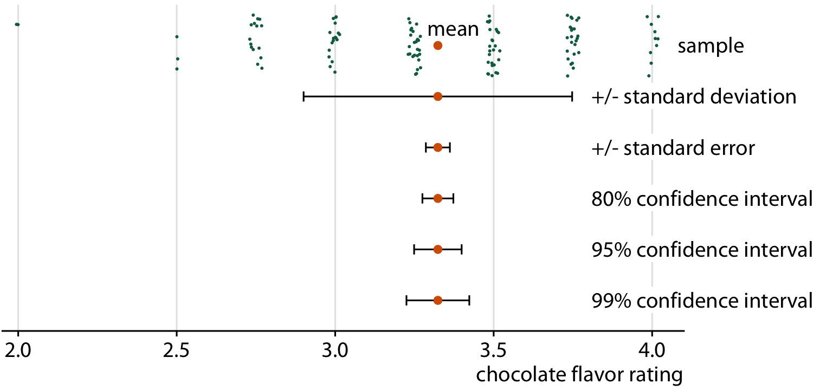

(\#fig:cocoa-data-vs-CI)(ref:cocoa-data-vs-CI)

Whenever you visualize uncertainty with error bars, you must specify what quantity and/or confidence level the error bars represent.

The standard error is approximately given by the sample standard deviation divided by the square root of the sample size, and confidence intervals are calculated by multiplying the standard error with small, constant values. For example, a 95% confidence interval extends approximately two times the standard error in either direction from the mean. Therefore, larger samples tend to have narrower standard errors and confidence intervals, even if their standard deviation is the same. We can see this effect when we compare ratings for chocolate bars from Canada to ones from Switzerland (Figure \@ref(fig:cocoa-CI-vs-n)). The mean rating and sample standard deviation are comparable between Canadian and Swiss chocolate bars, but we have ratings for 125 Canadian bars and only 38 Swiss bars, and consequently the confidence intervals around the mean are much wider in the case of Swiss bars.

(ref:cocoa-CI-vs-n) Confidence intervals widen with smaller sample size. Chocolate bars from Canada and Switzerland have comparable mean ratings and comparable standard deviations (indicated with simple black error bars). However, over three times as many Canadian bars were rated as Swiss bars, and therefore the confidence intervals (indicated with error bars of different colors and thickness drawn on top of one another) are substantially wider for the mean of the Swiss ratings than for the mean of the Canadian ratings. Data source: Brady Brelinski, Manhattan Chocolate Society

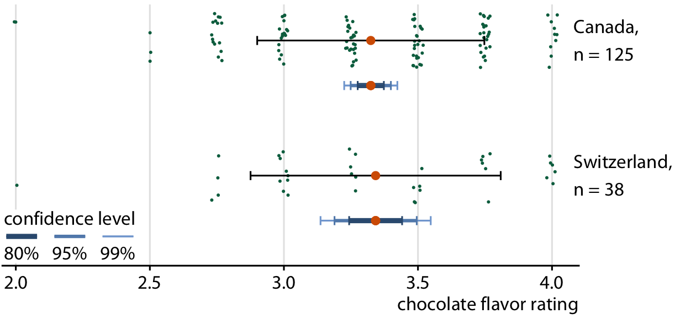

(\#fig:cocoa-CI-vs-n)(ref:cocoa-CI-vs-n)

In Figure \@ref(fig:cocoa-CI-vs-n), I am showing three different confidence intervals at the same time, using darker colors and thicker lines for the intervals representing lower confidence levels. I refer to these visualizations as *graded error bars*. The grading helps the reader perceive that there is a range of different possibilities. If I showed simple  error bars (without grading) to a group of people, chances are at least some of them would perceive the error bars deterministically, for example as representing minimum and maximum of the data. Alternatively, they might think the error bars delineate the range of possible parameter estimates, i.e., the estimate could never fall outside the error bars. These types of misperception are called *deterministic construal errors.* The more we can minimize the risk of deterministic construal error, the better our visualization of uncertainty.

Error bars are convenient because they allow us to show many estimates with their uncertainties all at once. Therefore, they are commonly used in scientific publications, where the primary goal is usually to convey a large amount of information to an expert audience. As an example of this type of application, Figure \@ref(fig:mean-chocolate-ratings) shows mean chocolate ratings and associated confidence intervals for chocolate bars manufactured in six different countries.

(ref:mean-chocolate-ratings) Mean chocolate flavor ratings and associated confidence intervals for chocolate bars from manufacturers in six different countries. Data source: Brady Brelinski, Manhattan Chocolate Society

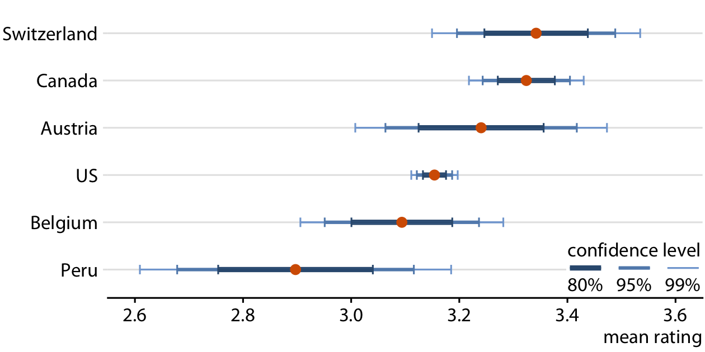

(\#fig:mean-chocolate-ratings)(ref:mean-chocolate-ratings)

When looking at Figure \@ref(fig:mean-chocolate-ratings), you may wonder what it tells us about the differences in mean ratings. The mean ratings of Canadian, Swiss, and Austrian bars are higher than the mean rating of U.S. bars, but given the uncertainty in these mean ratings, are the differences in means *significant*? The word "significant" here is a technical term used by statisticians. We call a difference significant if with some level of confidence we can reject the assumption that the observed difference was caused by random sampling. Since only a finite number of Canadian and U.S. bars was rated, the raters could have accidentally considered more of the better Canadian bars and fewer of the better U.S. bars, and this random chance might look like a systematic rating advantage of Canadian over U.S. bars.

Assessing significance from Figure \@ref(fig:mean-chocolate-ratings) is difficult, because both the mean Canadian rating and the mean U.S. rating have uncertainty. Both uncertainties matter to the question whether the means are different. Statistics textbooks and online tutorials sometimes publish rules of thumb of how to judge significance from the extent to which error bars do or don't overlap. However, these rules of thumb are not reliable and should be avoided. The correct way to assess whether there are differences in mean rating is to calculate confidence intervals for the differences. If those confidence intervals exclude zero, then we know the difference is significant at the respective confidence level. For the chocolate ratings dataset, we see that only bars from Canada are significantly higher rated than bars from the U.S. (Figure \@ref(fig:chocolate-ratings-contrasts)). For bars from Switzerland, the 95% confidence interval on the difference just barely includes the value zero. Thus, there is a slightly bigger than 5% chance that the observed difference between mean ratings of U.S. and Swiss chocolate bars represents nothing more than sampling variation. Finally,  there is no evidence at all that Austrian bars have systematically higher mean ratings that U.S. bars.

(ref:chocolate-ratings-contrasts) Mean chocolate flavor ratings for manufacturers from five different countries, relative to the mean rating of U.S. chocolate bars. Canadian chocolate bars are significantly higher rated that U.S. bars. For the other four countries there is no significant difference in mean rating to the U.S. at the 95% confidence level. Confidence levels have been adjusted for multiple comparisons using Dunnett's method. Data source: Brady Brelinski, Manhattan Chocolate Society

(\#fig:chocolate-ratings-contrasts)(ref:chocolate-ratings-contrasts)

In the preceding figures, I have used two different types of error bars, graded and simple. More variations are possible. For example, we can draw error bars with or without a cap at the end (Figure \@ref(fig:confidence-visualizations)a, c versus Figure \@ref(fig:confidence-visualizations)b, d). There are advantages and disadvantages to all these choices. Graded error bars highlight the existence of different ranges corresponding to different confidence levels. However, the flip side of this additional information is added visual noise. Depending on how complex and information-dense a figure is otherwise, simple error bars may be preferable to graded ones. Whether to draw error bars with or without cap is primarily a question of personal taste. A cap highlights where exactly an error bar ends (Figure \@ref(fig:confidence-visualizations)a, c), whereas an error bar without cap puts equal emphasis on the entire range of the interval (Figure \@ref(fig:confidence-visualizations)b, d). Also, again, caps add visual noise, so in a figure with many error bars omitting caps may be preferable.

(ref:confidence-visualizations) Mean chocolate flavor ratings for manufacturers from four different countries, relative to the mean rating of U.S. chocolate bars. Each panel uses a different approach to visualizing the same uncertainty information. (a) Graded error bars with cap. (b) Graded error bars without cap. (c) Single-interval error bars with cap. (d) Single-interval error bars without cap. (e) Confidence strips. (f) Confidence distributions.

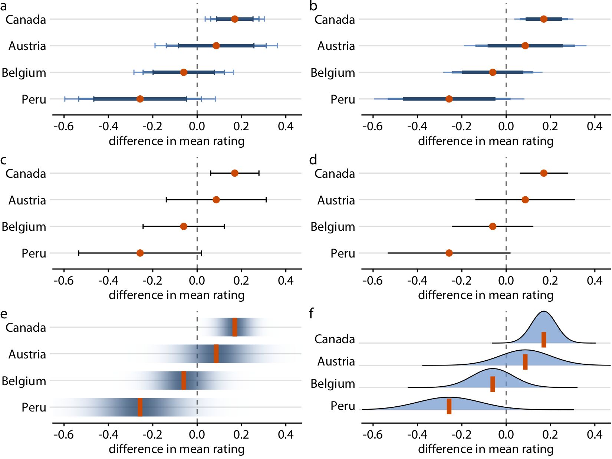

(\#fig:confidence-visualizations)(ref:confidence-visualizations)

As an alternative to error bars we could draw confidence strips that gradually fade into nothing (Figure \@ref(fig:confidence-visualizations)e). Confidence strips better convey how probable different values are, but they are difficult to read. We would have to visually integrate the different shadings of color to determine where a specific confidence level ends. From Figure \@ref(fig:confidence-visualizations)e we might conclude that the mean rating for Peruvian chocolate bars is significantly lower than that of U.S. chocolate bars, and yet this is not the case. Similar problems arise when we show explicit confidence distributions (Figure \@ref(fig:confidence-visualizations)f). It is difficult to visually integrate the area under the curve and to determine where exactly a given confidence level is reached. This issue can be somewhat alleviated, however, by drawing quantile dotplots as in Figure \@ref(fig:election-quantile-dot).

For simple 2D figures, error bars have one important advantage over more complex displays of uncertainty: They can be combined with many other types of plots. For nearly any visualization we may have, we can add some indication of uncertainty by adding error bars. For example, we can show amounts with uncertainty by drawing a bar plot with error bars (Figure \@ref(fig:butterfat-bars)). This type of visualization is commonly used in scientific publications. We can also draw error bars along both the *x* and the *y* direction in a scatter plot (Figure \@ref(fig:median-age-income)). 

(ref:butterfat-bars) Mean butterfat contents in the milk of four cattle breeds. Error bars indicate +/- one standard error of the mean. Visualizations of this type are frequently seen in the scientific literature. While they are technically correct, they represent neither the variation within each category nor the uncertainty of the sample means particularly well. See Figure \@ref(fig:butterfat-densitites) for the variation in butterfat contents within individual breeds. Data Source: Canadian Record of Performance for Purebred Dairy Cattle

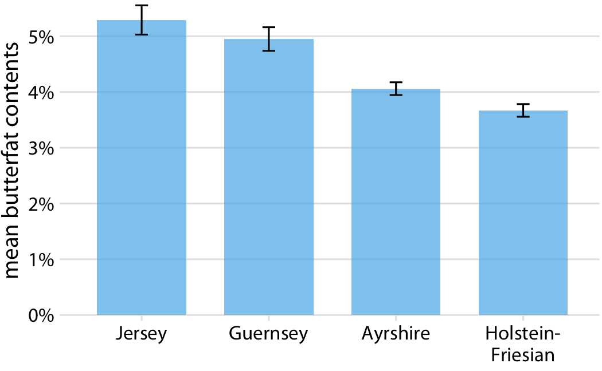

(\#fig:butterfat-bars)(ref:butterfat-bars)

(ref:median-age-income) Median income versus median age for 67 counties in Pennsylvania. Error bars represent 90% confidence intervals. Data source: 2015 Five-Year American Community Survey

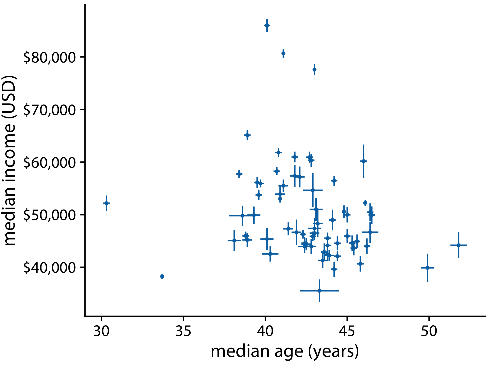

(\#fig:median-age-income)(ref:median-age-income)

Let's return to the topic of frequentists and Bayesians. Frequentists assess uncertainty with confidence intervals, whereas Bayesians calculate *posterior distributions* and *credible intervals.* The Bayesian posterior distribution tells us how likely specific parameter estimates are given the input data. The credible interval indicates a range of values in which the parameter value is expected with a given probability, as calculated from the posterior distribution. For example, a 95% credible interval corresponds to the center 95% of the posterior distribution. The true parameter value has a 95% chance of lying in the 95% credible interval.

If you are not a statistician you may be surprised by my definition of a credible interval. You may have thought that it was actually the definition of a confidence interval. It is not. A Bayesian credible interval tells you about where the true parameter likely is and a frequentist confidence interval tells you about where the true parameter likely not is. While this distinction may seem like semantics, there are important conceptual differences between the two approaches. Under the Bayesian approach, you use the data and your prior knowledge about the system under study (called the *prior*) to calculate a probability distribution (the posterior) that tells you where you can expect the true parameter value to lie. By contrast, under the frequentist approach, you first make an assumption that you intend to disprove. This assumption is called the *null hypothesis*, and it is often simply the assumption that the parameter equals zero (e.g., there is no difference between two conditions). You then calculate the probability that random sampling would generate data similar to what was observed if the null hypothesis were true. The confidence interval is a representation of this probability. If a given confidence interval excludes the parameter value under the null hypothesis (i.e., the value zero), then you can reject the null hypothesis at that confidence level. Alternatively, you can think of a confidence interval as an interval that captures the true parameter value with the specified likelihood under repeated sampling (Figure \@ref(fig:ci-frequentist-expl)). Thus, if the true parameter value were zero, a 95% confidence interval would only exclude zero in 5% of the samples analyzed.

(ref:ci-frequentist-expl) Frequency interpretation of a confidence interval. Confidence intervals (CIs) are best understood in the context of repeated sampling. For each sample, a specific confidence interval either includes or excludes the true parameter, here the mean. However, if we sample repeatedly, then the confidence intervals (shown here are 68% confidence intervals, corresponding to sample mean +/- standard error) include the true mean approximately 68% of the time.

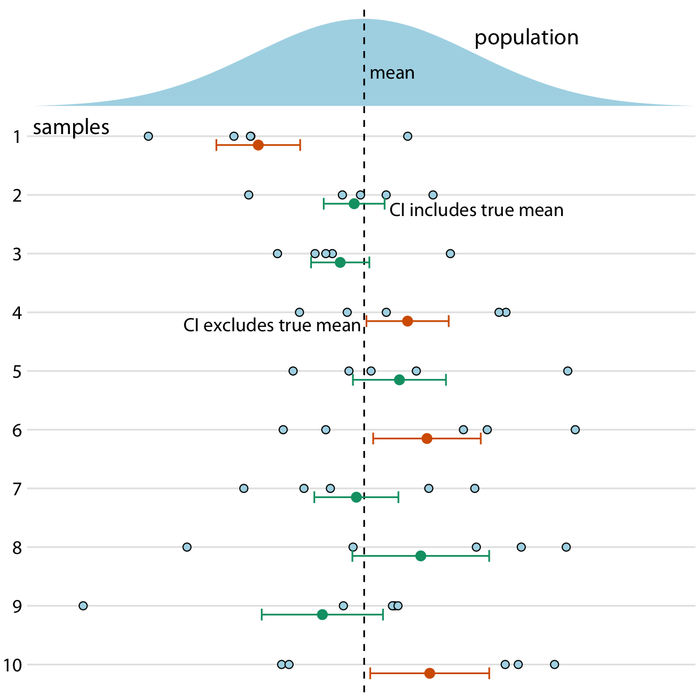

(\#fig:ci-frequentist-expl)(ref:ci-frequentist-expl)

To summarize, a Bayesian credible interval makes a statement about the true parameter value and a frequentist confidence interval makes a statement about the null hypothesis. In practice, however, Bayesian and frequentist estimates are often quite similar (Figure \@ref(fig:bayes-vs-ols)). Once conceptual advantage of the Bayesian approach is that it emphasizes thinking about the magnitude of an effect, whereas the frequentist thinking emphasizes a binary perspective of an effect either existing or not. 

(ref:bayes-vs-ols) Comparison of frequentist confidence intervals and Bayesian credible intervals for mean chocolate ratings. We see that both approaches yield similar but not exactly identical results. In particular, the Bayesian estimates display a small amount of shrinkage, which is an adjustment of the most extreme parameter estimates towards the overall mean. (Note how the Bayesian estimate for Switzerland is slightly moved to the left and the Bayesian estimate for Peru is slightly moved to the right relative to the respective frequentist estimates.) The frequentist estimates and confidence intervals shown here are identical to the results for 95% confidence shown in Figure \@ref(fig:mean-chocolate-ratings). 

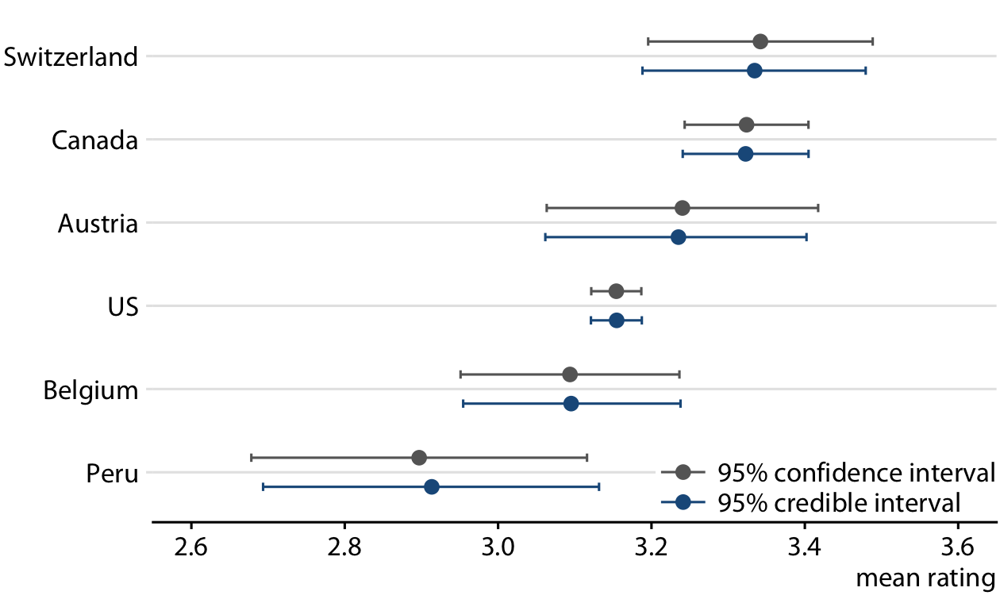

(\#fig:bayes-vs-ols)(ref:bayes-vs-ols)

A Bayesian credible interval answers the question: &quot;Where do we expect the true parameter value to lie?&quot; A frequentist confidence interval answers the question: &quot;How certain are we that the true parameter value is not zero?&quot;

The central goal of Bayesian estimation is to obtain the posterior distribution. Therefore, Bayesians commonly visualize the entire distribution rather than simplifying it into a credible interval. In terms of data visualization, therefore, all the approaches to visualizing distributions discussed in Chapters \@ref(histograms-density-plots), \@ref(ecdf-qq), and \@ref(boxplots-violins) are applicable. Specifically, histograms, density plots, boxplots, violins, and ridgeline plots are all commonly used to visualize Bayesian posterior distributions. Since these approaches have been discussed at length in their specific chapters, I will here show only one example, using a ridgeline plot to show Bayesian posterior distributions of mean chocolate ratings (Figure \@ref(fig:bayes-ridgeline)). In this specific case, I have added shading under the curve to indicate defined regions of posterior probabilities. As alternative to shading, I could also have drawn quantile dotplots, or I could have added graded error bars underneath each distribution. Ridgeline plots with error bars underneath are called half eyes, and violin plots with error bars are called eye plots (Chapter \@ref(directory-uncertainty)).

(ref:bayes-ridgeline) Bayesian posterior distributions of mean chocolate bar ratings, shown as a ridgeline plot. The red dots represent the medians of each posterior distribution. Because it is difficult to convert a continuous distribution into specific confidence regions by eye, I have added shading under each curve to indicate the center 80%, 95%, and 99% of each posterior distribution.

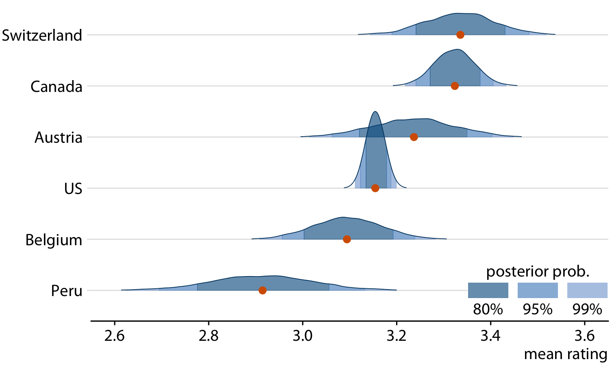

(\#fig:bayes-ridgeline)(ref:bayes-ridgeline)

## Visualizing the uncertainty of curve fits {#uncertainty-curve-fits}

In Chapter \@ref(visualizing-trends), we discussed how to show a trend in a dataset by fitting a straight line or curve to the data. These trend estimates also have uncertainty, and it is customary to show the uncertainty in a trend line with a confidence band (Figure \@ref(fig:blue-jays-male-conf-band)). The confidence band provides us with a range of different fit lines that would be compatible with the data. When students encounter a confidence band for the first time, they are often surprised that even a perfectly straight line fit produces a confidence band that is curved. The reason for the curvature is that the straight line fit can move in two distinct directions: it can move up and down (i.e., have different interepts), and it can rotate (i.e., have different slopes). We can visually show how the confidence band arises by drawing a set of alternative fit lines randomly generated from the posterior distribution of the fit parameters. This is done in Figure \@ref(fig:blue-jays-male-fitted-draws), which shows 15 randomly chosen alternative fits. We see that even though each line is perfectly straight, the combination of different slopes and intercepts of each line generates an overall shape that looks just like the confidence band.

(ref:blue-jays-male-conf-band) Head length versus body mass for male blue jays, as in Figure \@ref(fig:blue-jays-scatter-line). The straight blue line represents the best linear fit to the data, and the gray band around the line shows the uncertainty in the linear fit. The gray band represents a 95% confidence level. Data source: Keith Tarvin, Oberlin College

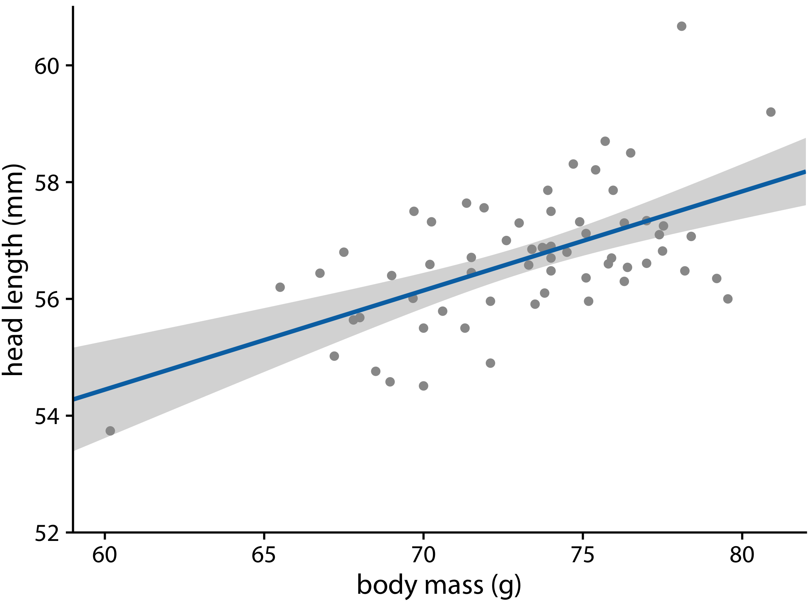

(\#fig:blue-jays-male-conf-band)(ref:blue-jays-male-conf-band)

(ref:blue-jays-male-fitted-draws) Head length versus body mass for male blue jays. In contrast to Figure  \@ref(fig:blue-jays-male-conf-band), the straight blue lines now represent equally likely alternative fits randomly drawn from the posterior distribution. Data source: Keith Tarvin, Oberlin College

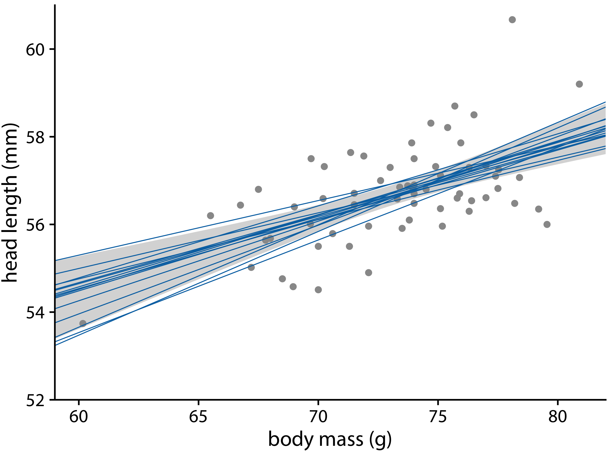

(\#fig:blue-jays-male-fitted-draws)(ref:blue-jays-male-fitted-draws)

To draw a confidence band, we need to specify a confidence level, and just as we saw for error bars and posterior probabilities, it can be useful to highlight different levels of confidence. This leads us to the graded confidence band, which shows several confidence levels at once (Figure \@ref(fig:blue-jays-male-graded-conf-band)). A graded confidence band enhances the sense of uncertainty in the reader, and it forces the reader to confront the possibility that the data might support different alternative trend lines.

(ref:blue-jays-male-graded-conf-band) Head length versus body mass for male blue jays. As in the case of error bars, we can draw graded confidence bands to highlight the uncertainty in the estimate. Data source: Keith Tarvin, Oberlin College

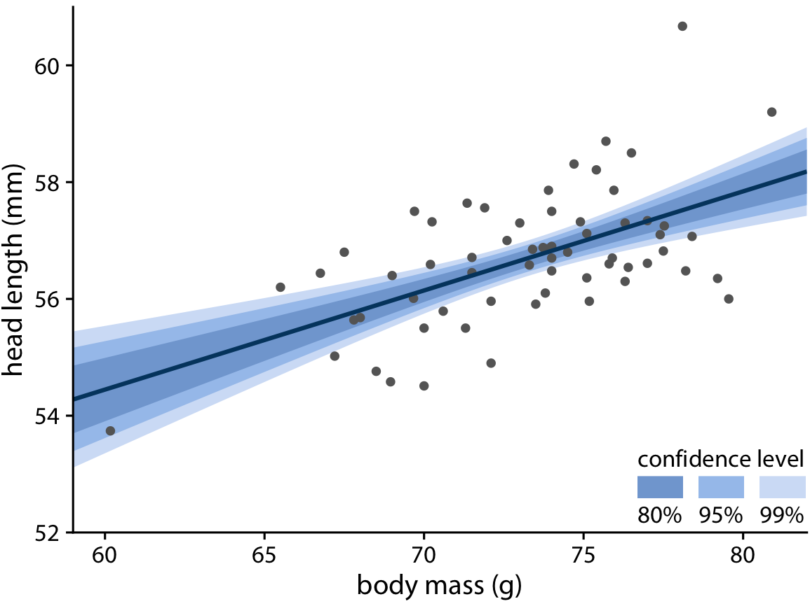

(\#fig:blue-jays-male-graded-conf-band)(ref:blue-jays-male-graded-conf-band)

We can also draw confidence bands for non-linear curve fits. Such confidence bands look nice but can be difficult to interpret (Figure \@ref(fig:mpg-uncertain)). If we look at Figure \@ref(fig:mpg-uncertain)a, we may think that the confidence band arises by moving the blue line up and down and maybe deforming it slightly. However, as Figure \@ref(fig:mpg-uncertain)b reveals, the confidence band represents a family of curves that are all quite a bit more wiggly than the overall best fit shown in part (a). This is a general principle of non-linear curve fits. Uncertainty corresponds not just to a movement of the curve up and down but also to increased wiggliness. 

(ref:mpg-uncertain) Fuel efficiency versus displacement, for 32 cars (1973–74 models). Each dot represents one car, and the smooth lines were obtained by fitting a cubic regression spline with 5 knots. (a) Best fit spline and confidence band. (b) Equally likely alternative fits drawn from the posterior distribution. Data source: Motor Trend, 1974.

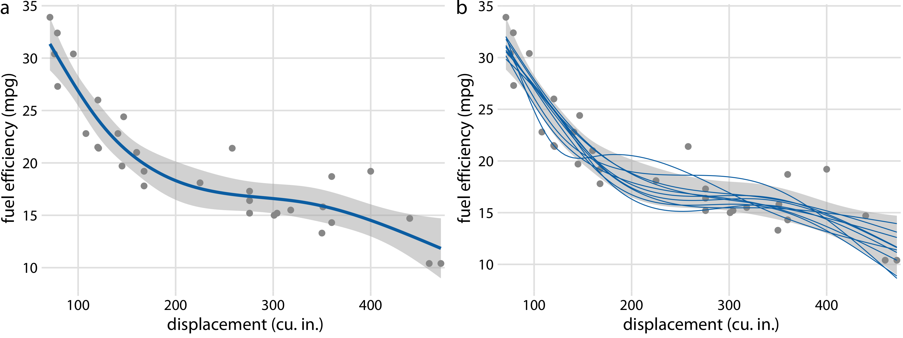

(\#fig:mpg-uncertain)(ref:mpg-uncertain)

## Hypothetical outcome plots

All static visualizations of uncertainty suffer from the problem that viewers may interpret some aspect of the uncertainty visualization as a deterministic feature of the data (deterministic construal error). We can avoid this problem by visualizing uncertainty through animation, by cycling through a number of different but equally likely plots. This kind of a visualization is called a hypothetical outcome plot [@Hullman_et_al_2015] or HOP. While HOPs are not possible in a print medium, they can be very effective in online settings where animated visualizations can be provided in the form of GIFs or MP4 videos. HOPs can also work well in the context of an oral presentation.

To illustrate the concept of a HOP, let's go back once more to chocolate bar ratings. When you are standing in the grocery store thinking about buying some chocolate, you probably don't care about the mean flavor rating and associated uncertainty for certain groups of chocolate bars. Instead, you might want to know the answer to a simpler question, such as: If I randomly pick up a Canadian and a U.S. manufactured chocolate bar, which one of the two should I expect to taste better? To arrive at  an answer to this question, we could randomly select a Canadian and a U.S. bar from the dataset, compare their ratings, record the outcome, and then repeat this process many times. If we did this, we would find that in approximately 53% of the cases the Canadian bar will be ranked higher, and in 47% of the cases either the U.S. bar is ranked higher or the two bars are tied. We can show this process visually by cycling between several of these random draws and showing the relative ranking of the two bars for each draw (Figure \@ref(fig:chocolate-HOP-static)/Figure \@ref(fig:chocolate-HOP-animated)).

(ref:chocolate-HOP-static) (for print edition) Schematic of a hypothetical outcome plot for chocolate bar ratings of Canadian and U.S. manufactured bars. Each vertical green bar represents the rating for one bar, and each panel shows a comparison of two randomly chosen bars, one each from a Canadian manufacturer and a U.S. manufacturer. In an actual hypothetical outcome plot, the display would cycle between the distinct plot panels instead of showing them side-by-side.

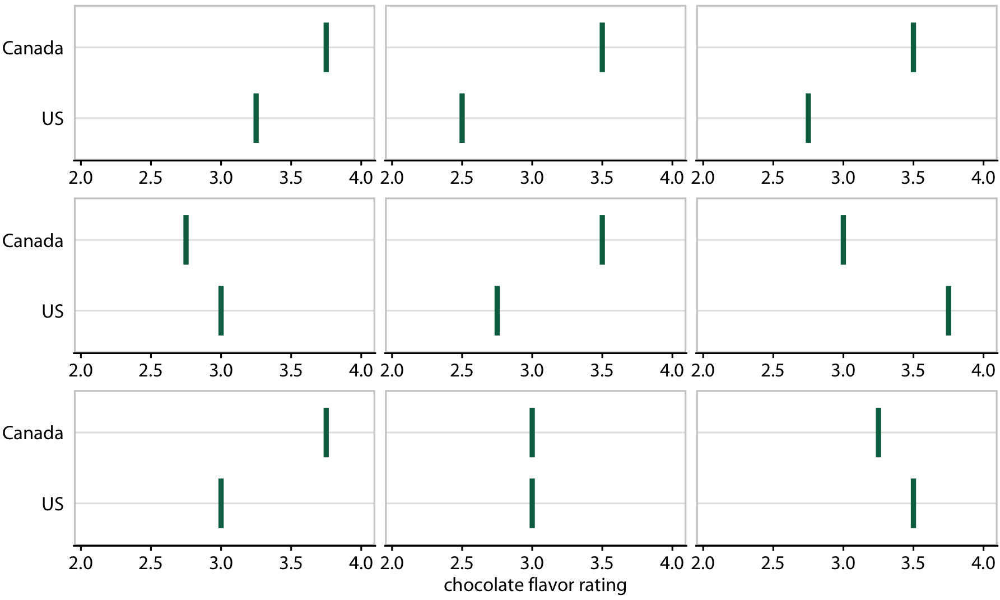

(\#fig:chocolate-HOP-static)(ref:chocolate-HOP-static)

(ref:chocolate-HOP-animated) (for online edition) Hypothetical outcome plot for chocolate bar ratings of Canadian and U.S. manufactured bars. Each vertical green bar represents the rating for one bar. The animation cycles through different cases of two randomly chosen bars, one each from a Canadian manufacturer and a U.S. manufacturer.

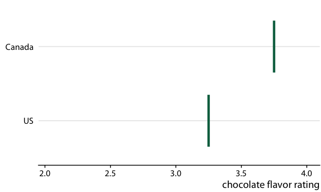

(\#fig:chocolate-HOP-animated)(ref:chocolate-HOP-animated)

As a second example, consider the variation in shapes among equally probable trendlines in Figure \@ref(fig:mpg-uncertain)b. Because all trendlines are plotted on top of one another, we primarily perceive the overall area that is covered by trendlines, which is similar to the confidence band. Perceiving individual trendlines is difficult. By turning this figure into a HOP, we can highlight individual trendlines one at a time (Figure \@ref(fig:mpg-uncertain-HOP-static)/Figure \@ref(fig:mpg-uncertain-HOP-animated)).

(ref:mpg-uncertain-HOP-static) (for print edition) Schematic of a hypothetical outcome plot for fuel efficiency versus displacement. Each dot represents one car, and the smooth lines were obtained by fitting a cubic regression spline with 5 knots. Each line in each panel represents one alternative fit outcome, drawn from the posterior distribution of the fit parameters. In an actual hypothetical outcome plot, the display would cycle between the distinct plot panels instead of showing them side-by-side.

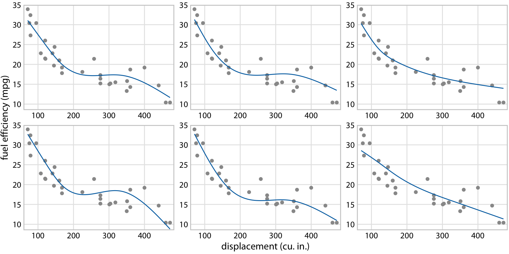

(\#fig:mpg-uncertain-HOP-static)(ref:mpg-uncertain-HOP-static)

(ref:mpg-uncertain-HOP-animated) (for online edition) Hypothetical outcome plot for fuel efficiency versus displacement. Each dot represents one car, and the smooth lines were obtained by fitting a cubic regression spline with 5 knots. The animation cycles through different alternative fit outcomes drawn from the posterior distribution of the fit parameters.

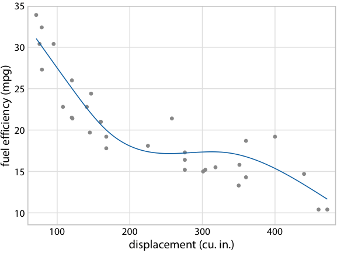

(\#fig:mpg-uncertain-HOP-animated)(ref:mpg-uncertain-HOP-animated)

When preparing a HOP, you may wonder whether it is better to make a hard switch between different outcomes (as in a slide projector) or rather smoothly animate from one outcome to the next (e.g., slowly deform the trendline for one outcome until it looks like the trendline for another outcome). While this is to some extent an open question that continues to be researched, some evidence indicates that smooth transitions make it harder to judge about the probabilities represented [@Kale_et_al_2018]. If you consider animating between outcomes, you may want to at least make these animations very fast, or choose an animation style where outcomes fade in and out rather than deform from one to the other. 

There is one critical aspect we need to pay attention to when preparing a HOP: We need to make sure that the outcomes we do show are representative of the true distribution of possible outcomes. Otherwise, our HOP could be rather misleading. For example, going back to the case of chocolate ratings, if I randomly selected ten outcome pairs of chocolate bars and among those the U.S. bar was rated higher than the Canadian bar in seven cases, then the HOP would erroneously create the impression that U.S. bars tend to be higher rated than Canadian bars. We can prevent this issue either by choosing a very large number of outcomes, so sampling biases are unlikely, or by verifying in some form that the outcomes that are shown are appropriate. When making Figure \@ref(fig:chocolate-HOP-static)/Figure \@ref(fig:chocolate-HOP-animated), I verified that the number of times the Canadian bar was shown winning was close to the true percentage of 53%.
