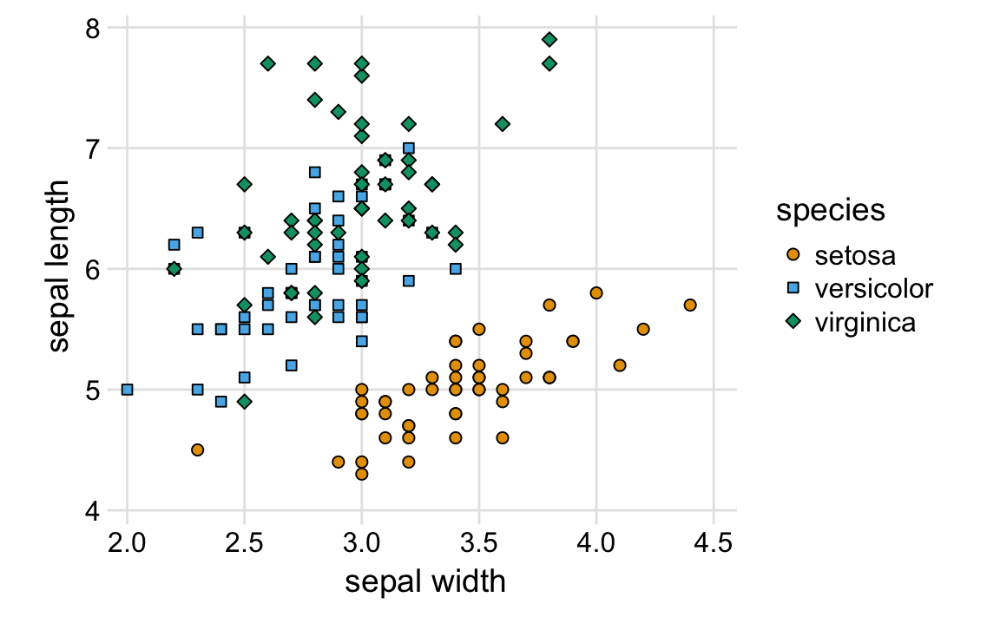

# Background grids {#background-grids}


With the rising popularity of the R package ggplot2, which uses a gray background grid as default, graphs with this style have become widespread. With apologies to ggplot2 author Hadley Wickham, for whom I have the utmost respect, I don't find this style particularly attractive. In general, I find that the gray background detracts from the actual data. As an example, consider Figure \@ref(fig:price-plot-ggplot-default), which shows the stock price of four major tech companies, indexed to their value in June 2012. The grid is too busy, and the gray background in the legend is distracting.

(ref:price-plot-ggplot-default) Stock price over time for four major tech companies. The stock price for each company has been normalized to equal 100 in June 2012. 

<div class="figure" style="text-align: center">

<p class="caption">(\#fig:price-plot-ggplot-default)(ref:price-plot-ggplot-default)</p>
</div>


We could try to remove the grid altogether, but I think that is a worse option (Figure \@ref(fig:price-plot-no-grid)). Now the curves seem to just float in space, and it's difficult to see where they go. In addition, since all prices are indexed to 100 in June 2012, at a minimum this value should be marked in the plot. Thus, one option would be to add a thin horizontal line at *y* = 100 (Figure \@ref(fig:price-plot-refline)).

(ref:price-plot-no-grid) Indexed stock price over time for four major tech companies.

<div class="figure" style="text-align: center">

<p class="caption">(\#fig:price-plot-no-grid)(ref:price-plot-no-grid)</p>
</div>

(ref:price-plot-refline) Indexed stock price over time for four major tech companies.

<div class="figure" style="text-align: center">

<p class="caption">(\#fig:price-plot-refline)(ref:price-plot-refline)</p>
</div>

Alternatively, we can use just a minimal grid. In particular, for a plot where we are primarily interested in the change in *y* values, vertical grid lines are not needed. Moreover, grid lines positioned at only the major axis ticks will often be sufficient. And, the axis line can be omitted or made very thin (Figure \@ref(fig:price-plot-hgrid)).

(ref:price-plot-hgrid) Indexed stock price over time for four major tech companies.

<div class="figure" style="text-align: center">

<p class="caption">(\#fig:price-plot-hgrid)(ref:price-plot-hgrid)</p>
</div>

For such a minimal grid, we generally draw the lines orthogonally to direction along which the numbers of interest vary. Therefore, if instead of plotting the stock price over time we plot the five-year increase, as horizontal bars, then we will want to use vertical lines instead (Figure \@ref(fig:price-increase)).

(ref:price-increase) Percent increase in stock price from June 2012 to June 2017, for four major tech companies.

<div class="figure" style="text-align: center">

<p class="caption">(\#fig:price-increase)(ref:price-increase)</p>
</div>


<div class="rmdtip">
<p>Grid lines that run perpendicular to the key variable of interest tend to be the most useful.</p>
</div>


Background grids along both axis directions can make sense, however, for scatter plots where there is no primary axis of interest. This presentation frequently looks best without axis lines. Figure \@ref(fig:iris-scatter) provides an example.

(ref:iris-scatter) Sepal length vs sepal width for 50 samples each from three different species of irises.

<div class="figure" style="text-align: center">

<p class="caption">(\#fig:iris-scatter)(ref:iris-scatter)</p>
</div>

For figures where the relevant comparison is the *x* = *y* line, I prefer to draw a diagonal line rather than a grid. For example, consider Figure \@ref(fig:echave-et-al), which compares two sets of correlations for 209 protein structures. By drawing the diagonal line, we can see immediately which correlations are systematically stronger. The same observation is much harder to make when the figure has a background grid instead (Figure \@ref(fig:echave-et-al-grid)). Thus, even though Figure \@ref(fig:echave-et-al-grid) looks pleasing, I label it as bad.

(ref:echave-et-al) Correlations between evolutionary conservation and structural features of sites in 209 proteins. Along the *y* axis, we plot the correlation between evolutonary conservation (measured as evolutionary rate) at individual sites in a protein and the relative solvent accessibility (RSA) of those sites in the protein structure. Along the *x* axis, we plot the correlation between rate and weighted contact number (WCN), a measure for the density of contacts of a site in the protein structure. Each point represents one protein. We see that evolutionary conservation and structural features are highly correlated in some proteins and not very much in others. We also see that WCN, on average, yields somewhat stronger correlations than RSA does. Adapted from @Echave-et-al-2016.

<div class="figure" style="text-align: center">

<p class="caption">(\#fig:echave-et-al)(ref:echave-et-al)</p>
</div>


(ref:echave-et-al-grid) Correlations between evolutionary conservation and structural features of sites in 209 proteins. By plotting this dataset against a background grid, the systematic shift of all points away from the *x* = *y* line is obscured.


```
## List of 58
##  $ line                 :List of 6
##   ..$ colour       : chr "black"
##   ..$ size         : num 0.636
##   ..$ linetype     : num 1
##   ..$ lineend      : chr "butt"
##   ..$ arrow        : logi FALSE
##   ..$ inherit.blank: logi TRUE
##   ..- attr(*, "class")= chr [1:2] "element_line" "element"
##  $ rect                 :List of 5
##   ..$ fill         : chr "transparent"
##   ..$ colour       : logi NA
##   ..$ size         : num 0
##   ..$ linetype     : num 0
##   ..$ inherit.blank: logi TRUE
##   ..- attr(*, "class")= chr [1:2] "element_rect" "element"
##  $ text                 :List of 11
##   ..$ family       : chr ""
##   ..$ face         : chr "plain"
##   ..$ colour       : chr "black"
##   ..$ size         : num 14
##   ..$ hjust        : num 0.5
##   ..$ vjust        : num 0.5
##   ..$ angle        : num 0
##   ..$ lineheight   : num 0.9
##   ..$ margin       :Classes 'margin', 'unit'  atomic [1:4] 0 0 0 0
##   .. .. ..- attr(*, "valid.unit")= int 8
##   .. .. ..- attr(*, "unit")= chr "pt"
##   ..$ debug        : logi FALSE
##   ..$ inherit.blank: logi TRUE
##   ..- attr(*, "class")= chr [1:2] "element_text" "element"
##  $ axis.title.x         :List of 11
##   ..$ family       : NULL
##   ..$ face         : NULL
##   ..$ colour       : NULL
##   ..$ size         : NULL
##   ..$ hjust        : NULL
##   ..$ vjust        : NULL
##   ..$ angle        : NULL
##   ..$ lineheight   : NULL
##   ..$ margin       :Classes 'margin', 'unit'  atomic [1:4] 6 0 3 0
##   .. .. ..- attr(*, "valid.unit")= int 8
##   .. .. ..- attr(*, "unit")= chr "pt"
##   ..$ debug        : NULL
##   ..$ inherit.blank: logi TRUE
##   ..- attr(*, "class")= chr [1:2] "element_text" "element"
##  $ axis.title.x.top     :List of 11
##   ..$ family       : NULL
##   ..$ face         : NULL
##   ..$ colour       : NULL
##   ..$ size         : NULL
##   ..$ hjust        : NULL
##   ..$ vjust        : num 0
##   ..$ angle        : NULL
##   ..$ lineheight   : NULL
##   ..$ margin       :Classes 'margin', 'unit'  atomic [1:4] 0 0 7 0
##   .. .. ..- attr(*, "valid.unit")= int 8
##   .. .. ..- attr(*, "unit")= chr "pt"
##   ..$ debug        : NULL
##   ..$ inherit.blank: logi TRUE
##   ..- attr(*, "class")= chr [1:2] "element_text" "element"
##  $ axis.title.y         :List of 11
##   ..$ family       : NULL
##   ..$ face         : NULL
##   ..$ colour       : NULL
##   ..$ size         : NULL
##   ..$ hjust        : NULL
##   ..$ vjust        : NULL
##   ..$ angle        : num 90
##   ..$ lineheight   : NULL
##   ..$ margin       :Classes 'margin', 'unit'  atomic [1:4] 0 6 0 3
##   .. .. ..- attr(*, "valid.unit")= int 8
##   .. .. ..- attr(*, "unit")= chr "pt"
##   ..$ debug        : NULL
##   ..$ inherit.blank: logi TRUE
##   ..- attr(*, "class")= chr [1:2] "element_text" "element"
##  $ axis.title.y.right   :List of 11
##   ..$ family       : NULL
##   ..$ face         : NULL
##   ..$ colour       : NULL
##   ..$ size         : NULL
##   ..$ hjust        : NULL
##   ..$ vjust        : num 0
##   ..$ angle        : num -90
##   ..$ lineheight   : NULL
##   ..$ margin       :Classes 'margin', 'unit'  atomic [1:4] 0 0 0 7
##   .. .. ..- attr(*, "valid.unit")= int 8
##   .. .. ..- attr(*, "unit")= chr "pt"
##   ..$ debug        : NULL
##   ..$ inherit.blank: logi TRUE
##   ..- attr(*, "class")= chr [1:2] "element_text" "element"
##  $ axis.text            :List of 11
##   ..$ family       : NULL
##   ..$ face         : NULL
##   ..$ colour       : chr "black"
##   ..$ size         : num 12
##   ..$ hjust        : NULL
##   ..$ vjust        : NULL
##   ..$ angle        : NULL
##   ..$ lineheight   : NULL
##   ..$ margin       : NULL
##   ..$ debug        : NULL
##   ..$ inherit.blank: logi TRUE
##   ..- attr(*, "class")= chr [1:2] "element_text" "element"
##  $ axis.text.x          :List of 11
##   ..$ family       : NULL
##   ..$ face         : NULL
##   ..$ colour       : NULL
##   ..$ size         : NULL
##   ..$ hjust        : NULL
##   ..$ vjust        : num 1
##   ..$ angle        : NULL
##   ..$ lineheight   : NULL
##   ..$ margin       :Classes 'margin', 'unit'  atomic [1:4] 3 0 0 0
##   .. .. ..- attr(*, "valid.unit")= int 8
##   .. .. ..- attr(*, "unit")= chr "pt"
##   ..$ debug        : NULL
##   ..$ inherit.blank: logi TRUE
##   ..- attr(*, "class")= chr [1:2] "element_text" "element"
##  $ axis.text.x.top      :List of 11
##   ..$ family       : NULL
##   ..$ face         : NULL
##   ..$ colour       : NULL
##   ..$ size         : NULL
##   ..$ hjust        : NULL
##   ..$ vjust        : num 0
##   ..$ angle        : NULL
##   ..$ lineheight   : NULL
##   ..$ margin       :Classes 'margin', 'unit'  atomic [1:4] 0 0 2.8 0
##   .. .. ..- attr(*, "valid.unit")= int 8
##   .. .. ..- attr(*, "unit")= chr "pt"
##   ..$ debug        : NULL
##   ..$ inherit.blank: logi TRUE
##   ..- attr(*, "class")= chr [1:2] "element_text" "element"
##  $ axis.text.y          :List of 11
##   ..$ family       : NULL
##   ..$ face         : NULL
##   ..$ colour       : NULL
##   ..$ size         : NULL
##   ..$ hjust        : num 1
##   ..$ vjust        : NULL
##   ..$ angle        : NULL
##   ..$ lineheight   : NULL
##   ..$ margin       :Classes 'margin', 'unit'  atomic [1:4] 0 3 0 0
##   .. .. ..- attr(*, "valid.unit")= int 8
##   .. .. ..- attr(*, "unit")= chr "pt"
##   ..$ debug        : NULL
##   ..$ inherit.blank: logi TRUE
##   ..- attr(*, "class")= chr [1:2] "element_text" "element"
##  $ axis.text.y.right    :List of 11
##   ..$ family       : NULL
##   ..$ face         : NULL
##   ..$ colour       : NULL
##   ..$ size         : NULL
##   ..$ hjust        : num 0
##   ..$ vjust        : NULL
##   ..$ angle        : NULL
##   ..$ lineheight   : NULL
##   ..$ margin       :Classes 'margin', 'unit'  atomic [1:4] 0 0 0 2.8
##   .. .. ..- attr(*, "valid.unit")= int 8
##   .. .. ..- attr(*, "unit")= chr "pt"
##   ..$ debug        : NULL
##   ..$ inherit.blank: logi TRUE
##   ..- attr(*, "class")= chr [1:2] "element_text" "element"
##  $ axis.ticks           :List of 6
##   ..$ colour       : chr "black"
##   ..$ size         : num 0.5
##   ..$ linetype     : NULL
##   ..$ lineend      : NULL
##   ..$ arrow        : logi FALSE
##   ..$ inherit.blank: logi TRUE
##   ..- attr(*, "class")= chr [1:2] "element_line" "element"
##  $ axis.ticks.length    :Class 'unit'  atomic [1:1] 3.5
##   .. ..- attr(*, "valid.unit")= int 8
##   .. ..- attr(*, "unit")= chr "pt"
##  $ axis.line            :List of 6
##   ..$ colour       : chr "black"
##   ..$ size         : num 0.5
##   ..$ linetype     : NULL
##   ..$ lineend      : chr "square"
##   ..$ arrow        : logi FALSE
##   ..$ inherit.blank: logi TRUE
##   ..- attr(*, "class")= chr [1:2] "element_line" "element"
##  $ axis.line.x          :List of 6
##   ..$ colour       : chr "black"
##   ..$ size         : num 0.5
##   ..$ linetype     : NULL
##   ..$ lineend      : chr "square"
##   ..$ arrow        : logi FALSE
##   ..$ inherit.blank: logi TRUE
##   ..- attr(*, "class")= chr [1:2] "element_line" "element"
##  $ axis.line.y          :List of 6
##   ..$ colour       : chr "black"
##   ..$ size         : num 0.5
##   ..$ linetype     : NULL
##   ..$ lineend      : chr "square"
##   ..$ arrow        : logi FALSE
##   ..$ inherit.blank: logi TRUE
##   ..- attr(*, "class")= chr [1:2] "element_line" "element"
##  $ legend.background    : list()
##   ..- attr(*, "class")= chr [1:2] "element_blank" "element"
##  $ legend.margin        :Classes 'margin', 'unit'  atomic [1:4] 0.2 0.2 0.2 0.2
##   .. ..- attr(*, "valid.unit")= int 1
##   .. ..- attr(*, "unit")= chr "cm"
##  $ legend.spacing       :Class 'unit'  atomic [1:1] 0.4
##   .. ..- attr(*, "valid.unit")= int 1
##   .. ..- attr(*, "unit")= chr "cm"
##  $ legend.spacing.x     : NULL
##  $ legend.spacing.y     : NULL
##  $ legend.key           : list()
##   ..- attr(*, "class")= chr [1:2] "element_blank" "element"
##  $ legend.key.size      :Class 'unit'  atomic [1:1] 1
##   .. ..- attr(*, "valid.unit")= int 3
##   .. ..- attr(*, "unit")= chr "lines"
##  $ legend.key.height    : NULL
##  $ legend.key.width     : NULL
##  $ legend.text          :List of 11
##   ..$ family       : NULL
##   ..$ face         : NULL
##   ..$ colour       : NULL
##   ..$ size         :Class 'rel'  num 0.857
##   ..$ hjust        : NULL
##   ..$ vjust        : NULL
##   ..$ angle        : NULL
##   ..$ lineheight   : NULL
##   ..$ margin       : NULL
##   ..$ debug        : NULL
##   ..$ inherit.blank: logi TRUE
##   ..- attr(*, "class")= chr [1:2] "element_text" "element"
##  $ legend.text.align    : NULL
##  $ legend.title         :List of 11
##   ..$ family       : NULL
##   ..$ face         : NULL
##   ..$ colour       : NULL
##   ..$ size         : NULL
##   ..$ hjust        : num 0
##   ..$ vjust        : NULL
##   ..$ angle        : NULL
##   ..$ lineheight   : NULL
##   ..$ margin       : NULL
##   ..$ debug        : NULL
##   ..$ inherit.blank: logi TRUE
##   ..- attr(*, "class")= chr [1:2] "element_text" "element"
##  $ legend.title.align   : NULL
##  $ legend.position      : chr "right"
##  $ legend.direction     : NULL
##  $ legend.justification : chr [1:2] "left" "center"
##  $ legend.box           : NULL
##  $ legend.box.margin    :Classes 'margin', 'unit'  atomic [1:4] 0 0 0 0
##   .. ..- attr(*, "valid.unit")= int 1
##   .. ..- attr(*, "unit")= chr "cm"
##  $ legend.box.background: list()
##   ..- attr(*, "class")= chr [1:2] "element_blank" "element"
##  $ legend.box.spacing   :Class 'unit'  atomic [1:1] 0.4
##   .. ..- attr(*, "valid.unit")= int 1
##   .. ..- attr(*, "unit")= chr "cm"
##  $ panel.background     : list()
##   ..- attr(*, "class")= chr [1:2] "element_blank" "element"
##  $ panel.border         : list()
##   ..- attr(*, "class")= chr [1:2] "element_blank" "element"
##  $ panel.spacing        :Class 'unit'  atomic [1:1] 7
##   .. ..- attr(*, "valid.unit")= int 8
##   .. ..- attr(*, "unit")= chr "pt"
##  $ panel.spacing.x      : NULL
##  $ panel.spacing.y      : NULL
##  $ panel.grid           :List of 6
##   ..$ colour       : chr "white"
##   ..$ size         : NULL
##   ..$ linetype     : NULL
##   ..$ lineend      : NULL
##   ..$ arrow        : logi FALSE
##   ..$ inherit.blank: logi TRUE
##   ..- attr(*, "class")= chr [1:2] "element_line" "element"
##  $ panel.grid.minor     :List of 6
##   ..$ colour       : chr "grey98"
##   ..$ size         : num 0.5
##   ..$ linetype     : NULL
##   ..$ lineend      : NULL
##   ..$ arrow        : logi FALSE
##   ..$ inherit.blank: logi FALSE
##   ..- attr(*, "class")= chr [1:2] "element_line" "element"
##  $ panel.ontop          : logi FALSE
##  $ plot.background      : list()
##   ..- attr(*, "class")= chr [1:2] "element_blank" "element"
##  $ plot.title           :List of 11
##   ..$ family       : NULL
##   ..$ face         : chr "bold"
##   ..$ colour       : NULL
##   ..$ size         : num 14
##   ..$ hjust        : NULL
##   ..$ vjust        : NULL
##   ..$ angle        : NULL
##   ..$ lineheight   : NULL
##   ..$ margin       :Classes 'margin', 'unit'  atomic [1:4] 0 0 7 0
##   .. .. ..- attr(*, "valid.unit")= int 8
##   .. .. ..- attr(*, "unit")= chr "pt"
##   ..$ debug        : NULL
##   ..$ inherit.blank: logi TRUE
##   ..- attr(*, "class")= chr [1:2] "element_text" "element"
##  $ plot.subtitle        :List of 11
##   ..$ family       : NULL
##   ..$ face         : NULL
##   ..$ colour       : NULL
##   ..$ size         :Class 'rel'  num 0.9
##   ..$ hjust        : num 0
##   ..$ vjust        : num 1
##   ..$ angle        : NULL
##   ..$ lineheight   : NULL
##   ..$ margin       :Classes 'margin', 'unit'  atomic [1:4] 0 0 6.3 0
##   .. .. ..- attr(*, "valid.unit")= int 8
##   .. .. ..- attr(*, "unit")= chr "pt"
##   ..$ debug        : NULL
##   ..$ inherit.blank: logi TRUE
##   ..- attr(*, "class")= chr [1:2] "element_text" "element"
##  $ plot.caption         :List of 11
##   ..$ family       : NULL
##   ..$ face         : NULL
##   ..$ colour       : NULL
##   ..$ size         :Class 'rel'  num 0.9
##   ..$ hjust        : num 1
##   ..$ vjust        : num 1
##   ..$ angle        : NULL
##   ..$ lineheight   : NULL
##   ..$ margin       :Classes 'margin', 'unit'  atomic [1:4] 6.3 0 0 0
##   .. .. ..- attr(*, "valid.unit")= int 8
##   .. .. ..- attr(*, "unit")= chr "pt"
##   ..$ debug        : NULL
##   ..$ inherit.blank: logi TRUE
##   ..- attr(*, "class")= chr [1:2] "element_text" "element"
##  $ plot.margin          :Classes 'margin', 'unit'  atomic [1:4] 7 7 7 7
##   .. ..- attr(*, "valid.unit")= int 8
##   .. ..- attr(*, "unit")= chr "pt"
##  $ strip.background     :List of 5
##   ..$ fill         : chr "grey80"
##   ..$ colour       : chr "grey50"
##   ..$ size         : num 0
##   ..$ linetype     : NULL
##   ..$ inherit.blank: logi TRUE
##   ..- attr(*, "class")= chr [1:2] "element_rect" "element"
##  $ strip.placement      : chr "inside"
##  $ strip.text           :List of 11
##   ..$ family       : NULL
##   ..$ face         : NULL
##   ..$ colour       : NULL
##   ..$ size         :Class 'rel'  num 0.857
##   ..$ hjust        : NULL
##   ..$ vjust        : NULL
##   ..$ angle        : NULL
##   ..$ lineheight   : NULL
##   ..$ margin       : NULL
##   ..$ debug        : NULL
##   ..$ inherit.blank: logi TRUE
##   ..- attr(*, "class")= chr [1:2] "element_text" "element"
##  $ strip.text.x         : NULL
##  $ strip.text.y         :List of 11
##   ..$ family       : NULL
##   ..$ face         : NULL
##   ..$ colour       : NULL
##   ..$ size         : NULL
##   ..$ hjust        : NULL
##   ..$ vjust        : NULL
##   ..$ angle        : num -90
##   ..$ lineheight   : NULL
##   ..$ margin       : NULL
##   ..$ debug        : NULL
##   ..$ inherit.blank: logi TRUE
##   ..- attr(*, "class")= chr [1:2] "element_text" "element"
##  $ strip.switch.pad.grid:Class 'unit'  atomic [1:1] 0.1
##   .. ..- attr(*, "valid.unit")= int 1
##   .. ..- attr(*, "unit")= chr "cm"
##  $ strip.switch.pad.wrap:Class 'unit'  atomic [1:1] 0.1
##   .. ..- attr(*, "valid.unit")= int 1
##   .. ..- attr(*, "unit")= chr "cm"
##  $ panel.grid.major     :List of 6
##   ..$ colour       : chr "grey90"
##   ..$ size         : num 0.5
##   ..$ linetype     : NULL
##   ..$ lineend      : NULL
##   ..$ arrow        : logi FALSE
##   ..$ inherit.blank: logi FALSE
##   ..- attr(*, "class")= chr [1:2] "element_line" "element"
##  - attr(*, "class")= chr [1:2] "theme" "gg"
##  - attr(*, "complete")= logi TRUE
##  - attr(*, "validate")= logi TRUE
```

<div class="figure" style="text-align: center">

<p class="caption">(\#fig:echave-et-al-grid)(ref:echave-et-al-grid)</p>
</div>


In summary, there is no simple choice of background grid that always works. I encourage you to think carefully about which specific grid or guidelines are most informative for the plot you are making, and to only show those. In general, less is more. Too many or overly thick and dark grid lines can distract your reader's attention away from the data you want to show.
