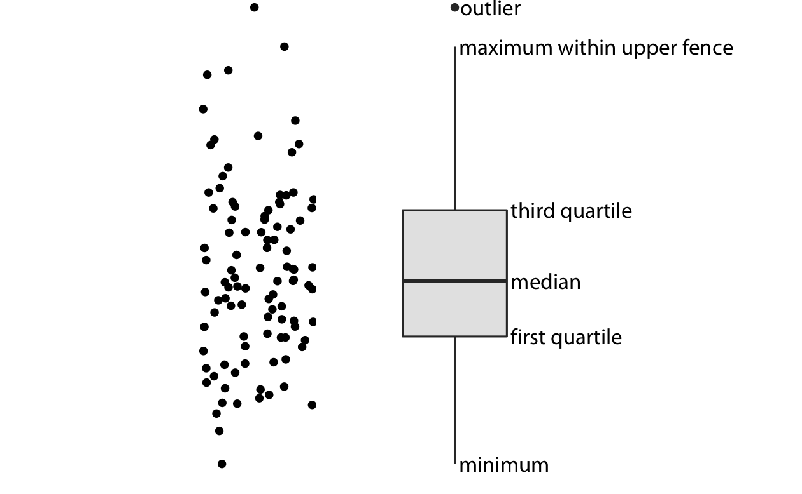
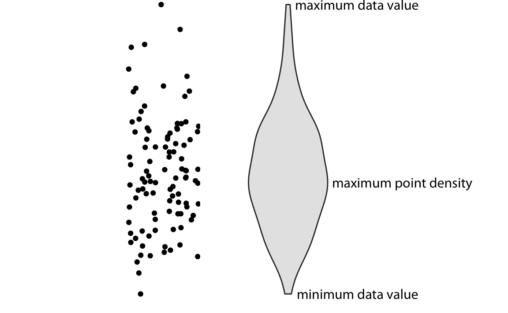

# Visualizing many distributions at once {#boxplots-violins}

There are many scenarios in which we want to visualize multiple distributions at the same time. For example, consider weather data. We may want to visualize how temperature varies across different months while also showing the distribution of observed temperatures within each month. This scenario requires showing twelve temperature distributions at once, one for each month. None of the visualizations discussed in Chapters \@ref(histograms-density-plots) or \@ref(ecdf-qq) work well in this case. Instead, viable approaches include boxplots, violin plots, and ridgeline plots.

Whenever we are dealing with many distributions, it is helpful to think in terms of the response variable and one or more grouping variables. The response variable is the variable whose distributions we want to show. The grouping variables define subsets of the data with distinct distributions of the response variable. For example, for temperature distributions across months, the response variable is the temperature and the grouping variable is the month. All techniques discussed in this chapter draw the response variable along one axis and the grouping variables along the other. In the following, I will first describe approaches that show the response variable along the vertical axis, and then I will describe approaches that show the response variable along the horizontal axis. In all cases discussed, we could flip the axes and arrive at an alternative and viable visualization. I am showing here the canonical forms of the various visualizations.

## Visualizing distributions along the vertical axis {#boxplots-violins-vertical}

The simplest approach to showing many distributions at once is to show their mean or median as points, with some indication of the variation around the mean or median shown by error bars. Figure \@ref(fig:lincoln-temp-points-errorbars) demonstrates this approach for the distributions of monthly temperatures in Lincoln, Nebraska, in 2016. I have labeled this figure as bad because there are multiple problems with this approach. First, by representing each distribution by only one point and two error bars, we are losing a lot of information about the data. Second, it is not immediately obvious what the points represent, even though most readers would likely guess that they represent either the mean or the median. Third, it is definitely not obvious what the error bars represent. Do they represent the standard deviation of the data, the standard error of the mean, a 95% confidence interval, or something else altogether? There is no commonly accepted standard. By reading the figure caption of Figure \@ref(fig:lincoln-temp-points-errorbars), we can see that they represent here twice the standard deviation of the daily mean temperatures, meant to indicate the range that contains approximately 95% of the data. However, error bars are more commonly employed to visualize the standard error (or twice the standard error for a 95% confidence interval), and it is easy for readers to confuse the standard error with the standard deviation. The standard error quantifies how accurate our estimate of the mean is, whereas the standard deviation estimates how much spread there is in the data around the mean. It is possible for a dataset to have both a very small standard error of the mean and a very large standard deviation. Fourth, symmetric error bars are misleading if there is any skew in the data, which is the case here and almost always for real-world datasets.

(ref:lincoln-temp-points-errorbars) Mean daily temperatures in Lincoln, Nebraska in 2016. Points represent the average daily mean temperatures for each month, averaged over all days of the month, and error bars represent twice the standard deviation of the daily mean temperatures within each month. This figure has been labeled as "bad" because because error bars are conventionally used to visualize the uncertainty of an estimate, not the variability in a population. Data source: Weather Underground

(\#fig:lincoln-temp-points-errorbars)(ref:lincoln-temp-points-errorbars)

We can address all four shortcomings of Figure \@ref(fig:lincoln-temp-points-errorbars) by using a traditional and commonly used method for visualizing distributions, the boxplot. A boxplot divides the data into quartiles and visualizes them in a standardized manner (Figure \@ref(fig:boxplot-schematic)).

(ref:boxplot-schematic) Anatomy of a boxplot. Shown are a cloud of points (left) and the corresponding boxplot (right). Only the *y* values of the points are visualized in the boxplot. The line in the middle of the boxplot represents the median, and the box encloses the middle 50% of the data. The top and bottom whiskers extend either to the maximum and minimum of the data or to the maximum or minimum that falls within 1.5 times the height of the box, whichever yields the shorter whisker. The distances of 1.5 times the height of the box in either direction are called the upper and the lower fences. Individual data points that fall beyond the fences are referred to as outliers and are usually showns as individual dots.

(\#fig:boxplot-schematic)(ref:boxplot-schematic)

Boxplots are simple yet informative, and they work well when plotted next to each other to visualize many distributions at once. For the Lincoln temperature data, using boxplots leads to Figure \@ref(fig:lincoln-temp-boxplots). In that figure, we can now see that temperature is highly skewed in December (most days are moderately cold and a few are extremely cold) and not very skewed at all in some other months, for example in July.

(ref:lincoln-temp-boxplots) Mean daily temperatures in Lincoln, Nebraska, visualized as boxplots.

(\#fig:lincoln-temp-boxplots)(ref:lincoln-temp-boxplots)

Boxplots were invented by the statistician John Tukey in the early 1970s, and they quickly gained popularity because they were highly informative while being easy to draw by hand. Most data visualizations were drawn by hand at that time. However, with modern computing and visualization capabilities, we are not limited to what is easily drawn by hand. Therefore, more recently, we see boxplots being replaced by violin plots, which are equivalent to the density estimates discussed in Chapter \@ref(histograms-density-plots) but rotated by 90 degrees and then mirrored (Figure \@ref(fig:violin-schematic)). Violins can be used whenever one would otherwise use a boxplot, and they provide a much more nuanced picture of the data. In particular, violin plots will accurately represent bimodal data whereas a boxplot will not.

(ref:violin-schematic) Anatomy of a violin plot. Shown are a cloud of points (left) and the corresponding violin plot (right). Only the *y* values of the points are visualized in the violin plot. The width of the violin at a given *y* value represents the point density at that *y* value. Technically, a violin plot is a density estimate rotated by 90 degrees and then mirrored. Violins are therefore symmetric. Violins begin and end at the minimum and maximum data values, respectively. The thickest part of the violin corresponds to the highest point density in the dataset.

(\#fig:violin-schematic)(ref:violin-schematic)

Before using violins to visualize distributions, verify that you have sufficiently many data points in each group to justify showing the point densities as smooth lines.

When we visualize the Lincoln temperature data with violins, we obtain Figure \@ref(fig:lincoln-temp-violins). We can now see that some months do have moderately bimodal data. For example, the month of November seems to have had two temperature clusters, one around 50 degrees and one around 35 degrees Fahrenheit.

(ref:lincoln-temp-violins) Mean daily temperatures in Lincoln, Nebraska, visualized as violin plots.

(\#fig:lincoln-temp-violins)(ref:lincoln-temp-violins)

Because violin plots are derived from density estimates, they have similar shortcomings (Chapter \@ref(histograms-density-plots)). In particular, they can generate the appearance that there is data where none exists, or that the data set is very dense when actually it is quite sparse. We can try to circumvent these issues by simply plotting all the individual data points directly, as dots (Figure \@ref(fig:lincoln-temp-all-points)). Such a figure is called a *strip chart.* Strip charts are fine in principle, as long as we make sure that we don't plot too many points on top of each other. A simple solution to overplotting is to spread out the points somewhat along the *x* axis, by adding some random noise in the *x* dimension (Figure \@ref(fig:lincoln-temp-jittered)). This technique is also called *jittering.*

(ref:lincoln-temp-all-points) Mean daily temperatures in Lincoln, Nebraska, visualized as strip chart. Each point represents the mean temperature for one day. This figure is labeled as "bad" because so many points are plotted on top of each other that it is not possible to ascertain which temperatures were the most common in each month. 

(\#fig:lincoln-temp-all-points)(ref:lincoln-temp-all-points)

(ref:lincoln-temp-jittered) Mean daily temperatures in Lincoln, Nebraska, visualized as strip chart. The points have been jittered along the *x* axis to better show the density of points at each temperature value.

(\#fig:lincoln-temp-jittered)(ref:lincoln-temp-jittered)

Whenever the dataset is too sparse to justify the violin visualization, plotting the raw data as individual points will be possible.

Finally, we can combine the best of both worlds by spreading out the dots in proportion to the point density at a given *y* coordinate. This method, called a *sina plot* [@Sidiropoulos_et_al_2018], can be thought of as a hybrid between a violin plot and jittered points, and it shows each individual point while also visualizing the distributions. I have here drawn the sina plots on top of the violins to highlight the relationship between these two approaches (Figure \@ref(fig:lincoln-temp-sina)).

(ref:lincoln-temp-sina) Mean daily temperatures in Lincoln, Nebraska, visualized as a sina plot (combination of individual points and violins). The points have been jittered along the *x* axis in proportion to the point density at the respective temperature. The name *sina plot* is meant to honor Sina Hadi Sohi, a student at the University of Copenhagen, Denmark, who wrote the first version of the code that researchers at the university used to make such plots (Frederik O. Bagger, personal communication).

(\#fig:lincoln-temp-sina)(ref:lincoln-temp-sina)

## Visualizing distributions along the horizontal axis {#boxplots-violins-horizontal}

In Chapter \@ref(histograms-density-plots), we visualized distributions along the horizontal axis using histograms and density plots. Here, we will expand on this idea by staggering the distribution plots in the vertical direction. The resulting visualization is called a ridgeline plot, because these plots look like mountain ridgelines. Ridgeline plots tend to work particularly well if want to show trends in distributions over time.

The standard ridgeline plot uses density estimates (Figure \@ref(fig:temp-ridgeline)). It is quite closely related to the violin plot, but frequently evokes a more intuitive understanding of the data. For example, the two clusters of temperatures around 35 degrees and 50 degrees Fahrenheit in November are much more obvious in Figure \@ref(fig:temp-ridgeline) than in Figure \@ref(fig:lincoln-temp-violins).

(ref:temp-ridgeline) Temperatures in Lincoln, Nebraska, in 2016, visualized as a ridgeline plot. For each month, we show the distribution of daily mean temperatures measured in Fahrenheit. Original figure concept: @Wehrwein-Lincoln-weather.

(\#fig:temp-ridgeline)(ref:temp-ridgeline)

Because the *x* axis shows the response variable and the *y* axis shows the grouping variable, there is no separate axis for the density estimates in a ridgeline plot. Density estimates are shown alongside the grouping variable. This is no different from the violin plot, where densities are also shown alongside the grouping variable, without a separate, explicit scale. In both cases, the purpose of the plot is not to show specific density values but instead to allow for easy comparison of density shapes and relative heights across groups.

In principle, we can use histograms instead of density plots in a ridgeline visualization. However, the resulting figures often don't look very good (Figure \@ref(fig:temp-binline)). The problems are similar to those of stacked or overlapping histograms (Chapter \@ref(histograms-density-plots)). Because the vertical lines in these ridgeline histograms appear always at the exact same *x* values, the bars from different histograms align with each other in confusing ways. In my opinion, it is better to not draw such overlapping histograms.

(ref:temp-binline) Temperatures in Lincoln, Nebraska, in 2016, visualized as a ridgeline plot of histograms. The individual histograms don't separate well visually, and the overall figure is quite busy and confusing.

(\#fig:temp-binline)(ref:temp-binline)

Ridgeline plots scale to very large numbers of distributions. For example, Figure \@ref(fig:movies-ridgeline) shows the distributions of movie lengths from 1913 to 2005. This figure contains almost 100 distinct distributions and yet it is very easy to read. We can see that in the 1920s, movies came in many different lengths, but since about 1960 movie length has standardized to approximately 90 minutes.

(ref:movies-ridgeline) Evolution of movie lengths over time. Since the 1960s, the majority of all movies are approximately 90 minutes long. Data source: Internet Movie Database, IMDB

(\#fig:movies-ridgeline)(ref:movies-ridgeline)

Ridgeline plots also work well if we want to compare two trends over time. This is a scenario that arises commonly if we want to analyze the voting patterns of the members of two different parties. We can make this comparison by staggering the distributions vertically by time and drawing two differently colored distributions at each time point, representing the two parties (Figure \@ref(fig:dw-nominate-ridgeline)).

(ref:dw-nominate-ridgeline) Voting patterns in the U.S. House of Representatives have become increasingly polarized. DW-NOMINATE scores are frequently used to compare voting patterns of representatives between parties and over time. Here, score distributions are shown for each Congress from 1963 to 2013 separately for Democrats and Republicans. Each Congress is represented by its first year. Original figure concept: @McDonald-DW-NOMINATE.

(\#fig:dw-nominate-ridgeline)(ref:dw-nominate-ridgeline)

