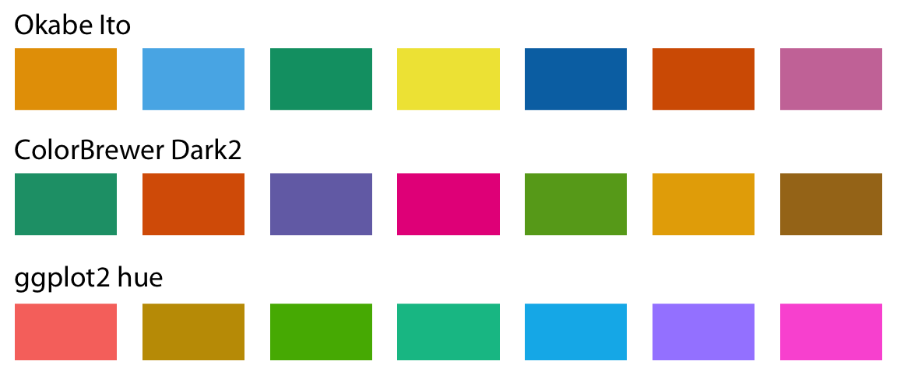
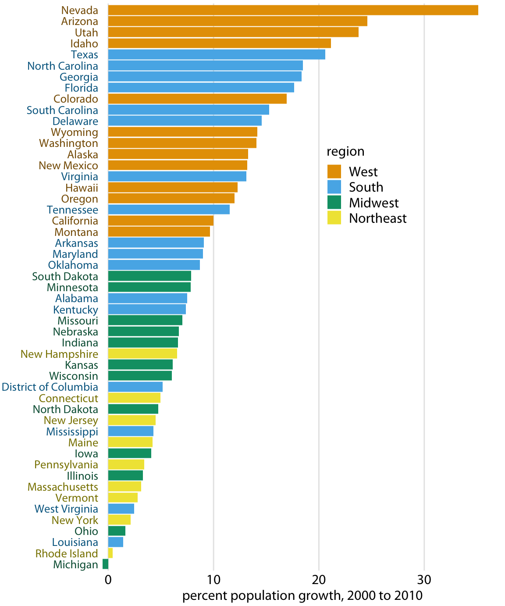
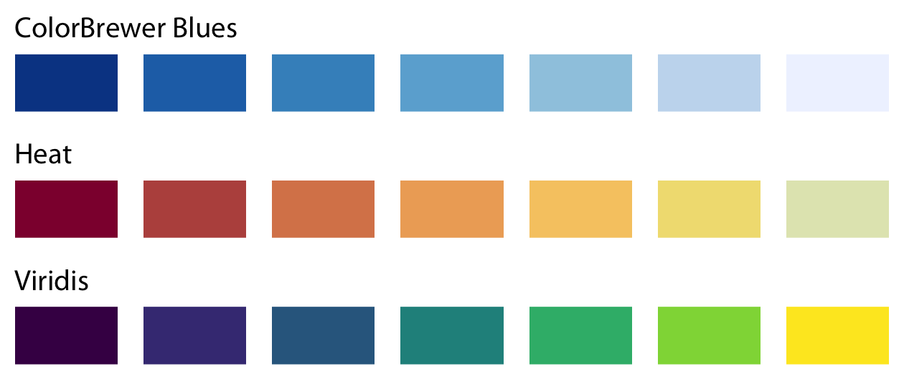
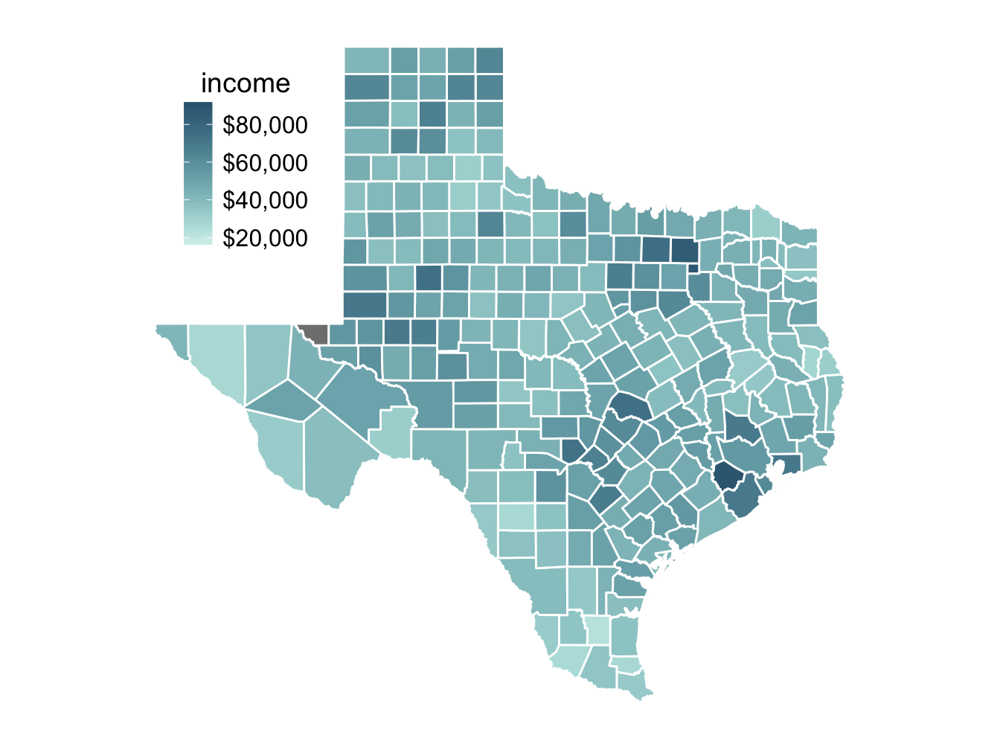
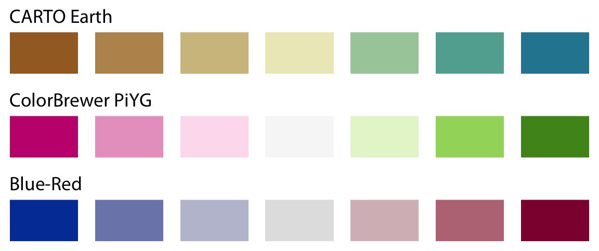
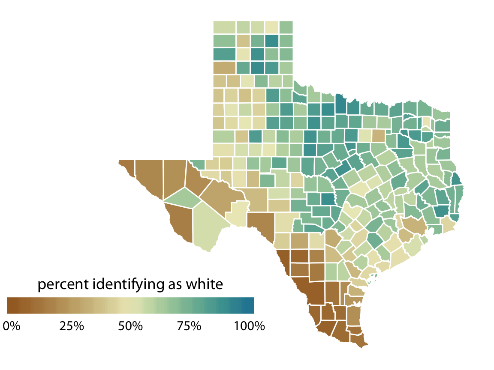
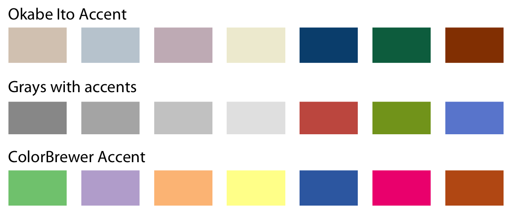
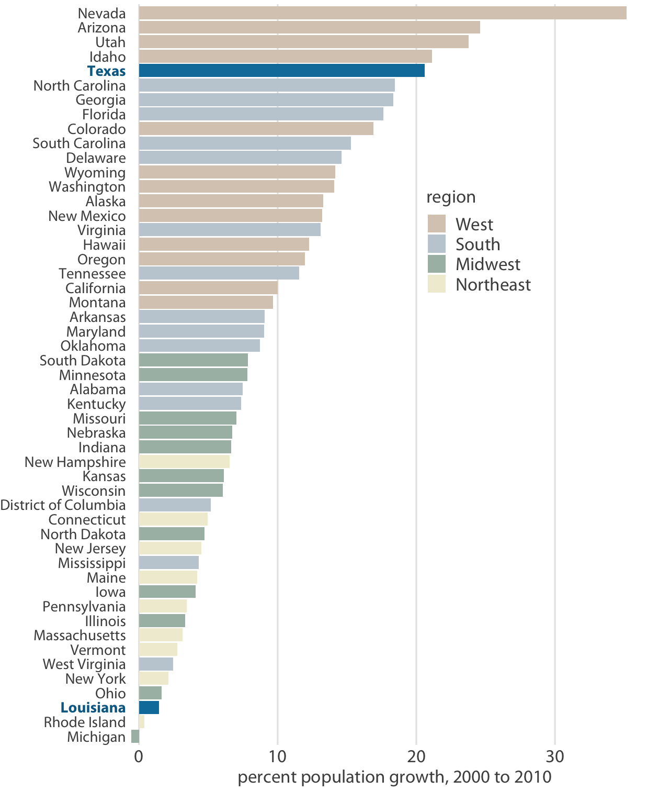
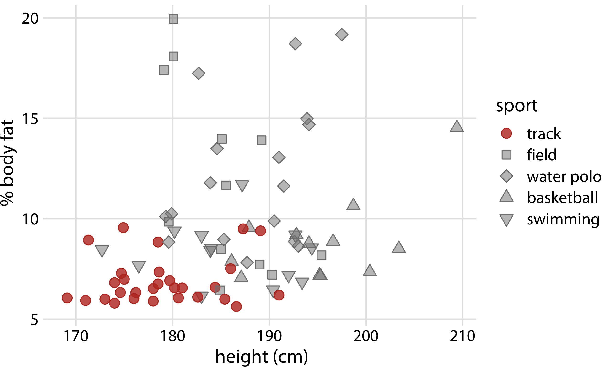

# Color scales {#color-basics}

There are three fundamental use cases for color in data visualizations: (i) we can use color to distinguish groups of data from each other; (ii) we can use color to represent data values; and (iii) we can use color to highlight. The types of colors we use and the way in which we use them are quite different for these three cases.

## Color as a tool to distinguish

We frequently use color as a means to distinguish discrete items or groups that do not have an intrinsic order, such as different countries on a map or different manufacturers of a certain product. In this case, we use a *qualitative* color scale. Such a scale contains a finite set of specific colors that are chosen to look clearly distinct from each other while also being equivalent to each other. The second condition requires that no one color should stand out relative to the others. And, the colors should not create the impression of an order, as would be the case with a sequence of colors that get successively lighter. Such colors would create an apparent order among the items being colored, which by definition have no order. 

Many appropriate qualitative color scales are readily available. Figure \@ref(fig:qualitative-scales) shows three representative examples. In particular, the ColorBrewer project provides a nice selection of qualitative color scales, including both fairly light and fairly dark colors [@ColorBrewer]. 

(ref:qualitative-scales) Example qualitative color scales. The Okabe Ito scale is the default scale used throughout this book [@Okabe-Ito-CUD]. The ColorBrewer Dark2 scale is provided by the ColorBrewer project [@ColorBrewer]. The ggplot2 hue scale is the default qualitative scale in the widely used plotting software ggplot2.

(\#fig:qualitative-scales)(ref:qualitative-scales)

As an example of how we use qualitative color scales, consider Figure \@ref(fig:popgrowth-US). It shows the percent population growth from 2000 to 2010 in U.S. states. I have arranged the states in order of their population growth, and I have colored them by geographic region. This coloring highlights that states in the same regions have experienced similar population growth. In particular, states in the West and the South have seen the largest population increases whereas states in the Midwest and the Northeast have grown much less.

(ref:popgrowth-US) Population growth in the U.S. from 2000 to 2010. States in the West and South have seen the largest increases, whereas states in the Midwest and Northeast have seen much smaller increases or even, in the case of Michigan, a decrease. Data source: U.S. Census Bureau

(\#fig:popgrowth-US)(ref:popgrowth-US)

## Color to represent data values

Color can also be used to represent data values, such as income, temperature, or speed. In this case, we use a *sequential* color scale. Such a scale contains a sequence of colors that clearly indicate (i) which values are larger or smaller than which other ones and (ii) how distant two specific values are from each other. The second point implies that the color scale needs to be perceived to vary uniformly across its entire range.

Sequential scales can be based on a single hue (e.g., from dark blue to light blue) or on multiple hues (e.g., from dark red to light yellow) (Figure \@ref(fig:sequential-scales)). Multi-hue scales tend to follow color gradients that can be seen in the natural world, such as dark red, green, or blue to light yellow, or dark purple to light green. The reverse, e.g. dark yellow to light blue, looks unnatural and doesn't make a useful sequential scale.

(ref:sequential-scales) Example sequential color scales. The ColorBrewer Blues scale is a monochromatic scale that varies from dark to light blue. The Heat and Viridis scales are multi-hue scales that vary from dark red to light yellow and from dark blue via green to light yellow, respectively. 

(\#fig:sequential-scales)(ref:sequential-scales)

Representing data values as colors is particularly useful when we want to show how the data values vary across geographic regions. In this case, we can draw a map of the geographic regions and color them by the data values. Such maps are called *choropleths*. Figure \@ref(fig:map-Texas-income) shows an example where I have mapped annual median income within each county in Texas onto a map of those counties. 

(ref:map-Texas-income) Median annual income in Texas counties. The highest median incomes are seen in major Texas metropolitan areas, in particular near Houston and Dallas. No median income estimate is available for Loving County in West Texas and therefore that county is shown in gray. Data source: 2015 Five-Year American Community Survey

(\#fig:map-Texas-income)(ref:map-Texas-income)

In some cases, we need to visualize the deviation of data values in one of two directions relative to a neutral midpoint. One straightforward example is a dataset containing both positive and negative numbers. We may want to show those with different colors, so that it is immediately obvious whether a value is positive or negative as well as how far in either direction it deviates from zero. The appropriate color scale in this situation is a *diverging* color scale. We can think of a diverging scale as two sequential scales stiched together at a common midpoint, which usually is represented by a light color (Figure \@ref(fig:diverging-scales)). Diverging scales need to be balanced, so that the progression from light colors in the center to dark colors on the outside is approximately the same in either direction. Otherwise, the perceived magnitude of a data value would depend on whether it fell above or below the midpoint value.

(ref:diverging-scales) Example diverging color scales. Diverging scales can be thought of as two sequential scales stiched together at a common midpoint color. Common color choices for diverging scales include brown to greenish blue, pink to yellow-green, and blue to red.

(\#fig:diverging-scales)(ref:diverging-scales)

As an example application of a diverging color scale, consider Figure \@ref(fig:map-Texas-race), which shows the percentage of people identifying as white in Texas counties. Even though percentage is always a positive number, a diverging scale is justified here, because 50% is a meaningful midpoint value. Numbers above 50% indicate that whites are in the majority and numbers below 50% indicate the opposite. The visualization clearly shows in which counties whites are in the majority, in which they are in the minority, and in which whites and non-whites occur in approximately equal proportions.

(ref:map-Texas-race) Percentage of people identifying as white in Texas counties. Whites are in the majority in North and East Texas but not in South or West Texas. Data source: 2010 Decennial U.S. Census

(\#fig:map-Texas-race)(ref:map-Texas-race)

## Color as a tool to highlight

Color can also be an effective tool to highlight specific elements in the data. There may be specific categories or values in the dataset that carry key information about the story we want to tell, and we can strengthen the story by emphasizing the relevant figure elements to the reader. An easy way to achieve this emphasis is to color these figure elements in a color or set of colors that vividly stand out against the rest of the figure. This effect can be achieved with *accent* color scales, which are color scales that contain both a set of subdued colors and a matching set of stronger, darker, and/or more saturated colors (Figure \@ref(fig:accent-scales)).

(ref:accent-scales) Example accent color scales, each with four base colors and three accent colors. Accent color scales can be derived in several different ways: (top) we can take an existing color scale (e.g., the Okabe Ito scale, Fig \@ref(fig:qualitative-scales)) and lighten and/or partially desaturate some colors while darkening others; (middle) we can take gray values and pair them with colors; (bottom) we can use an existing accent color scale, e.g. the one from the ColorBrewer project.

(\#fig:accent-scales)(ref:accent-scales)

As an example of how the same data can support differing stories with different coloring approaches, I have created a variant of Figure \@ref(fig:popgrowth-US) where now I highlight two specific states, Texas and Louisiana (Figure \@ref(fig:popgrowth-US-highlight)). Both states are in the South, they are immediate neighbors, and yet one state (Texas) was the fifth-fastest growing state within the U.S. whereas the other was the third slowest growing from 2000 to 2010.

(ref:popgrowth-US-highlight) From 2000 to 2010, the two neighboring southern states Texas and Louisiana have experienced among the highest and lowest population growth across the U.S. Data source: U.S. Census Bureau

(\#fig:popgrowth-US-highlight)(ref:popgrowth-US-highlight)

When working with accent colors, it is critical that the baseline colors do not compete for attention. Notice how drab the baseline colors are in (Figure \@ref(fig:popgrowth-US-highlight)). Yet they work well to support the accent color. It is easy to make the mistake of using baseline colors that are too colorful, so that they end up competing for the reader's attention against the accent colors. There is an easy remedy, however. Just remove all color from all elements in the figure except the highlighted data categories or points. An example of this strategy is provided in Figure \@ref(fig:Aus-athletes-track).

(ref:Aus-athletes-track) Track athletes are among the shortest and leanest of male professional athletes participating in popular sports. Data source: @Telford-Cunningham-1991

(\#fig:Aus-athletes-track)(ref:Aus-athletes-track)

