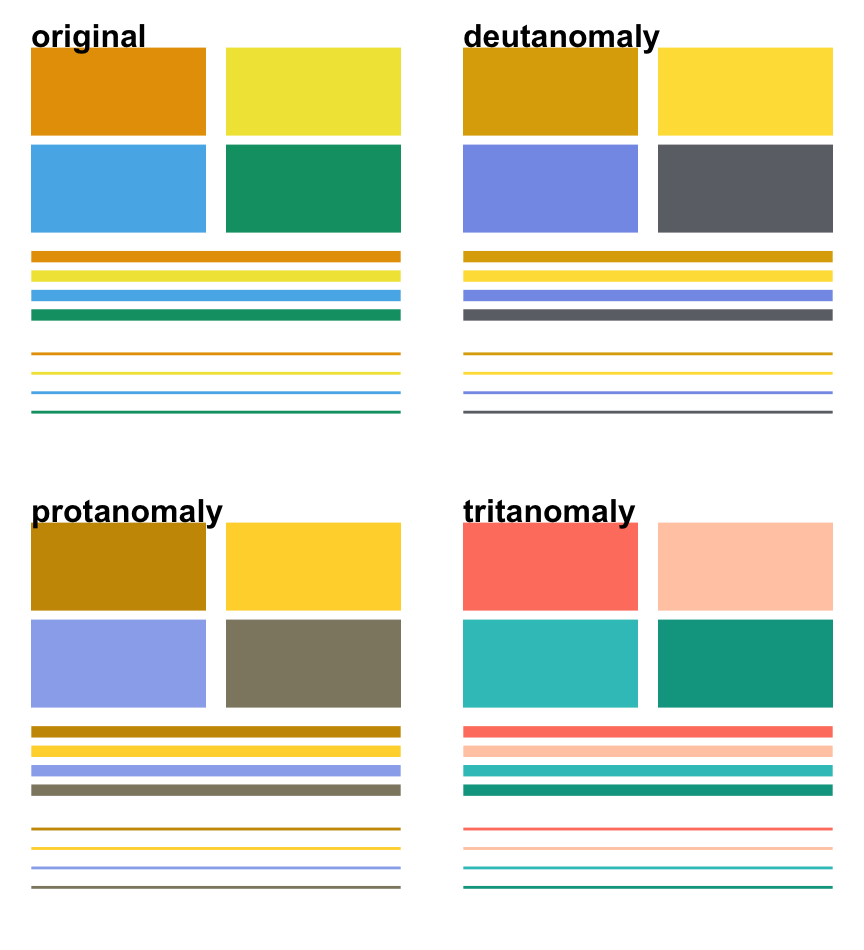
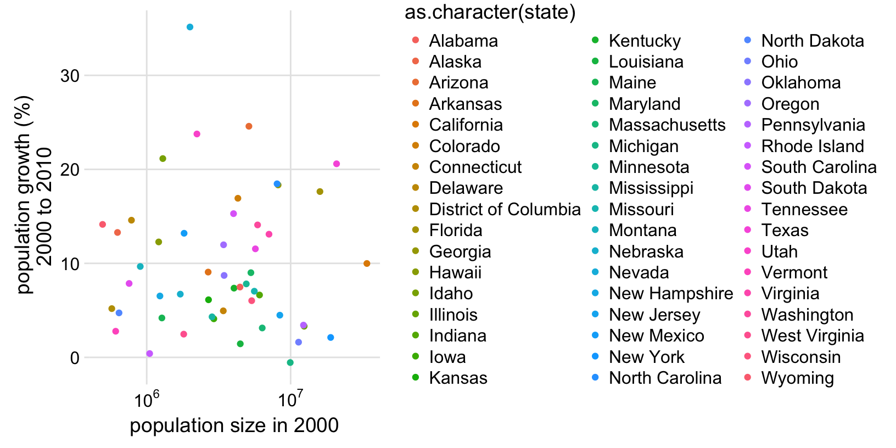
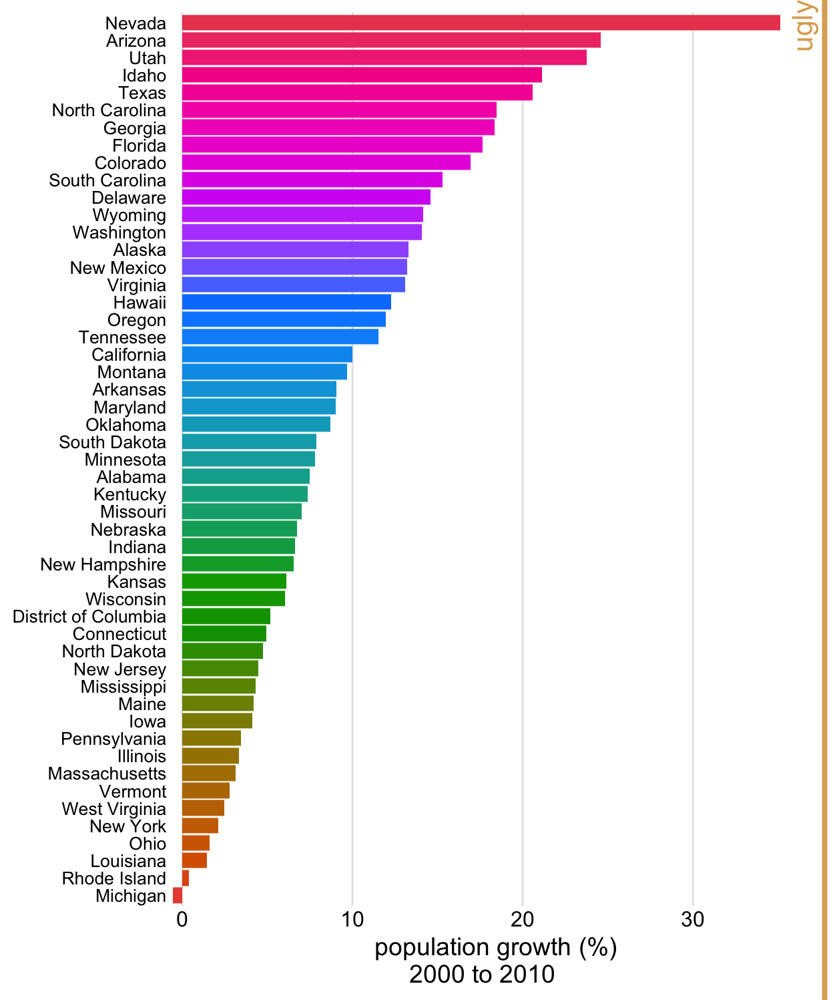

# Effective use of color in figures

Notes:

- Color as quantification: colored map
- Example of ineffective color legend: popgrowth vs. pop, colored by state?
- Example of spurious color: color popgrowth barchart by rainbow
