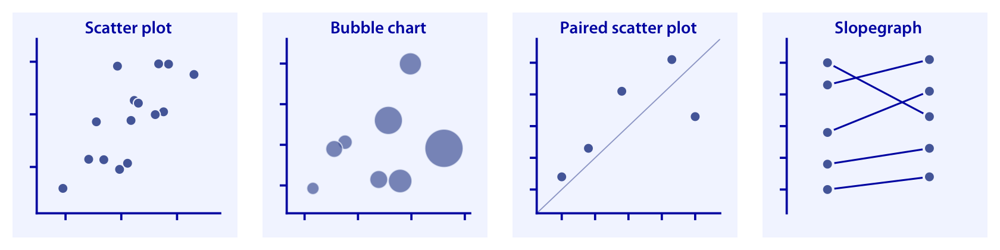

# (PART\*) Part II: A visualization for every occasion {-}

# Directory of visualizations

## Individual distributions

Histograms and density plots (Chapter \@ref(histograms-density-plots)) provide the most intuitive visualizations of a distribution, but both require arbitrary parameter choices and can be misleading. Cumulative densities and q-q plots (Chapter \@ref(ecdf-qq)) always represent the data faithfully but can be more difficult to interpret.

## Multiple distributions

## Proportions

## Other

