```
## Warning: package 'sf' was built under R version 3.5.2
```

# Directory of visualizations {#directory-of-visualizations}

This chapter provides a quick visual overview of the various plots and charts that are commonly used to visualize data. It is meant both to serve as a table of contents, in case you are looking for a particular visualization whose name you may not know, and as a source of inspiration, if you need to find alternatives to the figures you routinely make.


## Amounts

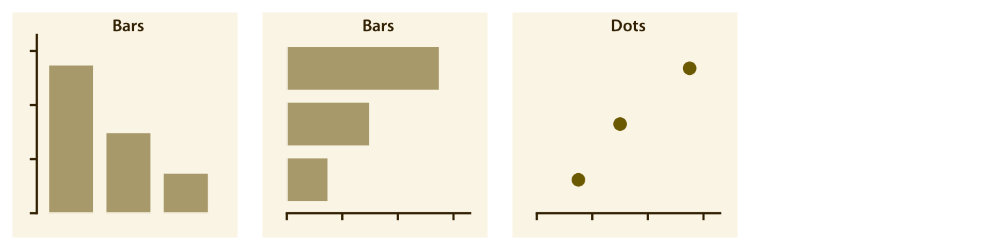

The most common approach to visualizing amounts (i.e., numerical values shown for some set of categories) is using bars, either vertically or horizontally arranged (Chapter \@ref(visualizing-amounts)). However, instead of using bars, we can also place dots at the location where the corresponding bar would end (Chapter \@ref(visualizing-amounts)).

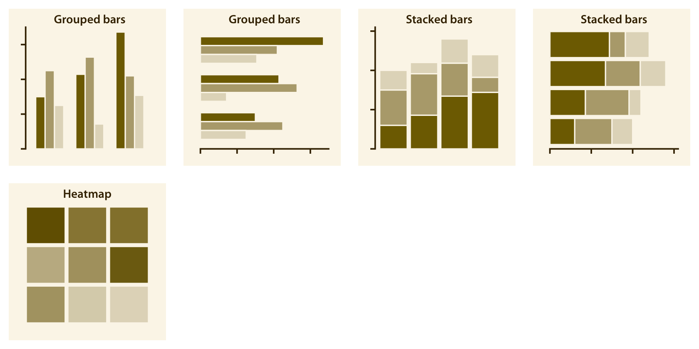

If there are two or more sets of categories for which we want to show amounts, we can group or stack the bars (Chapter \@ref(visualizing-amounts)). We can also map the categories onto the *x* and *y* axis and show amounts by color, via a heatmap (Chapter \@ref(visualizing-amounts)). 


## Distributions

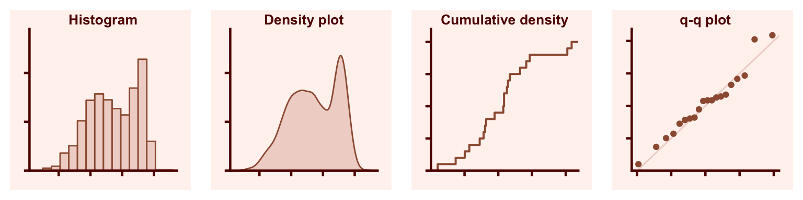

Histograms and density plots (Chapter \@ref(histograms-density-plots)) provide the most intuitive visualizations of a distribution, but both require arbitrary parameter choices and can be misleading. Cumulative densities and quantile-quantile (q-q) plots (Chapter \@ref(ecdf-qq)) always represent the data faithfully but can be more difficult to interpret.


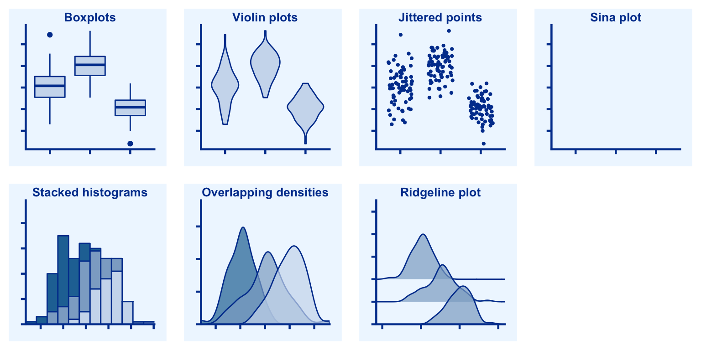

Boxplots, violins, strip charts, and sina plots are useful when we want to visualize many distributions at once and/or if we are primarily interested in overall shifts among the distributions (Chapter \@ref(boxplots-violins-vertical)). Stacked histograms and overlapping densities allow a more in-depth comparison of a smaller number of distributions, though stacked histograms can be difficult to interpret and are best avoided (Chapter \@ref(multiple-histograms-densities)). Ridgeline plots can be a useful alternative to violin plots and are often useful when visualizing very large numbers of distributions or changes in distributions over time (Chapter \@ref(boxplots-violins-horizontal)).

## Proportions

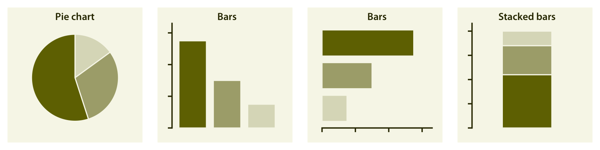

Proportions can be visualized as pie charts, side-by-side bars, or stacked bars (Chapter \@ref(visualizing-proportions)), and as in the case for amounts, bars can be arranged either vertically or horizontally. Pie charts emphasize that the individual parts add up to a whole and highlight simple fractions. However, the individual pieces are more easily compared in side-by-side bars. Stacked bars look awkward for a single set of proportions, but can be useful when comparing multiple sets of proportions (see below).


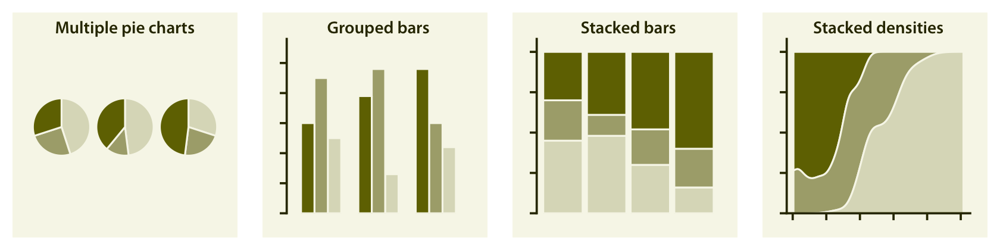

When visualizing multiple sets of proportions or changes in proportions across conditions, pie charts tend to be space-inefficient and often obscure relationships. Grouped bars work well as long as the number of conditions compared is moderate, and stacked bars can work for large numbers of conditions. Stacked densities (Chapter \@ref(visualizing-proportions)) are appropriate when the proportions change along a continuous variable.

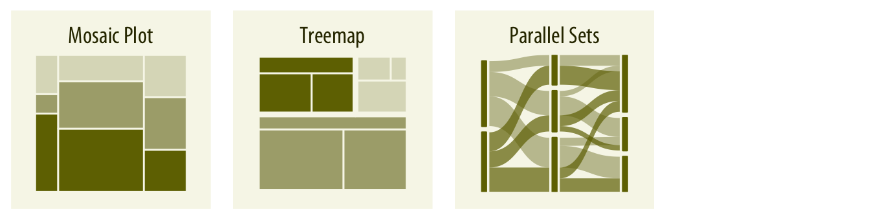

When proportions are specified according to multiple grouping variables, then mosaic plots, treemaps, or parallel sets are useful visualization approaches
(Chapter \@ref(nested-proportions)). Mosaic plots assume that every level of one grouping variable can be combined with every level of another grouping variable, whereas treemaps do not make such an assumption. Treemaps work well even if the subdivisions of one group are entirely distinct from the subdivisions of another. Parallel sets work better than either mosaic plots or treemaps when there are more than two grouping variables.


## *x*--*y* relationships

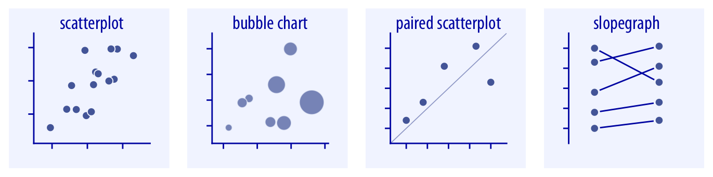


Scatterplots represent the archetypical visualization when we want to show one quantitative variable relative to another (Chapter \@ref(associations-scatterplots)). If we have three quantitative variables, we can map one onto the dot size, creating a variant of the scatterplot called bubble chart. For paired data, where the variables along the *x* and the *y* axes are measured in the same units, it is generally helpful to add a line indicating *x* = *y* (Chapter \@ref(associations-paired-data)). Paired data can also be shown as a slope graph of paired points connected by straight lines (Chapter \@ref(associations-paired-data)).

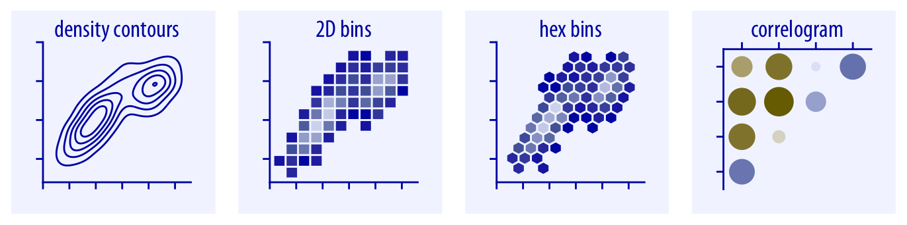

For large numbers of points, regular scatterplots can become uninformative due to overplotting. In this case, contour lines, 2D bins, or hex bins may provide an alternative (Chapter \@ref(overlapping-points)). When we want to visualize more than two quantities, on the other hand, we may choose to plot correlation coefficients in the form of a correlogram instead of the underlying raw data (Chapter \@ref(associations-correlograms)).

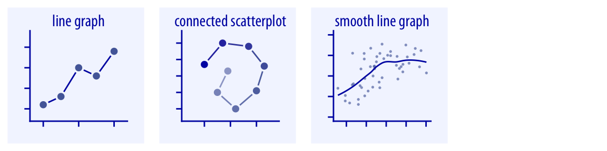

When the *x* axis represents time or a strictly increasing quantity such as a treatment dose, we commonly draw line graphs (Chapter \@ref(time-series)). If we have a temporal sequence of two response variables, we can draw a connected scatterplot where we first plot the two response variables in a scatterplot and then connect dots corresponding to adjacent time points (Chapter \@ref(time-series-connected-scatter)). We can use smooth lines to represent trends in a larger dataset (Chapter \@ref(visualizing-trends)). 


## Geospatial data {#directory-geospatial-data}


The primary mode of showing geospatial data is in the form of a map (Chapter \@ref(geospatial-data)). A map takes coordinates on the globe and projects them onto a flat surface, such that shapes and distances on the globe are approximately represented by shapes and distances in the 2D representation. In addition, we can show data values in different regions by coloring those regions in the map according to the data. Such a map is called a choropleth (Chapter \@ref(choropleth-mapping)). In some cases, it may be helpful to distort the different regions according to some other quantity (e.g., population number) or simplify each region into a square. Such visualizations are called cartograms.

## Uncertainty {#directory-uncertainty}

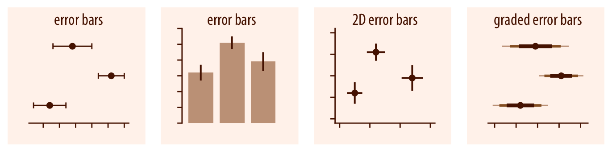

Error bars are meant to indicate the range of likely values for some estimate or measurement. They extend horizontally and/or vertically from some reference point representing the estimate or measurement (Chapter \@ref(visualizing-uncertainty)). Reference points can be shown in various ways, such as by dots or by bars. Graded 
error bars show multiple ranges at the same time, where each range corresponds to a different degree of confidence. They are in effect multiple error bars with different line thicknesses plotted on top of each other.

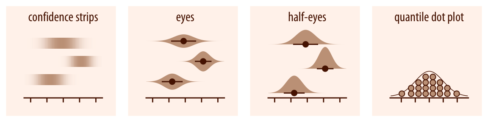

To achieve a more detailed visualization than is possible with error bars or graded error bars, we can visualize the actual confidence or posterior distributions (Chapter \@ref(visualizing-uncertainty)). Confidence strips provide a clear visual sense of uncertainty but are difficult to read accurately. Eyes and half-eyes combine error bars with approaches to visualize distributions (violins and ridgelines, respectively), and thus show both precise ranges for some confidence levels and the overall uncertainty distribution. A quantile dot plot can serve as an alternative visualization of an uncertainty distribution (Chapter \@ref(frequency-framing)). By showing the distribution in discrete units, the quantile dot plot is not as precise but can be easier to read than the continuous distribution shown by a violin or ridgeline plot.

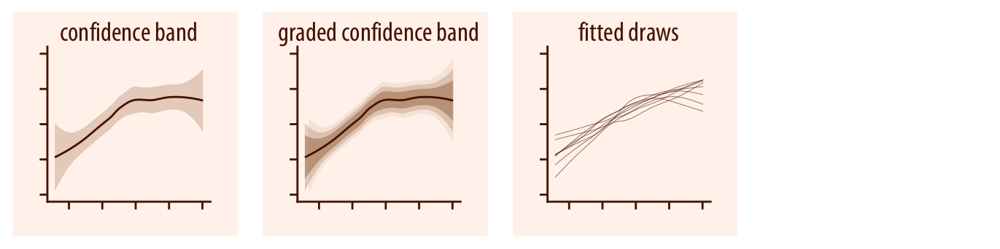

For smooth line graphs, the equivalent of an error bar is a confidence band (Chapter \@ref(uncertainty-curve-fits)). It shows a range of values the line might pass through at a given confidence level. As in the case of error bars, we can draw graded confidence bands that show multiple confidence levels at once. We can also show individual fitted draws in lieu of or in addition to the confidence bands.

