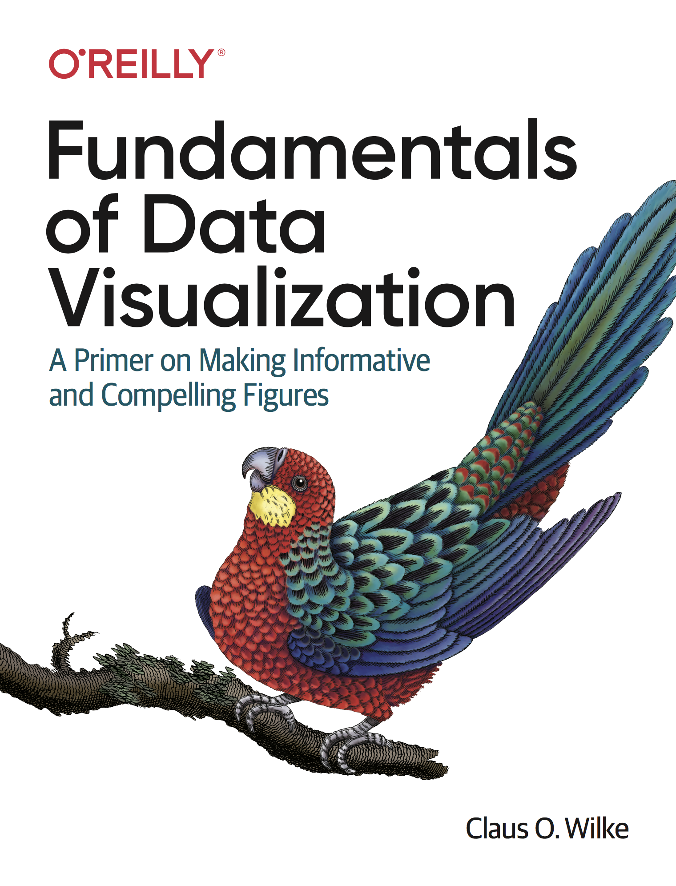

# Welcome {-}

 This is the website for the book "Fundamentals of Data Visualization," published by O’Reilly Media, Inc. The website contains the complete author manuscript before final copy-editing and other quality control. If you would like to order an official hardcopy or ebook, you can do so at various resellers, including [Amazon,](https://www.amazon.com/gp/product/1492031089) [Barnes and Noble,](https://www.barnesandnoble.com/w/fundamentals-of-data-visualization-claus-o-wilke/1128580869) [Google Play,](https://play.google.com/store/books/details/Claus_O_Wilke_Fundamentals_of_Data_Visualization?id=WmmNDwAAQBAJ) or [Powells.](https://www.powells.com/book/-9781492031086)

The book is meant as a guide to making visualizations that accurately reflect the data, tell a story, and look professional. It has grown out of my experience of working with students and postdocs in my laboratory on thousands of data visualizations. Over the years, I have noticed that the same issues arise over and over. I have attempted to collect my accumulated knowledge from these interactions in the form of this book.

The entire book is written in R Markdown, using RStudio as my text editor and the **bookdown** package to turn a collection of markdown documents into a coherent whole. The book's source code is hosted on GitHub, at https://github.com/clauswilke/dataviz. If you notice typos or other issues, feel free to open an issue on GitHub or submit a pull request. If you do the latter, in your commit message, please add the sentence "I assign the copyright of this contribution to Claus O. Wilke," so that I can maintain the option of publishing this book in other forms.

This work is licensed under the [Attribution-NonCommercial-NoDerivatives 4.0 International](https://creativecommons.org/licenses/by-nc-nd/4.0/legalcode) License. 
