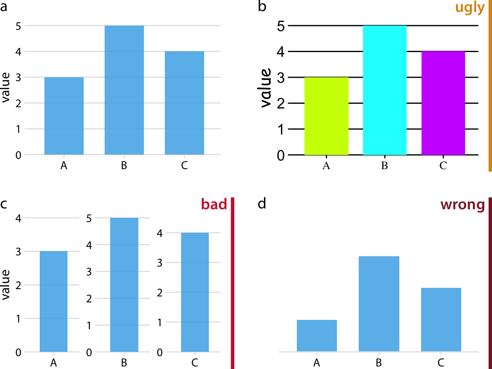

# Introduction {#introduction}

Data visualization is part art and part science. The challenge is to get the art right without getting the science wrong and vice versa. A data visualization first and foremost has to accurately convey the data. It must not mislead or distort. If one number is twice as large as another, but in the visualization they look to be about the same, then the visualization is wrong. At the same time, a data visualization should be aesthetically pleasing. Good visual presentations tend to enhance the message of the visualization. If a figure contains jarring colors, imbalanced visual elements, or other features that distract, then the viewer will find it harder to inspect the figure and interpret it correctly.

In my experience, scientists frequently (though not always!) know how to visualize data without being grossly misleading. However, they may not have a well developed sense of visual aesthetics, and they may inadvertantly make visual choices that detract from their desired message. Designers, on the other hand, may prepare visualizations that look beautiful but play fast and loose with the data. It is my goal to provide useful information to both groups. 

The book attempts to cover the key principles, methods, and concepts required to visualize data for publications, reports, or presentations. Because data visualization is a vast field, and in its broadest definition could include topics as varied as schematic technical drawings, 3D animations, and user interfaces, I necessarily had to limit my scope for this book. I am specifically covering the case of static visualizations presented in print, online, or as slides. The book does not cover interactive visuals or movies, except in one brief section in the chapter on visualizing uncertainty. Therefore, throughout this book, I will use the words "visualization" and "figure" somewhat interchangeably. The book also does not provide any instruction on *how* to make figures with existing visualization softwares or programming libraries. The annotated bibliography at the end of the book includes pointers to appropriate texts covering these topics.

The book is divided into three parts. The first, "From data to visualization," describes different types of plots and charts, such as bar graphs, scatter plots, or pie charts. Its primary emphasis is the science of visualization. In this part, rather than attempting to provide encyclopedic coverage of every conceivable visualization approach, I discuss a core set of visuals that you will likely encounter in publications and/or need in your own work. In organizing this part, I have attempted to group visualizations by the type of message they convey rather than by the type of data being visualized. Statistical texts often describe data analysis and visualization by type of data, organizing the material by number and type of variables (one continuous variable, one discrete variable, two continuous variables, one continuous and one discrete variable, etc.). I believe that only statisticians find this organization helpful. Most other people think in terms of a message, such as how large something is, how it is composed of parts, how it relates to something else, and so on.

The second part, "Principles of figure design," discusses various design issues that arise when assembling data visualizations. Its primary but not exclusive emphasis is the aesthetic aspect of data visualization. Once we have chosen the correct type of plot or chart that is appropriate for our dataset, we have to make aesthetic choices about the visual elements, such as colors, symbols, and font sizes. These choices can affect both how clear a visualization is and how elegant it looks. The chapters in this second part address the most common issues that I have seen arise repeatedly in practical applications.

The third part, "Miscellaneous topics," covers a few remaining issues that didn't fit into the first two parts. It discusses file formats commonly used to store images and plots, it provides thoughts about the choice of visualization software, and it explains how to place individual figures into the context of a larger document.

## Ugly, bad, and wrong figures {-}

Throughout this book, I frequently show different versions of the same figures, some as examples of how to make a good visualization and some as examples of how not to. To provide a simple visual guideline of which examples should be emulated and which should be avoided, I am clearly labeling problematic figures as "ugly", "bad", or "wrong" (Figure \@ref(fig:ugly-bad-wrong-examples)):

- **ugly**---A figure that has aesthetic problems but otherwise is clear and informative.
- **bad**---A figure that has problems related to perception; it may be unclear, confusing, overly complicated, or deceiving.
- **wrong**---A figure that has problems related to mathematics; it is objectively incorrect.

(ref:ugly-bad-wrong-examples) Examples of ugly, bad, and wrong figures. (a) A bar plot showing three values (A = 3, B = 5, and C = 4). This is a reasonable visualization with no major flaws. (b) An ugly version of part (a). While the plot is technically correct, it is not aesthetically pleasing. The colors are too bright and not useful. The background grid is too prominent. The text is displayed using three different fonts in three different sizes. (c) A bad version of part (a). Each bar is shown with its own *y*-axis scale. Because the scales don't align, this makes the figure misleading. One can easily get the impression that the three values are closer together than they actually are. (d) A wrong version of part (a). Without an explicit *y* axis scale, the numbers represented by the bars cannot be ascertained. The bars appear to be of lengths 1, 3, and 2, even though the values displayed are meant to be 3, 5, and 4.

(\#fig:ugly-bad-wrong-examples)(ref:ugly-bad-wrong-examples)

I am not explicitly labeling good figures. Any figure that isn't clearly labeled as flawed  should be assumed to be at least acceptable. It is a figure that is informative, looks appealing, and could be printed as is. Note that among the good figures, there will still be differences in quality, and some good figures will be better than others.

I generally provide my rationale for specific ratings, but some are a matter of taste. In general, the "ugly" rating is more subjective than the "bad" or "wrong" rating. Moreover, the boundary between "ugly" and "bad" is somewhat fluid. Sometimes poor design choices can interfere with human perception to the point where a "bad" rating is more appropriate than an "ugly" rating. In any case, I encourage you to develop your own eye and to critically evaluate my choices.

