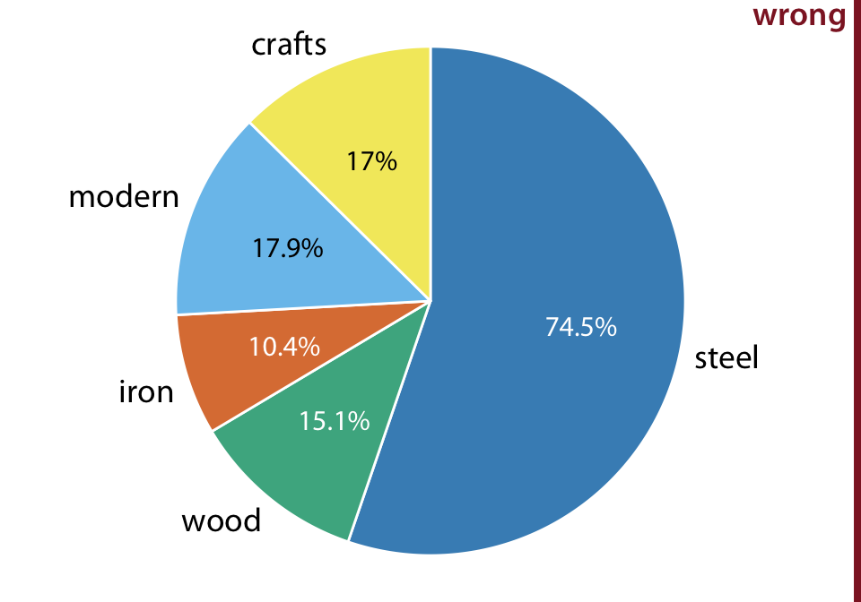
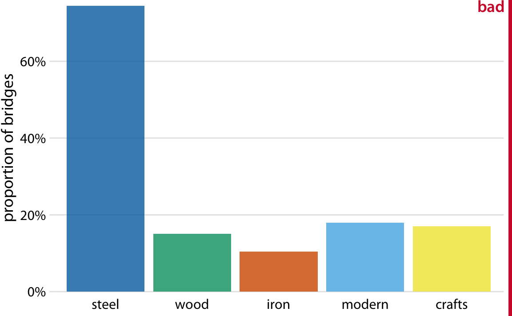
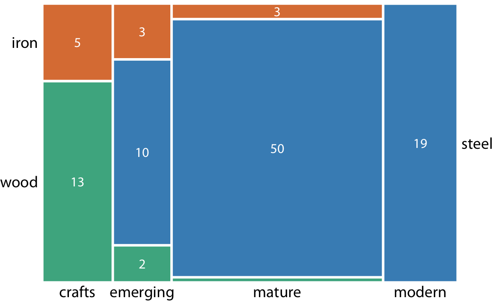
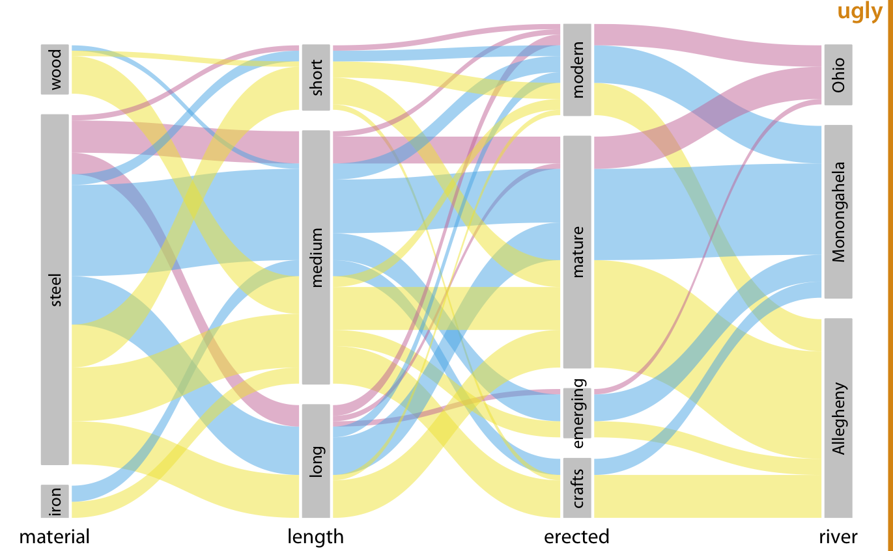

# Visualizing nested proportions {#nested-proportions}

In the preceding chapter, I discussed scenarios where a dataset is broken into pieces defined by one cateogical variable, such as political party, company, or health status. It is not uncommon, however, that we want to drill down further and break down a dataset by multiple categorical variables at once. For example, in the case of parliamentary seats, we could be interested in the proportions of seats by party and by the gender of the representatives. Similarly, in the case of people's health status, we could ask how health status further breaks down by marital status. I refer to these scenarios as nested proportions, because each additional categorical variable that we add creates a finer subdivision of the data nested within the previous proportions. There are several suitable approaches to visualize such nested proportions, including  mosaic plots, treemaps, and parallel sets.

## Nested proportions gone wrong

I will begin by demonstrating two flawed approaches to visualizing nested proportions. While these approaches may seem nonsensical to any experienced data scientist, I have seen them in the wild and therefore think they warrant discussion. Throughout this chapter, I will work with a dataset of 106 bridges in Pittsburgh. This dataset contains various pieces of information about the bridges, such as the material from which they are constructed (steel, iron, or wood) and the year when they were erected. Based on the year of erection, bridges are grouped into distinct categories, such as crafts bridges that were erected before 1870 and modern bridges that were erected after 1940.

Let's assume we want to visualize both the fraction of bridges made from steel, iron, or wood and the fraction that are crafts or modern. We might be tempted to do so by drawing a combined pie chart (Figure \@ref(fig:bridges-pie-wrong)). However, this visualization is not valid. All the slices in a pie chart must add up to 100%, and here the slices add up to 135%. We reach a total percentage in excess of 100% because we are double-counting bridges. Every bridge in the dataset is made of steel, iron, or wood, so these three slices of the pie already represent 100% of the bridges. Every crafts or modern bridge is also a steel, iron, or wood bridge, and hence is counted twice in the pie chart.

(ref:bridges-pie-wrong)  Breakdown of bridges in Pittsburgh by construction material (steel, wood, iron) and by date of construction (crafts, before 1870, and modern, after 1940), shown as a pie chart. Numbers represent the percentages of bridges of a given type among all bridges. This figure is invalid, because the percentages add up to more than 100%. There is overlap between construction material and date of construction. For example, all modern bridges are made of steel, and the majority of crafts bridges are made of wood. Data source: Yoram Reich and Steven J. Fenves, via the UCI Machine Learning Repository [@UCI_repo_2017]

(\#fig:bridges-pie-wrong)(ref:bridges-pie-wrong)

Double-counting is not necessarily a problem if we choose a visualization that does not require the proportions to add to 100%. As discussed in the preceding chapter, side-by-side bars meet this criterion. We can show the various proportions of bridges as bars in a single plot, and this plot is not technically wrong (Figure \@ref(fig:bridges-bars-bad)). Nevertheless, I have labeled it as "bad", because it does not immediately show that there is overlap among some of the categories shown. A casual observer might conclude from Figure \@ref(fig:bridges-bars-bad) that there are five separate categories of bridges, and that, for example, modern bridges are neither made of steel nor of wood or iron.

(ref:bridges-bars-bad) Breakdown of bridges in Pittsburgh by construction material (steel, wood, iron) and by date of construction (crafts, before 1870, and modern, after 1940), shown as a bar plot. Unlike Figure \@ref(fig:bridges-pie-wrong), this visualization is not technically wrong, since it doesn't imply that the bar heights need to add up to 100%. However, it also does not clearly indicate the overlap among different groups, and therefore I have labeled it "bad". Data source: Yoram Reich and Steven J. Fenves, via the UCI Machine Learning Repository [@UCI_repo_2017]

(\#fig:bridges-bars-bad)(ref:bridges-bars-bad)

## Mosaic plots and treemaps

Whenever we have categories that overlap, it is best to show clearly how they relate to each other. This can be done with a mosaic plot (Figure \@ref(fig:bridges-mosaic)). On first glance, a mosaic plot looks similar to a stacked bar plot (e.g., Figure \@ref(fig:marketshare-stacked)). However, unlike in a stacked bar plot, in a mosaic plot both the heights and the widths of individual shaded areas vary. Note that in Figure \@ref(fig:bridges-mosaic), we see two additional construction eras, *emerging* (from 1870 to 1889) and *mature* (1890 to 1939). In combination with crafts and modern, these construction eras cover all bridges in the dataset, as do the three building materials. This is a critical condition for a mosaic plot: Every categorical variable shown must cover all the observations in the dataset.

(ref:bridges-mosaic) Breakdown of bridges in Pittsburgh by construction material (steel, wood, iron) and by era of construction (crafts, emerging, mature, modern), shown as a mosaic plot. The widths of each rectangle are proportional to the number of bridges constructed in that era, and the heights are proportional to the number of bridges constructed from that material. Numbers represent the counts of bridges within each category. Data source: Yoram Reich and Steven J. Fenves, via the UCI Machine Learning Repository [@UCI_repo_2017]

(\#fig:bridges-mosaic)(ref:bridges-mosaic)

To draw a mosaic plot, we begin by placing one categorical variable along the *x* axis (here, era of bridge construction) and subdivide the *x* axis by the relative proportions that make up the categories. We then place the other categorical variable along the *y* axis (here, building material) and, within each category along the *x* axis, subdivide the *y* axis by the relative proportions that make up the categories of the *y* variable. The result is a set of rectangles whose areas are proportional to the number of cases representing each possible combination of the two categorical variables.

The bridges dataset can also be visualized in a related but distinct format called a *treemap*. In a treemap, just as is the case in a mosaic plot, we take an enclosing rectangle and subdivide it into smaller rectangles whose areas represent the proportions. However, the method of placing the smaller rectangles into the larger one is different compared to the mosaic plot. In a treemap, we recursively nest rectangles inside each other. For example, in the case of the Pittsburgh bridges, we can first subdivide the total area into three parts representing the three building materials wood, iron, and steel. Then, we subdivide each of those areas further to represent the construction eras represented for each building material (Figure \@ref(fig:bridges-treemap)). In principle, we could keep going with nesting ever more smaller subdivisions inside each other, though relatively quickly the result would become unwieldy or confusing.

(ref:bridges-treemap) Breakdown of bridges in Pittsburgh by construction material (steel, wood, iron) and by era of construction (crafts, emerging, mature, modern), shown as a treemap. The area of each rectangle is proportional to the number of bridges of that type. Data source: Yoram Reich and Steven J. Fenves, via the UCI Machine Learning Repository [@UCI_repo_2017]

(\#fig:bridges-treemap)(ref:bridges-treemap)

While mosaic plots and treemaps are closely related, they have different points of emphasis and different application areas. Here, the mosaic plot (Figure \@ref(fig:bridges-mosaic))  emphasizes the temporal evolution in building-material use from the crafts era to the modern era, whereas the treemap (Figure \@ref(fig:bridges-treemap)) emphasizes the total number of steel, iron, and wood bridges.

More generally, mosaic plots assume that all of the proportions shown can be identified via combinations of two or more orthogonal categorical  variables. For example, in Figure \@ref(fig:bridges-mosaic), every bridge can be described by a choice of building material (wood, iron, steel) and a choice of time period (crafts, emerging, mature, modern). Moreover, in principle every combination of these two variable is possible, even though in practice this need not be the case. (Here, there are no steel crafts bridges and no wood or iron modern bridges.) By contrast, such a requirement does not exist for treemaps. In fact, treemaps tend to work well when the proportions cannot meaningfully be described by combining multiple categorical variables. For example, we can separate the U.S. into four regions (West, Northeast, Midwest, and South) and each region into distinct states, but the states in one region have no relationship to the states in another region (Figure \@ref(fig:US-states-treemap)).

(ref:US-states-treemap) States in the U.S. visualized as a treemap. Each rectangle represents one state, and the area of each rectangle is proportional to the state's land surface area. The states are grouped into four regions, West, Northeast, Midwest, and South. The coloring is proportional to the number of inhabitants for each state, with darker colors representing larger numbers of inhabitants. Data source: 2010 U.S. Census

(\#fig:US-states-treemap)(ref:US-states-treemap)

Both mosaic plots and treemaps are commonly used and can be illuminating, but they have similar limitations as do stacked bars (Chapter \@ref(tab:pros-cons-pie-bar)): A direct comparison among conditions can be difficult, because different rectangles do not necessarily share baselines that enable visual comparison. In mosaic plots or treemaps, this problem is exacerbated by the fact that the shapes of the different rectangles can vary. For example, there are the same number of iron bridges (three) among the emerging and the mature bridges, but this is difficult to discern in the mosaic plot (Figure \@ref(fig:bridges-mosaic)), because the two rectangles representing these two groups of three bridges have entirely different shapes. There isn't necessarily a solution to this problem---visualizing nested proportions can be tricky. Whenever possible, I recommend showing the actual counts or percentages on the plot, so readers can verify that their intuitive interpretation of the shaded areas is correct.

## Nested pies

At the beginning of this chapter, I visualized the bridges dataset with a flawed pie chart (Figure \@ref(fig:bridges-pie-wrong)), and I then argued that a mosaic plot or a treemap are more appropriate. However, both of these latter plot types are closely related to pie charts, since they all use area to represent data values. The primary difference is the type of coordinate system, polar in the case of a pie chart versus cartesian in the case of a mosaic plot or treemap. This close relationship between these different plots begs the question whether some variant of a pie chart can be used to visualize this dataset.

There are two possibilities. First, we can draw a pie chart composed of an inner and an outer circle (Figure \@ref(fig:bridges-nested-pie)). The inner circle shows the breakdown of the data by one variable (here, building material) and the outer circle shows the breakdown of each slice of the inner circle by the second variable (here, era of bridge construction). This visualization is reasonable but I have my reservations, and therefore I have labeled it "ugly". Most importantly, the two separate circles obscure the fact that each bridge in the dataset has both a building material and an era of bridge construction. In effect, in Figure \@ref(fig:bridges-nested-pie), we are still double-counting each bridge. If we add up all the numbers shown in the two circles we obtain 212, which is twice the number of bridges in the dataset.

(ref:bridges-nested-pie) Breakdown of bridges in Pittsburgh by construction material (steel, wood, iron, inner circle) and by era of construction (crafts, emerging, mature, modern, outer circle). Numbers represent the counts of bridges within each category. Data source: Yoram Reich and Steven J. Fenves, via the UCI Machine Learning Repository [@UCI_repo_2017]

(\#fig:bridges-nested-pie)(ref:bridges-nested-pie)

Alternatively, we can first slice the pie into pieces representing the proportions according to one variable (e.g. material) and then subdivide these slices further according to the other variable (construction era) (Figure \@ref(fig:bridges-nested-pie2)). In this way, in effect we are making a normal pie chart with a large number of small pie slices. However, we can then use coloring to indicate the nested nature of the pie. In Figure \@ref(fig:bridges-nested-pie2), green colors represent wood bridges, orange colors represent iron bridges, and blue colors represent steel bridges. The darkness of each color represents the construction era, with darker colors corresponding to more recently constructed bridges. By using a nested color scale in this way, we can visualize the breakdown of the data both by the primary variable (construction material) and by the secondary variable (construction era).

(ref:bridges-nested-pie2) Breakdown of bridges in Pittsburgh by construction material (steel, wood, iron) and by era of construction (crafts, emerging, mature, modern). Numbers represent the counts of bridges within each category.  Data source: Yoram Reich and Steven J. Fenves, via the UCI Machine Learning Repository [@UCI_repo_2017]

(\#fig:bridges-nested-pie2)(ref:bridges-nested-pie2)

The pie chart of Figure \@ref(fig:bridges-nested-pie2) represents a reasonable visualization of the bridges dataset, but in a direct comparison to the equivalent treemap (Figure \@ref(fig:bridges-treemap)) I think the treemap is preferable. First, the rectangular shape of the treemap allows it to make better use of the available space. Figures \@ref(fig:bridges-treemap) and \@ref(fig:bridges-nested-pie2) are of exactly equal size, but in Figure \@ref(fig:bridges-nested-pie2) much of the figure is wasted as white space. Figure \@ref(fig:bridges-treemap), the treemap, has virtually no superfluous white space. This matters because it enables me to place the labels inside the shaded areas in the treemap. Inside labels always create a stronger visual unit with the data than outside labels and hence are preferred. Second, some of the pie slices in Figure \@ref(fig:bridges-nested-pie2) are very thin and thus hard to see. By contrast, every rectangle in Figure \@ref(fig:bridges-treemap) is of a reasonable size.

## Parallel sets

When we want to visualize proportions described by more than two categorical variables, mosaic plots, treemaps, and pie charts all can quickly become unwieldy. A viable alternative in this case can be a *parallel sets plot*. In a parallel sets plot, we show how the total dataset breaks down by each individual categorical variable, and then we draw shaded bands that show how the subgroups relate to each other. See Figure \@ref(fig:bridges-parallel-sets1) for an example. In this figure, I have broken down the bridges dataset by construction material (iron, steel, wood), length of each bridge (long, medium, short), the era during which each bridge was constructed (crafts, emerging, mature, modern), and the river each bridge spans (Allegheny, Monongahela, Ohio). The bands that connect the parallel sets are colored by construction material. This shows, for example, that wood bridges are mostly of medium length (with a few short bridges), were primarily erected during the crafts period (with a few bridges of medium length erected during the emerging and mature periods), and span primarily the Allegheny river (with a few crafts bridges spanning the Monongahela river). By contrast, iron bridges are all of medium length, were primarily erected during the crafts period, and span the Allegheny and Monongahela rivers in approximately equal proportions.

(ref:bridges-parallel-sets1) Breakdown of bridges in Pittsburgh by construction material, length, era of construction, and the river they span, shown as a parallel sets plot. The coloring of the bands highlights the construction material of the different bridges. Data source: Yoram Reich and Steven J. Fenves, via the UCI Machine Learning Repository [@UCI_repo_2017]

(\#fig:bridges-parallel-sets1)(ref:bridges-parallel-sets1)

The same visualization looks quite different if we color by a different criterion, for example by river (Figure \@ref(fig:bridges-parallel-sets2)). This figure is visually busy, with many criss-crossing bands, but we do see that nearly any bridge of any type can be found to span each river.

(ref:bridges-parallel-sets2) Breakdown of bridges in Pittsburgh by construction material, length, era of construction, and the river they span. This figure is similar to Figure \@ref(fig:bridges-parallel-sets1) but now the coloring of the bands highlights the river spanned by the different bridges. This figure is labeled "ugly" because the arrangement of the colored bands in the middle of the figure is very busy, and also because the bands need to be read from right to left. Data source: Yoram Reich and Steven J. Fenves, via the UCI Machine Learning Repository [@UCI_repo_2017]

(\#fig:bridges-parallel-sets2)(ref:bridges-parallel-sets2)

I have labeled Figure \@ref(fig:bridges-parallel-sets2) as "ugly" because I think it is overly complex and confusing. First, since we are used to reading from left to right I think the sets that define the coloring should appear all the way to the left, not on the right. This will make it easier to see where the coloring originates and how it flows through the dataset. Second, it is a good idea to change the order of the sets such that the amount of criss-crossing bands is minimized. Following these principles, I arrive at Figure \@ref(fig:bridges-parallel-sets3), which I consider preferable to Figure \@ref(fig:bridges-parallel-sets2).

(ref:bridges-parallel-sets3) Breakdown of bridges in Pittsburgh by river, era of construction, length, and construction material. This figure differs from Figure \@ref(fig:bridges-parallel-sets2) only in the order of the parallel sets. However, the modified order results in a figure that is easier to read and less busy. Data source: Yoram Reich and Steven J. Fenves, via the UCI Machine Learning Repository [@UCI_repo_2017]

(\#fig:bridges-parallel-sets3)(ref:bridges-parallel-sets3)

