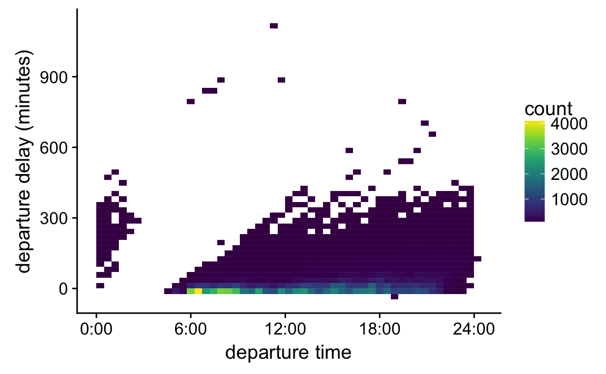
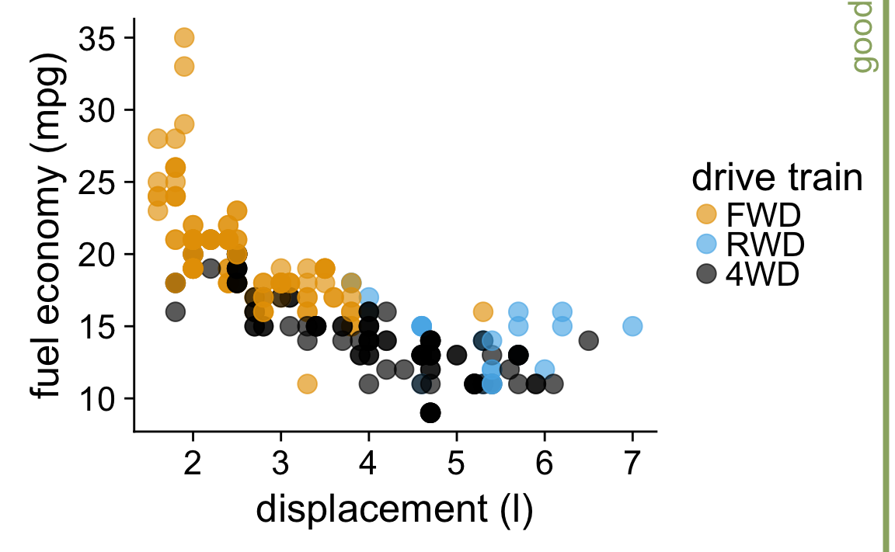

# Handling overlapping points

Let's revisit this figure from Chapter \@ref(small-axis-labels) and focus on an aspect we ignored there:

I have labeled this figure "ugly" here because the points overlap and partly obscure each other. A simple way to ameliorate this issue is to use partial transparency:

