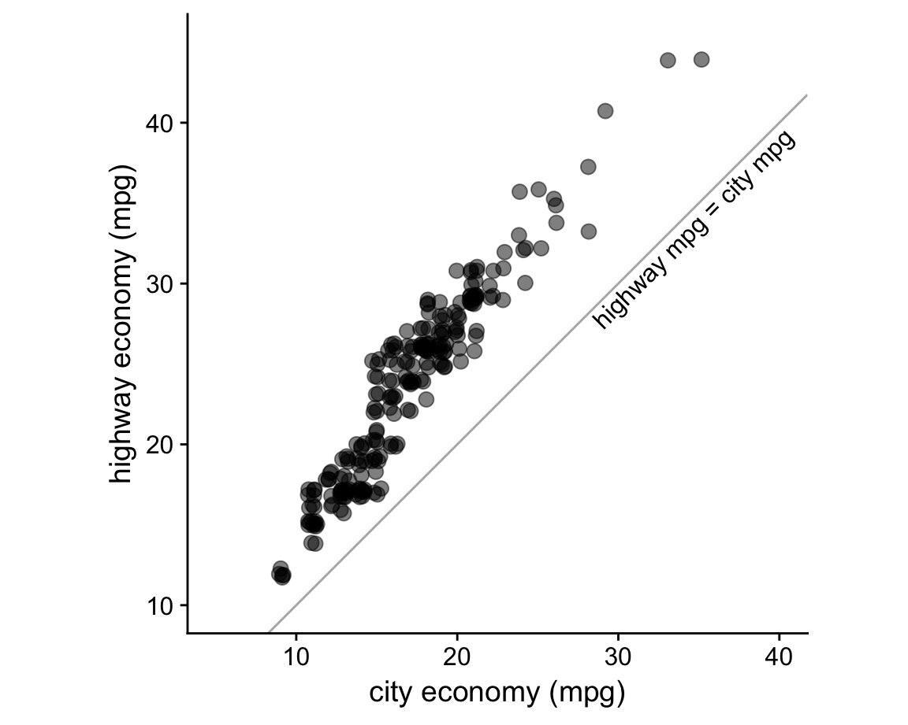
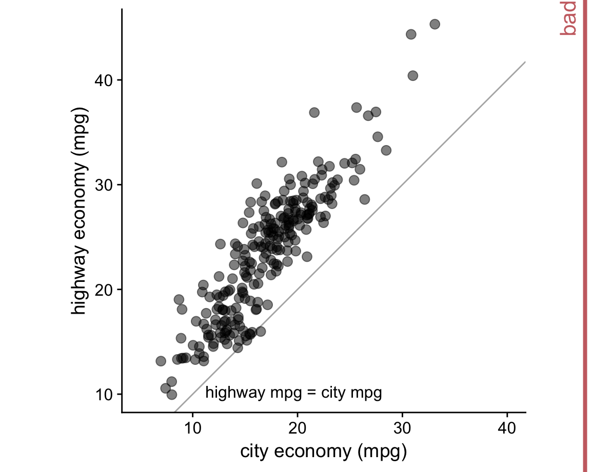
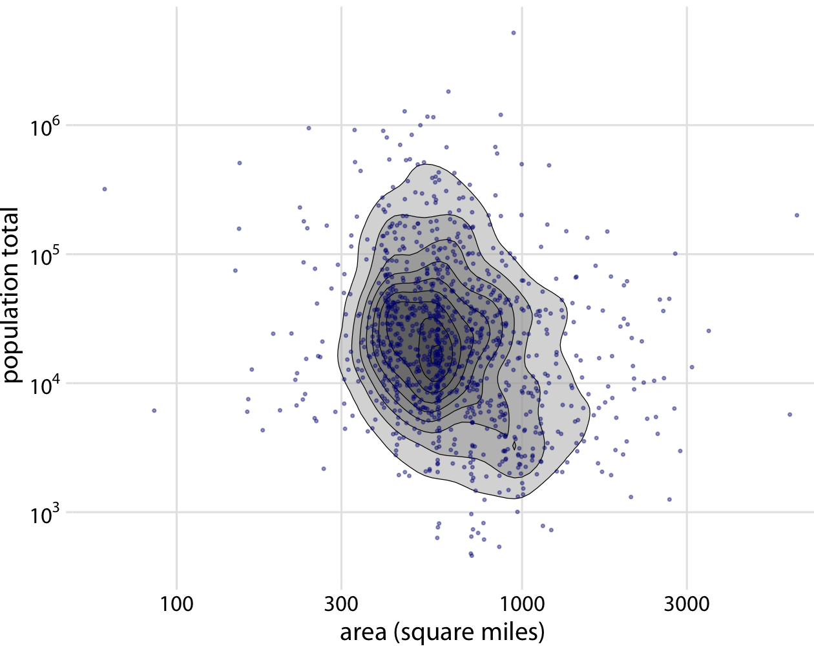
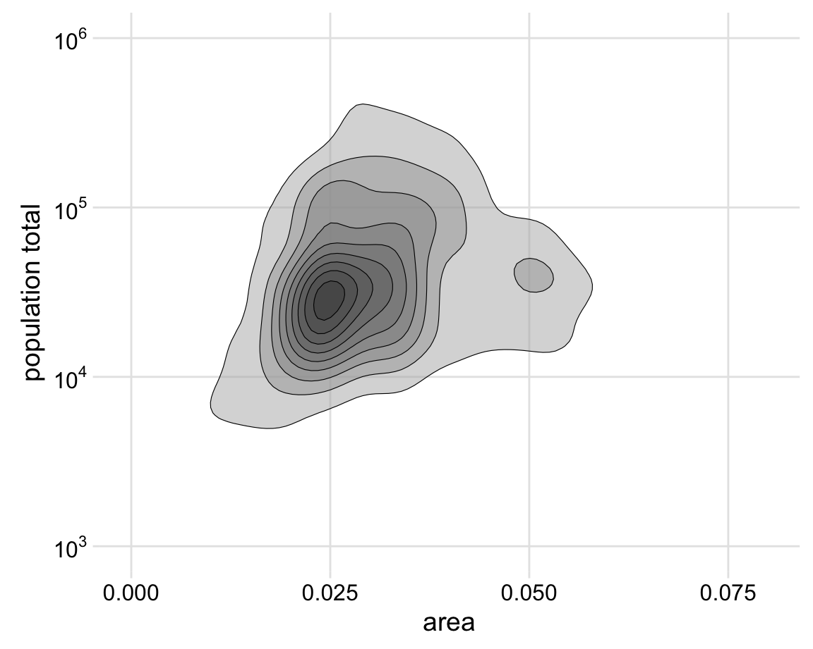
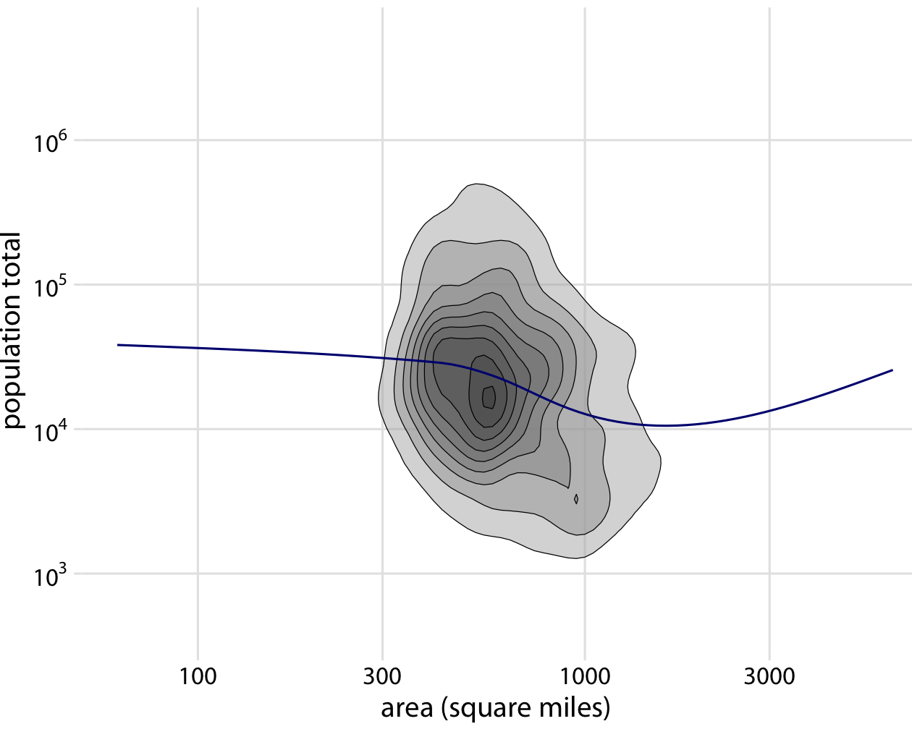

# Handling overlapping points {#overlapping-points}

When we want to visualize large or very large datasets, we often experience the challenge that simple *x*--*y* scatter plots do not work very well because many points lie on top of each other and partially or fully overlap. And similar problems can arise even in small datasets if values were recorded with low precision or rounded, such that multiple observations have exactly the same numeric values. The technical term commonly used to describe this situation is "overplotting", i.e., plotting many points on top of each other. Below, I describe several strategies you can pursue when you encounter this challenge.

## Partial transparency

Let's revisit the fuel economy figure from Chapter \@ref(small-axis-labels) and focus on an aspect we ignored there:

I have labeled this figure "bad" here because the points overlap and partly obscure each other. A simple way to ameliorate this issue is to use partial transparency:

## Jittering

Making points partially transparent is not always sufficient. For example, the same dataset contains fuel economy for both city and highway driving. If we plot those two quantities against each other, we obtain the following figure.

Because fuel economy is rounded to whole integers in this dataset, many points lie exactly on top of each other. While these fully overlapping points appear darker in the plot, the visual appearance is that of one darker point rather than of a set of points plotted in the same location. We can emphasize the number of points in the same locations by applying a small amount of jitter, i.e., displacing each point randomly by a small amount.

However, when jittering we have to make sure not to overdo it. If we jitter too much, we end up placing points in locations that are not representative of the underlying dataset and hence are creating a misleading visualization of the data.

For example, in this particular case the extreme jittering creates the impression that for some cars the highway economy can fall below the city economy. However, such cases do not exist in the original dataset.

## Contour lines

When the number of points grows large, it can be helpful to indicate the point density, for example with contour lines. This technique works well for the following figure, which shows the total population as a function of area for counties in the midwest.

If we want to emphasize the overall features of the distribution rather than the individual points, we can also show only the contour lines and leave out the individual points.

Finally, we can add a smoothing line to highlight the overall trend in the relationship between the two variables.

## 2d histograms

None of the techniques discussed so far work very well when the majority of points falls into a small area relative to the overall extent of the data and the overall extent highlights important data features.

Consider the following figure, which shows the departure delay in minutes versus the flight departure time, for all flights departing Newark airport (EWR) in 2013.

Even though we have made the points fairly transparent, the majority of the points just form a black band between 0 and 300 minutes departure delay. This black band obscures whether most flights depart approximately on time or with substantial delay (say 50 minutes or more). At the same time, the most delayed flights (with delays of 400 minutes or more) are barely visible due to the transparency of the points.

A good solution for this particular case is a 2d histogram, where we subdivide the entire x--y plane into small squares, count how many observations fall into each square, and then color the square by that count. The result is the following figure.

This figure clearly highlights several important features. First, the vast majority of departures during the day (6am to about 9pm) actually depart without delay or even early (negative delay). However, a modest number of departures has a substantial delay. Moreover, the later a plane departs in the day the more of a delay it can have. Importantly, here the departure time is the actual time of departure, not the scheduled time of departure. So this figure does not necessarily tell us that planes scheduled to depart early never experience delay. What it does tell us, though, is that if a plane departs early it either has little delay or, in very rare cases, a delay of around 900 minutes.

As an alternative to binning the data into squares, we can also bin into hexagons. This approach, first proposed by 
@Carr-et-al-1987, has the advantage that the points in a hexagon are, on average, closer to the hexagon center than the points in an equal-area square are to the center of the square. As a consequence, the colored hexagon represents the data slightly more accurately than the colored square does. The following figure shows the same data with hexagon binning rather than square binning.

