# Common pitfalls of color use {#color-pitfalls}

Color can be an incredibly effective tool to enhance data visualizations. At the same time, poor color choices can ruin an otherwise excellent visualization. Color needs to be applied to serve a purpose, it must be clear, and it must not distract.

## Encoding too much or irrelevant information

One common mistake is trying to give color a job that is too big for it to handle, by encoding too many different items in different colors. As an example, consider Figure \@ref(fig:popgrowth-vs-popsize-colored). It shows population growth versus population size for all 50 U.S. states and the District of Columbia. I have attempted to identify each state by giving it its own color. However, the result is not very useful. Even though we can guess which state is which by looking at the colored points in the plot and in the legend, it takes a lot of effort to go back and forth between the two to try to match them up. There are simply too many different colors, and many of them are quite similar to each other. Even if with a lot of effort we can figure out exactly which state is which, this visualization defeats the purpose of coloring. We should use color to enhance figures and make them easier to read, not to obscure the data by creating visual puzzles.

(ref:popgrowth-vs-popsize-colored) Population growth from 2000 to 2010 versus population size in 2000, for all 50 U.S. states and the Discrict of Columbia. Every state is marked in a different color. Because there are so many states, it is very difficult to match the colors in the legend to the dots in the scatter plot. Data source: U.S. Census Bureau

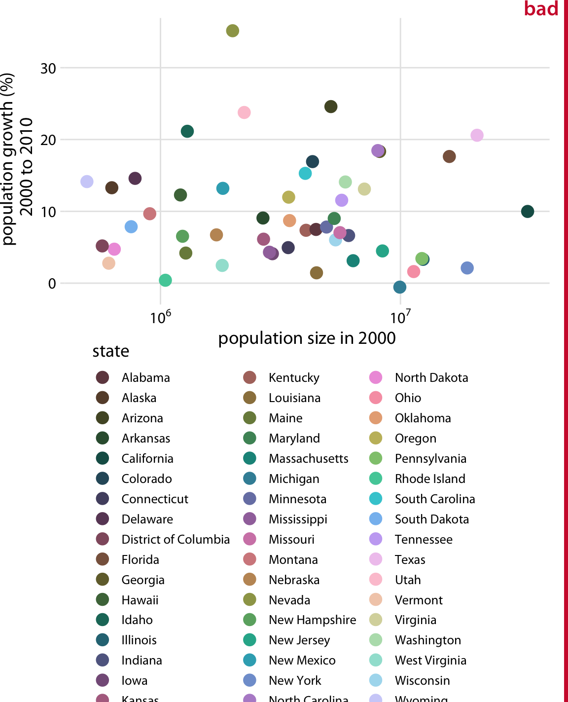

(\#fig:popgrowth-vs-popsize-colored)(ref:popgrowth-vs-popsize-colored)

As a rule of thumb, qualitative color scales work best when there are three to five different categories that need to be colored. Once we reach eight to ten different categories or more, the task of matching colors to categories becomes too burdensome to be useful, even if the colors remain sufficiently different to be distinguishable in principle. For the dataset of Figure \@ref(fig:popgrowth-vs-popsize-colored), it is probably best to use color only to indicate the geographic region of each state and to identify individual states by direct labeling, i.e., by placing appropriate text labels adjacent to the data points (Figure \@ref(fig:popgrowth-vs-popsize-bw)). Even though we cannot label every individual state without making the figure too crowded, direct labeling is the right choice for this figure. In general, for figures such as this one, we don't need to label every single data point. It is sufficient to label a representative subset, for example a set of states we specifically want to call out in the text that will accompany the figure. We always have the option to also provide the underlying data as a table if we want to make sure the reader has access to it in its entirety.

(ref:popgrowth-vs-popsize-bw) Population growth from 2000 to 2010 versus population size in 2000. In contrast to Figure \@ref(fig:popgrowth-vs-popsize-colored), I have now colored states by region and have directly labeled a subset of states. The majority of states have been left unlabeled to keep the figure from overcrowding. Data source: U.S. Census Bureau

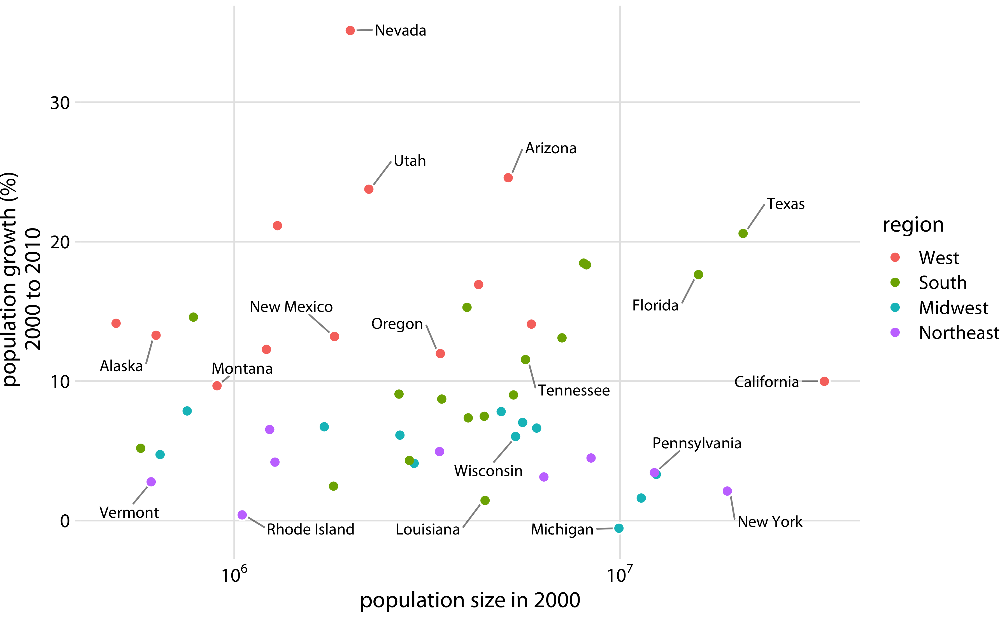

(\#fig:popgrowth-vs-popsize-bw)(ref:popgrowth-vs-popsize-bw)

Use direct labeling instead of colors when you need to distinguish between more than about eight categorical items.

A second common problem is coloring for the sake of coloring, without having a clear purpose for the colors. As an example, consider Figure \@ref(fig:popgrowth-US-rainbow), which is a variation of Figure \@ref(fig:popgrowth-US). However, now instead of coloring the bars by geographic regions, I have given each bar its own color, so that in aggregate the bars create a rainbow effect. This may look like an interesting visual effect, but it is not creating any new insight into the data or making the figure easier to read.

(ref:popgrowth-US-rainbow) Population growth in the U.S. from 2000 to 2010. The rainbow coloring of states serves no purpose and is distracting. Furthermore, the colors are overly saturated. Data source: U.S. Census Bureau

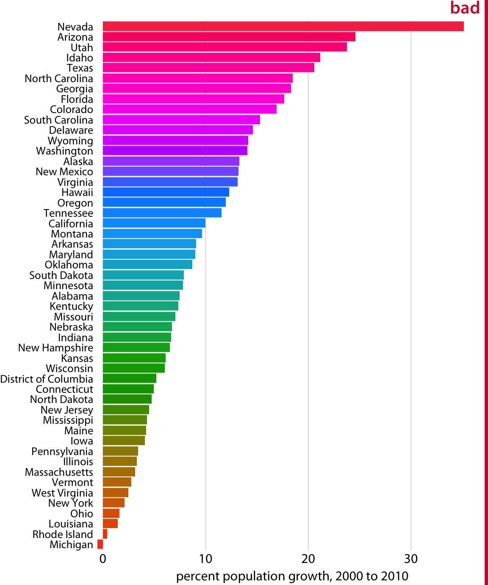

(\#fig:popgrowth-US-rainbow)(ref:popgrowth-US-rainbow)

Besides the gratuitous use of different colors, Figure \@ref(fig:popgrowth-US-rainbow) has a second color-related problem: The chosen colors are too saturated and intense. This color intensity makes the figure difficult to look at. For example, it is difficult to read the names of the states without having our eyes drawn to the large, strongly colored areas right next to the state names. Similarly, it is difficult to compare the endpoints of the bars to the underlying grid lines.

Avoid large filled areas of overly saturated colors. They make it difficult for your reader to carefully inspect your figure.

## Using non-monotonic color scales to encode data values

In Chapter \@ref(color-basics), I listed two critical conditions for designing sequential color scales that can represent data values: The colors need to clearly indicate which data values are larger or smaller than which other ones, and the differences between colors need to visualize the corresponding differences between data values. Unfortunately, several existing color scales---including very popular ones---violate one or both of these conditions. The most popular such scale is the rainbow scale (Figure \@ref(fig:rainbow-desaturated)). It runs through all possible colors in the color spectrum. This means the scale is effectively circular; the colors at the beginning and the end are nearly the same (dark red). If these two colors end up next to each other in a plot, we do not instinctively perceive them as representing data values that are maximally apart. In addition, the scale is highly non-monotonic. It has regions where colors change very slowly and others when colors change rapidly. This lack of monotonicity becomes particularly apparent if we look at the color scale in grayscale (Figure \@ref(fig:rainbow-desaturated)). The scale goes from medium dark to light to very dark and back to medium dark, and there are large stretches where lightness changes very little followed by relatively narrow stretches with large changes in lightness. 

(ref:rainbow-desaturated) The rainbow colorscale is highly non-monotonic. This becomes clearly visible by converting the colors to gray values. From left to right, the scale goes from moderately dark to light to very dark and back to moderately dark. In addition, the changes in lightness are very non-uniform. The lightest part of the scale (corresponding to the colors yellow, light green, and cyan) takes up almost a third of the entire scale while the darkest part (corresponding to dark blue) is concentrated in a narrow region of the scale.

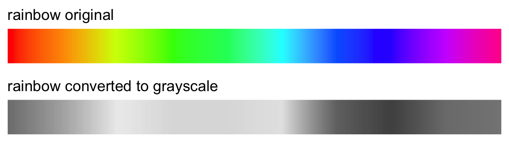

(\#fig:rainbow-desaturated)(ref:rainbow-desaturated)

In a visualization of actual data, the rainbow scale tends to obscure data features and/or highlight arbitrary aspects of the data (Figure \@ref(fig:map-Texas-rainbow)). As an aside, the colors in the rainbow scale are also overly saturated. Looking at Figure \@ref(fig:map-Texas-rainbow) for any extended period of time can be quite uncomfortable.

(ref:map-Texas-rainbow) Percentage of people identifying as white in Texas counties. The rainbow color scale is not an appropriate scale to visualize continuous data values, because it tends to place emphasis on arbitrary features of the data. Here, it emphasizes counties in which approximately 75% of the population identify as white. Data source: 2010 Decennial U.S. Census

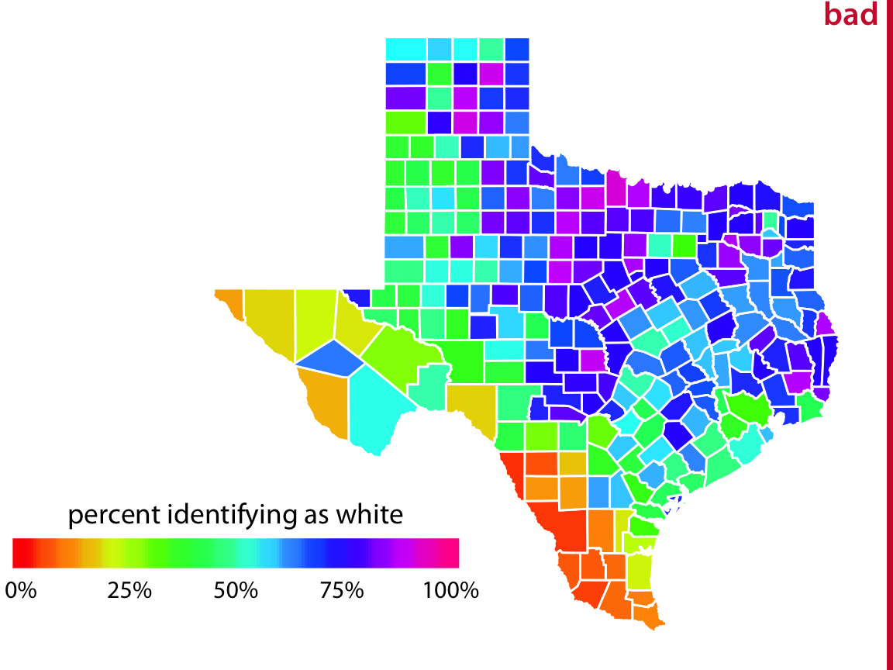

(\#fig:map-Texas-rainbow)(ref:map-Texas-rainbow)

## Not designing for color-vision deficiency

Whenever we are choosing colors for a visualization, we need to keep in mind that a good proportion of our readers may have some form of color-vision deficiency (i.e., are colorblind). These readers may not be able to distinguish colors that look clearly different to most other people. People with impaired color vision are not literally unable to see any colors, however. Instead, they will typically have difficulty to distinguish certain types of colors, for example red and green (red--green color-vision deficiency) or blue and green (blue--yellow color-vision deficiency). The technical terms for these deficiencies are deuteranomaly/deuteranopia and protanomaly/protanopia for the red--green variant (where people have difficulty perceiving either green or red, respectively) and tritanomaly/tritanopia for the blue--yellow variant (where people have difficulty perceiving blue). The terms ending in "anomaly" refer to some impairment in the perception of the respective color, and the terms ending in "anopia" refer to complete absence of perception of that color. Approximately 8% of males and 0.5% of females suffer from some sort of color-vision deficiency, and deuteranomaly is the most common form whereas tritanomaly is relatively rare.

As discussed in Chapter \@ref(color-basics), there are three fundamental types of color scales used in data visualization: sequential scales, diverging scales, and qualitative scales. Of these three, sequential scales will generally not cause any problems for people with color-vision deficiency (cvd), since a properly designed sequential scale should present a continuous gradient from dark to light colors. Figure \@ref(fig:heat-cvd-sim) shows the Heat scale from Figure \@ref(fig:sequential-scales) in simulated versions of deuteranomaly, protanomaly, and tritanomaly. While none of these cvd-simulated scales look like the original, they all present a clear gradient from dark to light and they all work well to convey the magnitude of a data value.

(ref:heat-cvd-sim) Color-vision deficiency (cvd) simulation of the sequential color scale Heat, which runs from dark red to light yellow. From left to right and top to bottom, we see the original scale and the scale as seen under deuteranomaly, protanomaly, and tritanomaly simulations. Even though the specific colors look different under the three types of cvd, in each case we can see a clear gradient from dark to light. Therefore, this color scale is safe to use for cvd.

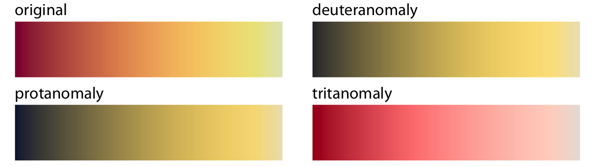

(\#fig:heat-cvd-sim)(ref:heat-cvd-sim)

Things become more complicated for diverging scales, because popular color contrasts can become indistinguishable under cvd. In particular, the colors red and green provide about the strongest contrast for people with normal color vision but become nearly indistinguishable for deutans (people with deuteranomaly) or protans (people with protanomaly) (Figure \@ref(fig:red-green-cvd-sim)). Similarly, blue-green contrasts are visible for deutans and protans but become indistinguishable for tritans (people with tritanomaly) (Figure \@ref(fig:blue-green-cvd-sim)).

(ref:red-green-cvd-sim) A red--green contrast becomes indistinguishable under red--green cvd (deuteranomaly or protanomaly).

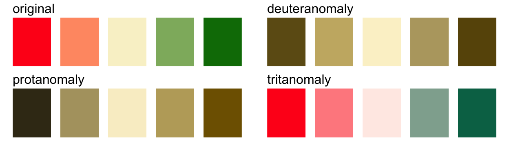

(\#fig:red-green-cvd-sim)(ref:red-green-cvd-sim)

(ref:blue-green-cvd-sim) A blue--green contrast becomes indistinguishable under blue--yellow cvd (tritanomaly).

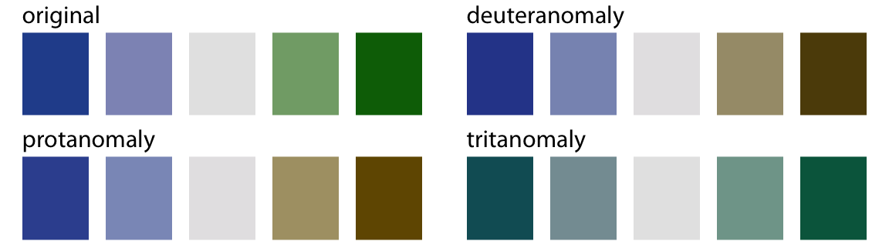

(\#fig:blue-green-cvd-sim)(ref:blue-green-cvd-sim)

With these examples, it might seem that it is nearly impossible to find two contrasting colors that are safe under all forms of cvd. However, the situation is not that dire. It is often possible to make slight modifications to the colors such that they have the desired character while also being safe for cvd. For example, the ColorBrewer PiYG (pink to yellow-green) scale from Figure \@ref(fig:diverging-scales) looks red--green to people with normal color vision yet remains distinguishable for people with cvd (Figure \@ref(fig:PiYG-cvd-sim)).

(ref:PiYG-cvd-sim) The ColorBrewer PiYG (pink to yellow-green) scale from Figure \@ref(fig:diverging-scales) looks like a red--green contrast to people with regular color vision but works for all forms of color-vision deficiency. It works because the reddish color is actually pink (a mix of red and blue) while the greenish color also contains yellow. The difference in the blue component between the two colors can be picked up even by deutans or protans, and the difference in the red component can be picked up by tritans.

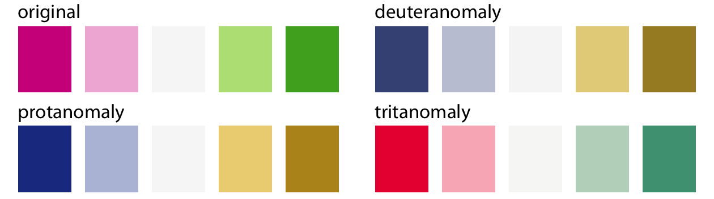

(\#fig:PiYG-cvd-sim)(ref:PiYG-cvd-sim)

Things are most complicated for qualitative scales, because there we need many different colors and they all need to be distinguishable from each other under all forms of cvd. My preferred qualitative color scale, which I use extensively throughout this book, was developed specifically to address this challenge (Figure \@ref(fig:palette-Okabe-Ito)). By providing eight different colors, the palette works for nearly any scenario with discrete colors. As discussed at the beginning of this chapter, you should probably not color-code more than eight different items in a plot anyways.

(ref:palette-Okabe-Ito) Qualitative color palette for all color-vision deficiencies [@Okabe-Ito-CUD]. The alphanumeric codes represent the colors in RGB space, encoded as hexadecimals. In many plot libraries and image-manipulation programs, you can just enter these codes directly. If your software does not take hexadecimals directly, you can also use the values in Table \@ref(tab:color-codes).

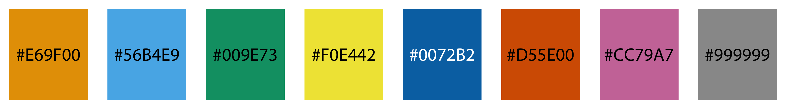

(\#fig:palette-Okabe-Ito)(ref:palette-Okabe-Ito)

Table: (\#tab:color-codes) Colorblind-friendly color scale, developed by @Okabe-Ito-CUD. 

Name            Hex code     Hue     C, M, Y, K (%)   R, G, B (0-255)   R, G, B (%)
--------------  ------------ ------- ---------------- ----------------- ------------
        orange       #E69F00     41° 0, 50, 100, 0    230, 159, 0       90, 60, 0
      sky blue       #56B4E9    202° 80, 0, 0, 0      86, 180, 233      35, 70, 90
  bluish green       #009E73    164° 97, 0, 75, 0     0, 158, 115       0, 60, 50
        yellow       #F0E442     56° 10, 5, 90, 0     240, 228, 66      95, 90, 25
          blue       #0072B2    202° 100, 50, 0, 0    0, 114, 178       0, 45, 70
     vermilion       #D55E00     27° 0, 80, 100, 0    213, 94, 0        80, 40, 0
reddish purple       #CC79A7    326° 10, 70, 0, 0     204, 121, 167     80, 60, 70
         black       #000000      -  0, 0, 0, 100     0, 0, 0           0, 0, 0
 
While there are several good, cvd-safe color scales readily available, we need to recognize that they are no magic bullets. It is very possible to use a cvd-safe scale and yet produce a figure a person with cvd cannot decipher. One critical parameter is the size of the colored graphical elements. Colors are much easier to distinguish when they are applied to large areas than to small ones or thin lines [@Stone_et_al_2014]. And this effect is exacerbated under cvd (Figure \@ref(fig:colors-thin-lines)). In addition to the various color-design considerations discussed in this chapter and in Chapter \@ref(color-basics), I recommend to view color figures under cvd simulations to get a sense of what they may look like for a person with cvd. There are several online services and desktop apps available that allow users to run arbitrary figures through a cvd simulation.

(ref:colors-thin-lines) Colored elements become difficult to distinguish at small sizes. The top left panel (labeled "original") shows four rectangles, four thick lines, four thin lines, and four groups of points, all colored in the same four colors. We can see that the colors become more difficult to distinguish the smaller or thinner the visual elements are. This problem becomes exacerbated in the cvd simulations, where the colors are already more difficult to distinguish even for the large graphical elements.

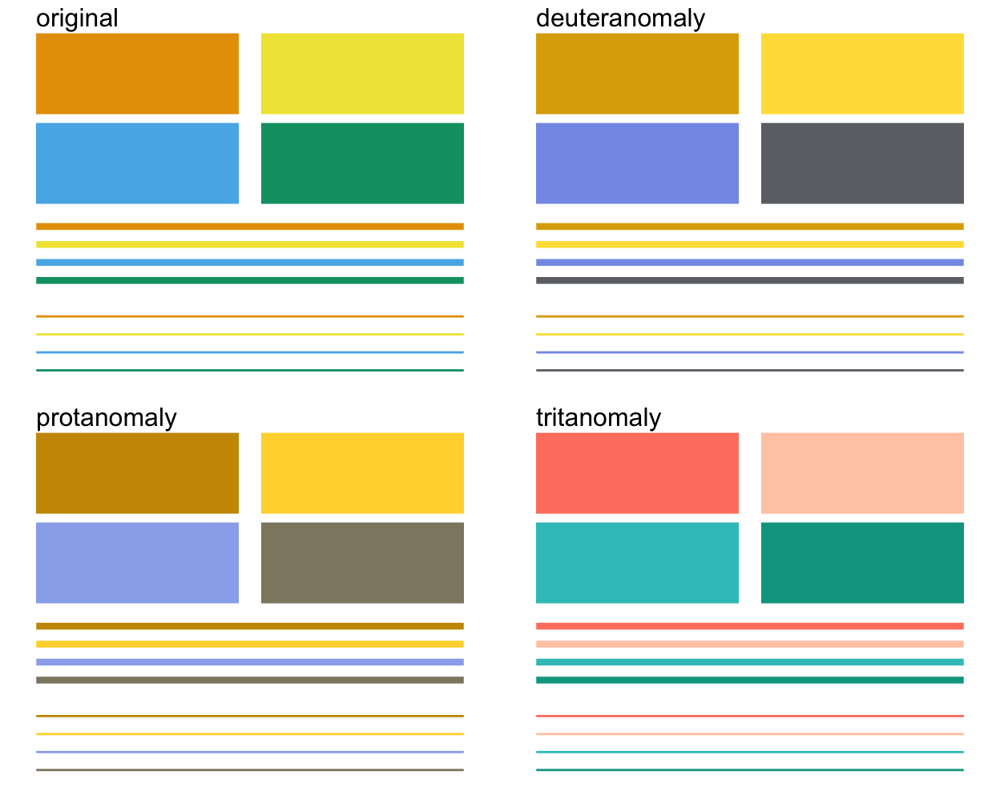

(\#fig:colors-thin-lines)(ref:colors-thin-lines)

To make sure your figures work for people with cvd, don't just rely on specific color scales. Instead, test your figures in a cvd simulator.

