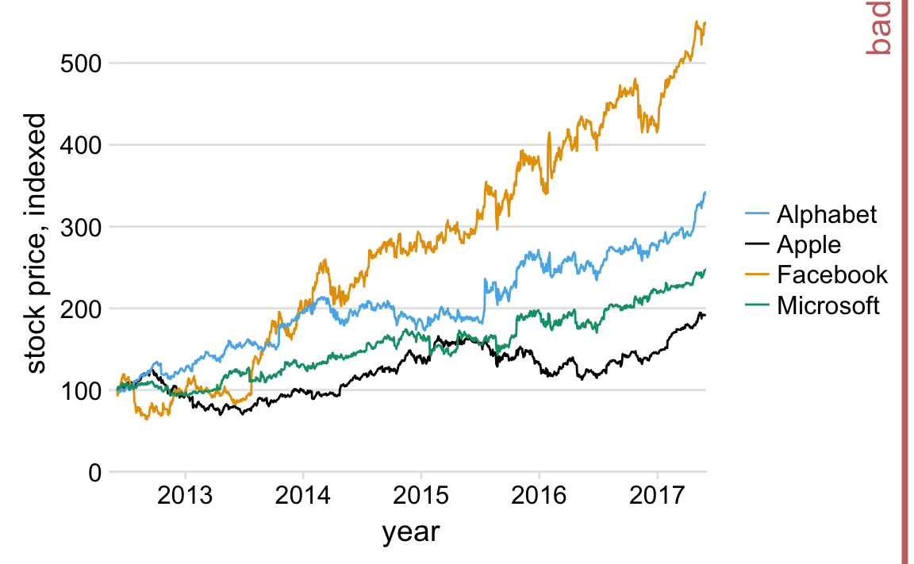

# Redundant coding {#redundant-coding}

*Need some intro text here about the concept of redundant coding, showing the same information with multiple visua elements that reinforce each other.*

Let's consider this example, which demonstrates an very common visualization mistake.

The figure contains four lines, representing the stock prices of four different companies. The lines are color coded using a colorblind-friendly color scale. So it should be relatively straightfoward to associate each line with the corresponding company. Yet it is not. The problem here is that the data lines have a clear visual order. The yellow line, representing Facebook, is clearly the highest line, and the black line, representing Apple, is clearly the lowest, with Alphabet and Microsoft inbetween, in that order. Yet the order of the four companies in the legend is Alphabet, Apple, Facebook, Microsoft (alphabetic order). Thus, the perceived order of the data lines differs from the order of the companies in the legend, and it takes a surprising amount of effort to match data lines with company names.

This problem arises commonly with plotting software that autogenerates legends, as is the case for instance with R's ggplot2. The plotting software has no concept of the visual order that the viewer will perceive in the data, and it will instead sort the legend by some other order, most commonly alphabetical. We can fix this problem by manually reordering the entries in the legend so they match the preceived ordering in the data.

While the above figure is a major improvement, we can still do better. Even with the correct ordering, a legend imposes an unnecessary mental burden on the viewer of the figure. The viewer has to match the colors in the legend to the colors in the figure and translate which company name goes with which data line. It is better to get rid of the legend altogether and instead draw the company names right next to the data lines.

The general principle is this: **Whenever possible, design your figures so they don't need a legend.**
