# Visualizing amounts {#visualizing-amounts}

In many scenarios, we are interested in the magnitude of some set of numbers. For example, we might want to visualize the total sales volume of different brands of cars, or the total number of people living in different cities, or the age of olympians performing different sports. In all these cases, we have a set of categories (e.g., brands of cars, cities, or sports) and a quantitative value for each category. I refer to these cases as visualizing amounts, because the main emphasis in these visualizations will be on the magnitude of the quantitative values. The standard visualization in this scenario is the bar plot, which comes in several variations, including simple bars as well as grouped and stacked bars. Alternatives to the bar plot are the dot plot and the heatmap.

## Bar plots

To motivate the concept of a bar plot, consider the total ticket sales for the most popular movies on a given weekend. Table \@ref(tab:boxoffice-gross) shows the top-five weekend gross ticket sales on the Christmas weekend of 2017. The movie "Star Wars: The Last Jedi" was by far the most popular movie on that weekend, outselling the fourth- and fifth-ranked movies "The Greatest Showman" and "Ferdinand" by almost a factor of 10.

Table: (\#tab:boxoffice-gross)Highest grossing movies for the weekend of December 22-24, 2017. Data source: Box Office Mojo (http://www.boxofficemojo.com/). Used with permission

      Rank   Title                             Weekend gross          
---  ------  -------------------------------  --------------  ---  ---
       1     Star Wars: The Last Jedi            $71,565,498          
       2     Jumanji: Welcome to the Jungle      $36,169,328          
       3     Pitch Perfect 3                     $19,928,525          
       4     The Greatest Showman                 $8,805,843          
       5     Ferdinand                            $7,316,746          

This kind of data is commonly visualized with vertical bars. For each movie, we draw a bar that starts at zero and extends all the way to the dollar value for that movie's weekend gross (Figure \@ref(fig:boxoffice-vertical)). This visualization is called a *bar plot* or *bar chart*.

(ref:boxoffice-vertical) Highest grossing movies for the weekend of December 22-24, 2017, displayed as a bar plot. Data source: Box Office Mojo (http://www.boxofficemojo.com/). Used with permission

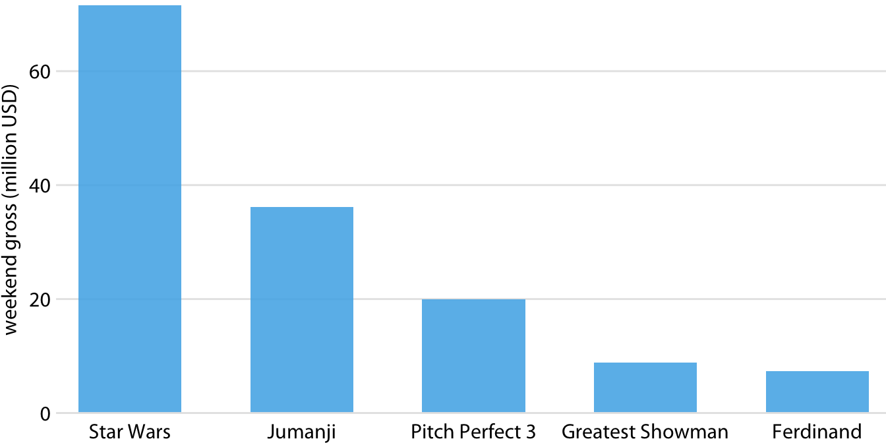

(\#fig:boxoffice-vertical)(ref:boxoffice-vertical)

One problem we commonly encounter with vertical bars is that the labels identifying each bar take up a lot of horizontal space. In fact, I had to make Figure \@ref(fig:boxoffice-vertical) fairly wide and space out the bars so that I could place the movie titles underneath. To save horizontal space, we could place the bars closer together and rotate the labels (Figure \@ref(fig:boxoffice-rot-axis-tick-labels)). However, I am not a big proponent of rotated labels. I find the resulting plots awkward and difficult to read. And, in my experience, whenever the labels are too long to place horizontally they also don't look good rotated.

(ref:boxoffice-rot-axis-tick-labels) Highest grossing movies for the weekend of December 22-24, 2017, displayed as a bar plot with rotated axis tick labels. Rotated axis tick labels tend to be difficult to read and require awkward space use undearneath the plot. For these reasons, I generally consider plots with rotated tick labels to be ugly. Data source: Box Office Mojo (http://www.boxofficemojo.com/). Used with permission

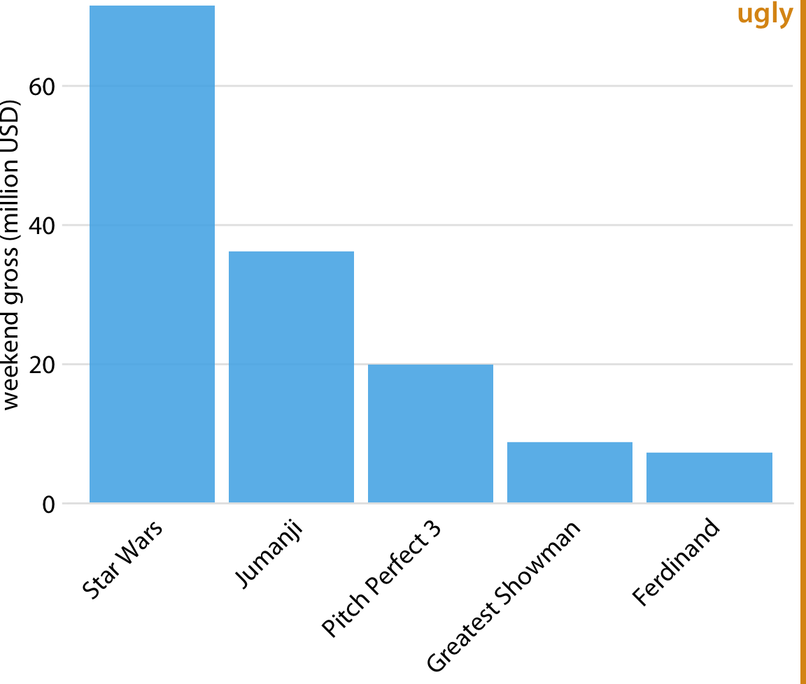

(\#fig:boxoffice-rot-axis-tick-labels)(ref:boxoffice-rot-axis-tick-labels)

The better solution for long labels is usually to swap the *x* and the *y* axis, so that the bars run horizontally (Figure \@ref(fig:boxoffice-horizontal)). After swapping the axes, we obtain a compact figure in which all visual elements, including all text, are horizontally oriented. As a result, the figure is much easier to read than Figure \@ref(fig:boxoffice-rot-axis-tick-labels) or even Figure \@ref(fig:boxoffice-vertical).

(ref:boxoffice-horizontal) Highest grossing movies for the weekend of December 22-24, 2017, displayed as a horizontal bar plot. Data source: Box Office Mojo (http://www.boxofficemojo.com/). Used with permission

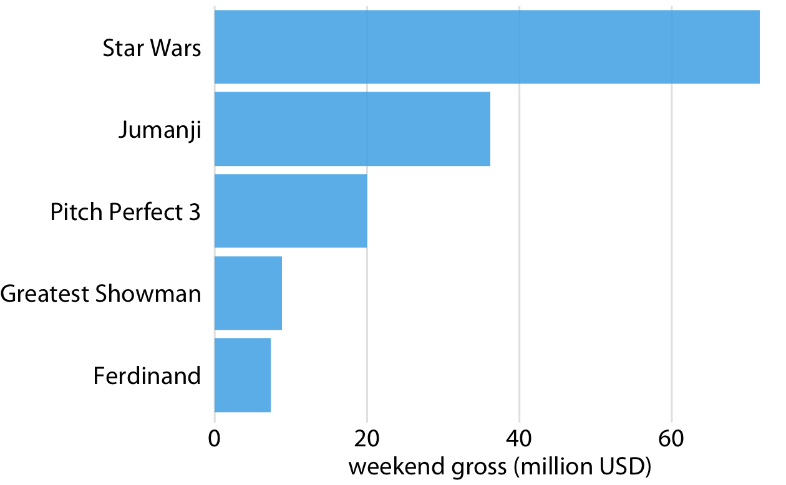

(\#fig:boxoffice-horizontal)(ref:boxoffice-horizontal)

Regardless of whether we place bars vertically or horizontally, we need to pay attention to the order in which the bars are arranged. I often see bar plots where the bars are arranged arbitrarily or by some criterion that is not meaningful in the context of the figure. Some plotting programs arrange bars by default in alphabetic order of the labels, and other, similarly arbitrary arrangements are possible (Figure \@ref(fig:boxoffice-horizontal-bad-order)). In general, the resulting figures are more confusing and less intuitive than figures where bars are arranged in order of their size.  

(ref:boxoffice-horizontal-bad-order) Highest grossing movies for the weekend of December 22-24, 2017, displayed as a horizontal bar plot. Here, the bars have been placed in descending order of the lengths of the movie titles. This arrangement of bars is arbitrary, it doesn't serve a meaningful purpose, and it makes the resulting figure much less intuitive than Figure \@ref(fig:boxoffice-horizontal). Data source: Box Office Mojo (http://www.boxofficemojo.com/). Used with permission

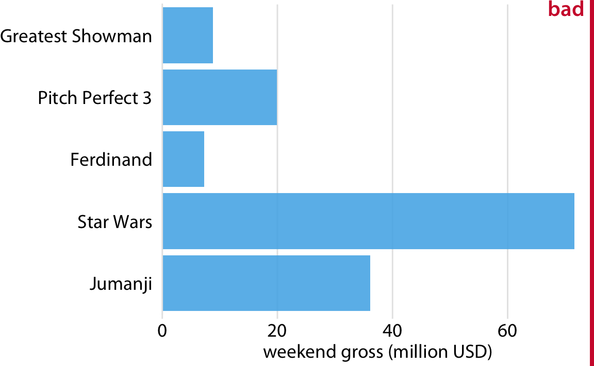

(\#fig:boxoffice-horizontal-bad-order)(ref:boxoffice-horizontal-bad-order)

We should only rearrange bars, however, when there is no natural ordering to the categories the bars represent. Whenever there is a natural ordering (i.e., when our categorical variable is an ordered factor) we should retain that ordering in the visualization. For example, Figure \@ref(fig:income-by-age) shows the median annual income in the U.S. by age groups. In this case, the bars should be arranged in order of increasing age. Sorting by bar height while shuffling the age groups makes no sense (Figure \@ref(fig:income-by-age-sorted)).

(ref:income-by-age) 2016 median U.S. annual household income versus age group. The 45--54 year age group has the highest median income. Data source: United States Census Bureau

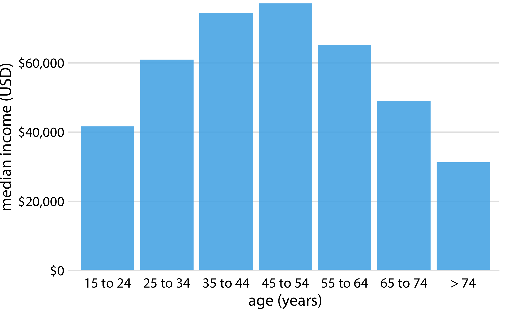

(\#fig:income-by-age)(ref:income-by-age)

(ref:income-by-age-sorted) 2016 median U.S. annual household income versus age group, sorted by income. While this order of bars looks visually appealing, the order of the age groups is now confusing. Data source: United States Census Bureau

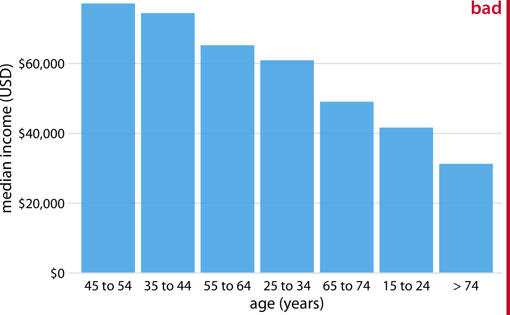

(\#fig:income-by-age-sorted)(ref:income-by-age-sorted)

Pay attention to the bar order. If the bars represent unordered categories, order them by ascending or descending data values.

## Grouped and stacked bars

All examples from the previous subsection showed how a quantitative amount varied with respect to one categorical variable. Frequently, however, we are interested in two categorical variables at the same time. For example, the U.S. Census Bureau provides median income levels broken down by both age and race. We can visualize this dataset with a *grouped bar plot* (Figure \@ref(fig:income-by-age-race-dodged)). In a grouped bar plot, we draw a group of bars at each position along the *x* axis, determined by one categorical variable, and then we draw bars within each group according to the other categorical variable.

(ref:income-by-age-race-dodged) 2016 median U.S. annual household income versus age group and race. Age groups are shown along the *x* axis, and for each age group there are four bars, corresponding to the median income of Asian, white, Hispanic, and black people, respectively. Data source: United States Census Bureau

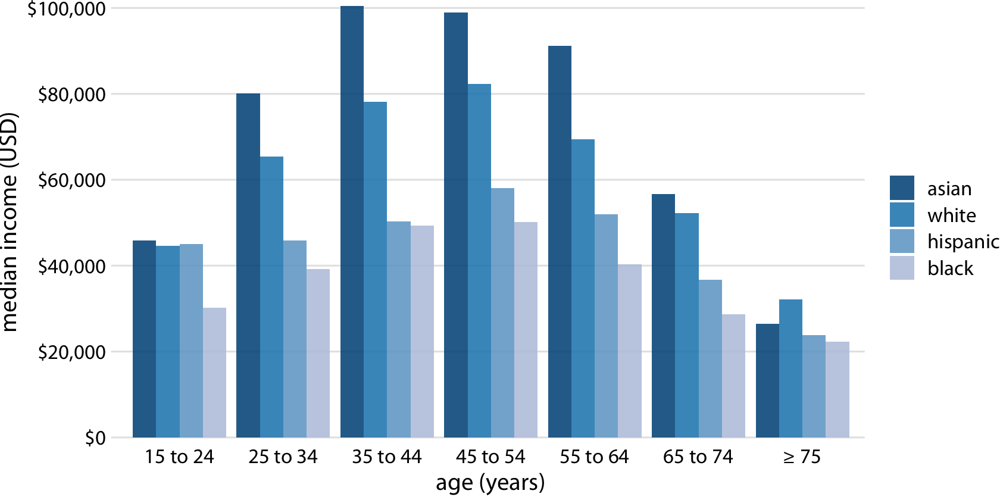

(\#fig:income-by-age-race-dodged)(ref:income-by-age-race-dodged)

Grouped bar plots show a lot of information at once and they can be confusing. In fact, even though I have not labeled Figure \@ref(fig:income-by-age-race-dodged) as bad or ugly, I find it difficult to read. In particular, it is difficult to compare median incomes across age groups for a given racial group. So this figure is only appropriate if we are primarily interested in the differences in income levels among racial groups, separately for specific age groups. If we care more about the overall pattern of income levels among racial groups, it may be preferable to show race along the *x* axis and show ages as distinct bars within each racial group (Figure \@ref(fig:income-by-race-age-dodged)).

(ref:income-by-race-age-dodged) 2016 median U.S. annual household income versus age group and race. In contrast to Figure \@ref(fig:income-by-age-race-dodged), now race is shown along the *x* axis, and for each race we show seven bars according to the seven age groups. Data source: United States Census Bureau

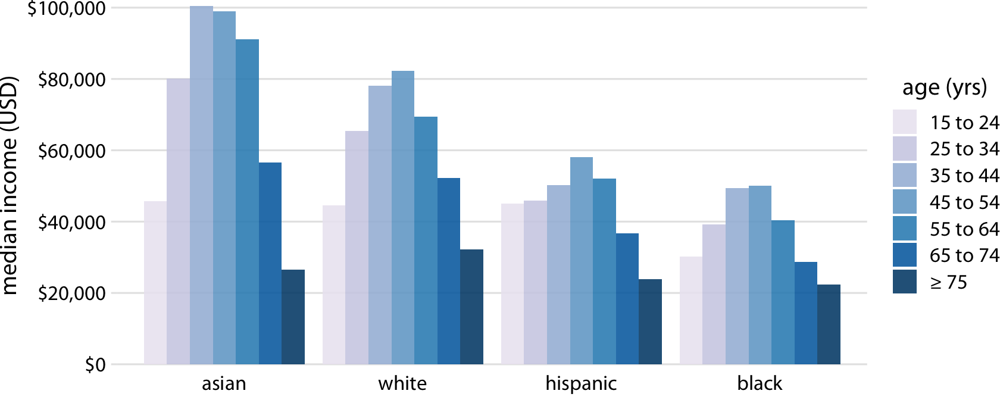

(\#fig:income-by-race-age-dodged)(ref:income-by-race-age-dodged) 

Both Figures \@ref(fig:income-by-age-race-dodged) and \@ref(fig:income-by-race-age-dodged) encode one categorical variable by position along the *x* axis and the other by bar color. And in both cases, the encoding by position is easy to read while the encoding by bar color requires more mental effort, as we have to mentally match the colors of the bars against the colors in the legend. We can avoid this added mental effort by showing four separate regular bar plots rather than one grouped bar plot (Figure \@ref(fig:income-by-age-race-faceted)). Which of these various options we choose is ultimately a matter of taste. I would likely choose Figure \@ref(fig:income-by-age-race-faceted), because it circumvents the need for different bar colors.

(ref:income-by-age-race-faceted) 2016 median U.S. annual household income versus age group and race. Instead of displaying this data as a grouped bar plot, as in Figures \@ref(fig:income-by-age-race-dodged) and \@ref(fig:income-by-race-age-dodged), we now show the data as four separate regular bar plots. This choice has the advantage that we don't need to encode either categorical variable by bar color. Data source: United States Census Bureau

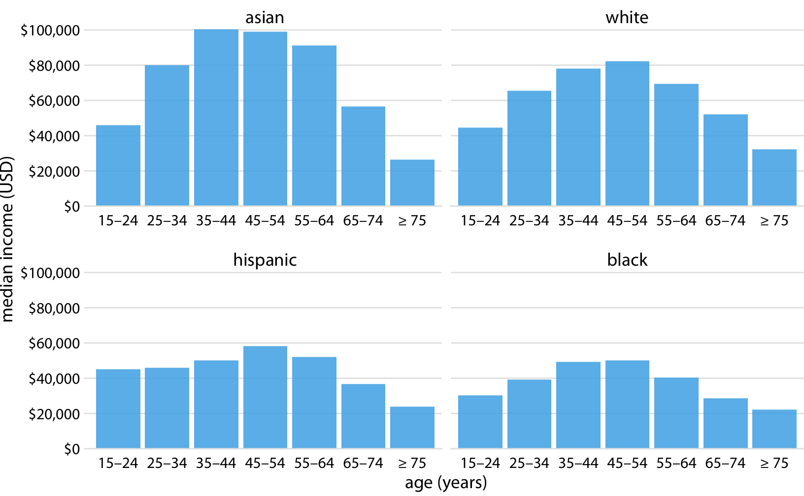

(\#fig:income-by-age-race-faceted)(ref:income-by-age-race-faceted)

Instead of drawing groups of bars side-by-side, it is sometimes preferable to stack bars on top of each other. Stacking is useful when the sum of the amounts represented by the individual stacked bars is in itself a meaningful amount. So, while it would not make sense to stack the median income values of Figure \@ref(fig:income-by-age-race-dodged) (the sum of two median income values is not a meaningful value), it might make sense to stack the weekend gross values of Figure \@ref(fig:boxoffice-vertical) (the sum of the weekend gross values of two movies is the total gross for the two movies combined). Stacking is also appropriate when the individual bars represent counts. For example, in a dataset of people, we can either count men and women separately or we can count them together. If we stack a bar representing a count of women on top of a bar representing a count of men, then the combined bar height represents the total count of people regardless of gender.

I will demonstrate this principle using a dataset about the passengers of the transatlantic ocean liner Titanic, which sank on April 15, 1912. On board were approximately 1300 passengers, not counting crew. The passengers were traveling in one of three classes (1st, 2nd, or 3rd), and there were almost twice as many male as female passengers on the ship. To visualize the breakdown of passengers by class and gender, we can draw separate bars for each class and gender and stack the bars representing women on top of the bars representing men, separately for each class (Figure \@ref(fig:titanic-passengers-by-class-sex)). The combined bars represent the total number of passengers in each class.

(ref:titanic-passengers-by-class-sex) Numbers of female and male passengers on the Titanic traveling in 1st, 2nd, and 3rd class.

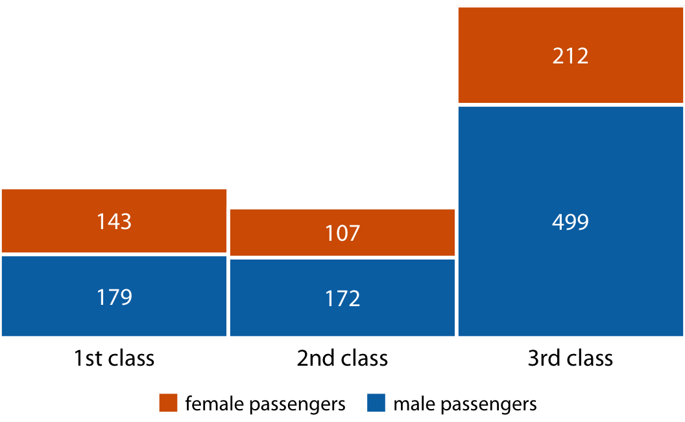

(\#fig:titanic-passengers-by-class-sex)(ref:titanic-passengers-by-class-sex)

Figure \@ref(fig:titanic-passengers-by-class-sex) differs from the previous bar plots I have shown in that there is no explicit *y* axis. I have instead shown the actual numerical values that each bar represents. Whenever a plot is meant to display only a small number of different values, it makes sense to add the actual numbers to the plot. This substantially increases the amount of information conveyed by the plot without adding much visual noise, and it removes the need for an explicit *y* axis.

## Dot plots and heatmaps

Bars are not the only option for visualizing amounts. One important limitation of bars is that they need to start at zero, so that the bar length is proportional to the amount shown. For some datasets, this can be impractical or may obscure key features. In this case, we can indicate amounts by placing dots at the appropriate locations along the *x* or *y* axis.

Figure \@ref(fig:Americas-life-expect) demonstrates this visualization approach for a dataset of life expectancies in 25 countries in the Americas. The citizens of these countries have life expectancies between 60 and 81 years, and each individual life expectancy value is shown with a blue dot at the appropriate location along the *x* axis. By limiting the axis range to the interval from 60 to 81 years, the figure highlights the key features of this dataset: Canada has the highest life expectancy among all listed countries, and Bolivia and Haiti have much lower life expectancies than all other countries. If we had used bars instead of dots (Figure \@ref(fig:Americas-life-expect-bars)), we'd have made a much less compelling figure. Because the bars are so long in this figure, and they all have nearly the same length, the eye is drawn to the middle of the bars rather than to their end points, and the figure fails to convey its message.

(ref:Americas-life-expect) Life expectancies of countries in the Americas, for the year 2007. Data source: Gapminder project

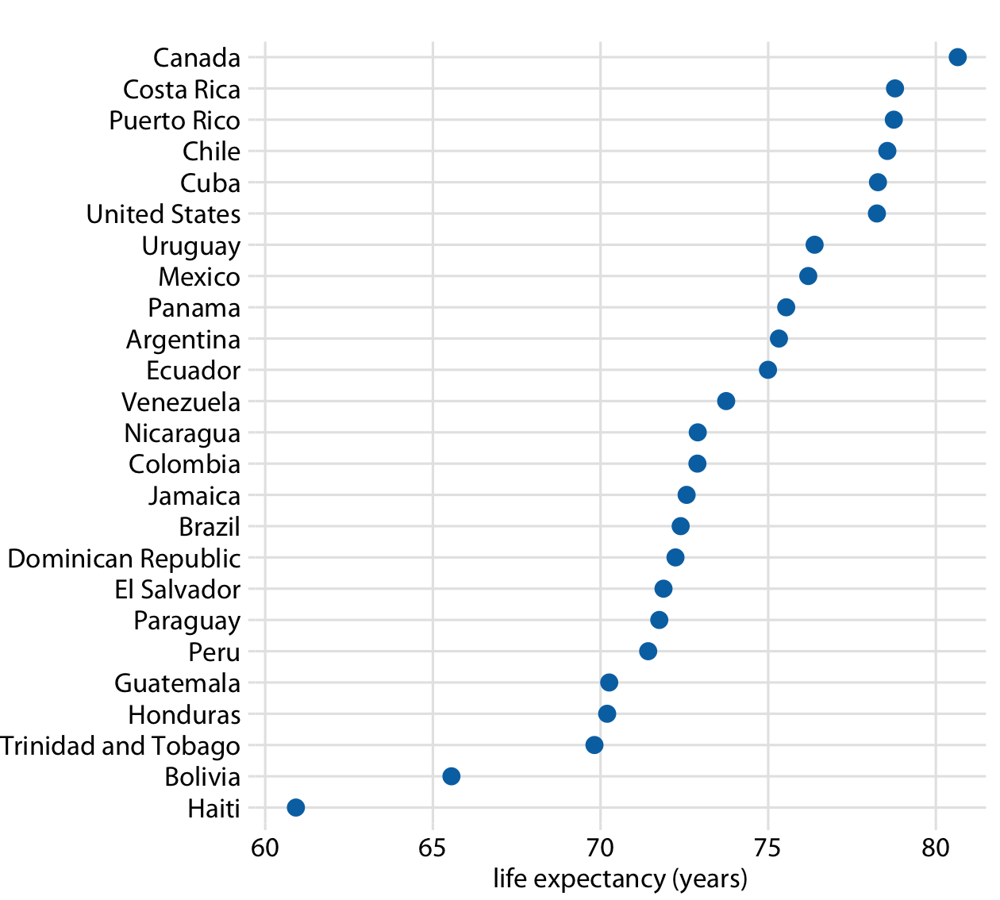

(\#fig:Americas-life-expect)(ref:Americas-life-expect)

(ref:Americas-life-expect-bars) Life expectancies of countries in the Americas, for the year 2007, shown as bars. This dataset is not suitable for being visualized with bars. The bars are too long and they draw attention away from the key feature of the data, the differences in life expectancy among the different countries. Data source: Gapminder project

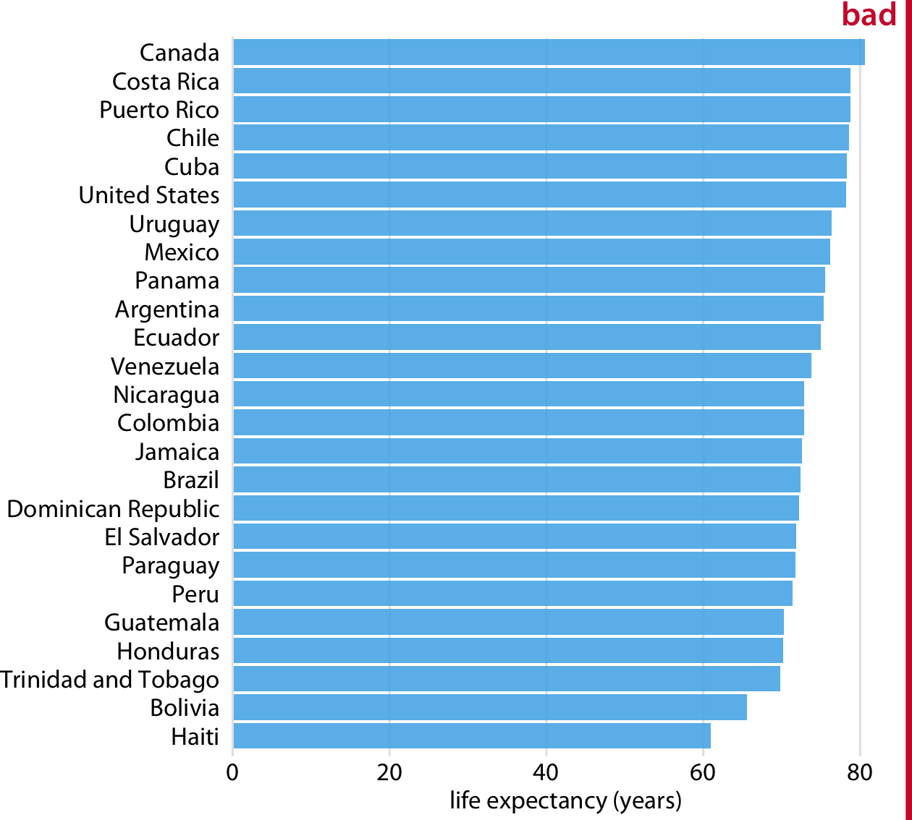

(\#fig:Americas-life-expect-bars)(ref:Americas-life-expect-bars)

Regardless of whether we use bars or dots, however, we need to pay attention to the ordering of the data values. In Figures \@ref(fig:Americas-life-expect) and \@ref(fig:Americas-life-expect-bars), the countries are ordered in descending order of life expectancy. If we instead ordered them alphabetically, we'd end up with a disordered cloud of points that is confusing and fails to convey a clear message (Figure \@ref(fig:Americas-life-expect-bad)). 

(ref:Americas-life-expect-bad) Life expectancies of countries in the Americas, for the year 2007. Here, the countries are ordered alphabetically, which causes a dots to form a disordered cloud of points. This makes the figure difficult to read, and therefore it deserves to be labeled as "bad." Data source: Gapminder project

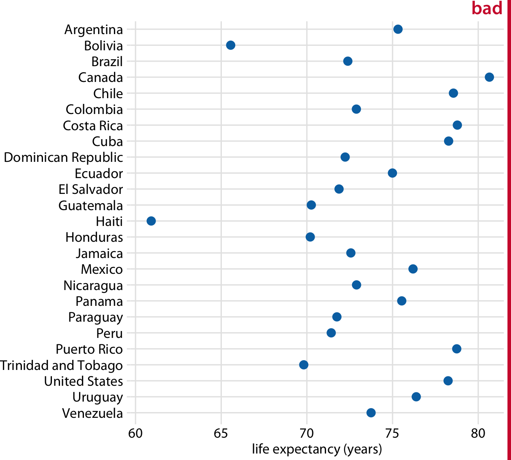

(\#fig:Americas-life-expect-bad)(ref:Americas-life-expect-bad)

All examples so far have represented amounts by location along a position scale, either through the end point of a bar or the placement of a dot. For very large datasets, neither of these options may be appropriate, because the resulting figure would become too busy. We had already seen in Figure \@ref(fig:income-by-age-race-dodged) that just seven groups of four data values can result in a figure that is complex and not that easy to read. If we had 20 groups of 20 data values, a similar figure would likely be highly confusing.

As an alternative to mapping data values onto positions via bars or dots, we can map data values onto colors. Such a figure is called a *heatmap*. Figure \@ref(fig:internet-over-time) uses this approach to show the percentage of internet users over time in 20 countries and for 23 years, from 1994 to 2016. While this visualization makes it harder to determine the exact data values shown (e.g., what's the exact percentage of internet users in the United States in 2015?), it does an excellent job of highlighting broader trends. We can see clearly in which countries internet use began early and which it did not, and we can also see clearly which countries have high internet penetration in the final year covered by the dataset (2016).

(ref:internet-over-time) Internet adoption over time, for select countries. Color represents the percent of internet users for the respective country and year. Countries were ordered by percent internet users in 2016. Data source: World Bank

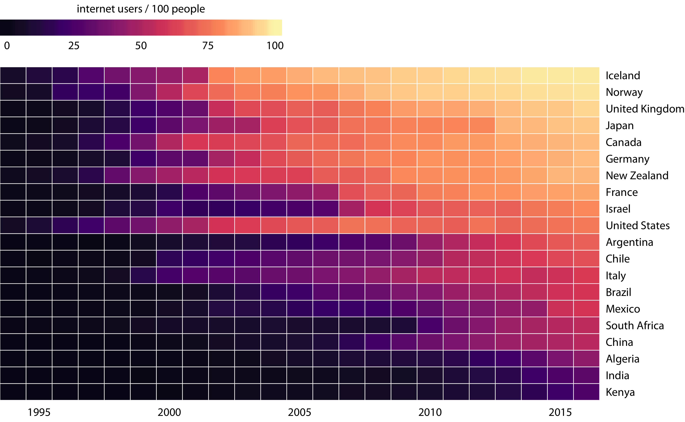

(\#fig:internet-over-time)(ref:internet-over-time)

As is the case with all other visualization approaches discussed in this chapter, we need to pay attention to the ordering of the categorical data values when making heatmaps. In Figure \@ref(fig:internet-over-time), countries are ordered by the percentage of internet users in 2016. This ordering places the United Kingdom, Japan, Canada, and Germany above the United States, because all these countries have higher internet penetration in 2016 than the United States does, even though the United States saw significant internet use at an earlier time. Alternatively, we could order countries by how early they started to see significant internet usage. In Figure \@ref(fig:internet-over-time2), countries are ordered by the year in which internet usage first rose to above 20%. In this figure, the United States falls into the third position from the top, and it stands out for having relatively low internet usage in 2016 compared to how early internet usage started there. A similar pattern can be seen for Italy. Israel and France, by contrast, started relatively late but gained ground rapidly.

(ref:internet-over-time2) Internet adoption over time, for select countries. Countries were ordered by the year in which their internet usage first exceeded 20%. Data source: World Bank

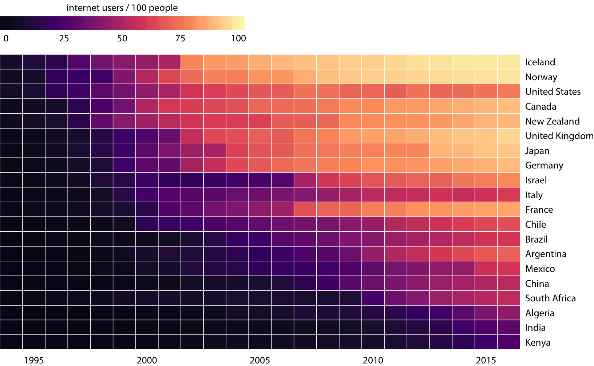

(\#fig:internet-over-time2)(ref:internet-over-time2)

Both Figures \@ref(fig:internet-over-time) and \@ref(fig:internet-over-time2) are valid representations of the data. Which one is prefered depends on the story we want to convey. If our story is about internet usage in 2016, then Figures \@ref(fig:internet-over-time) is probably the better choice. If, however, our story is about how early or late adoption of the internet relates to current-day usage, then Figure \@ref(fig:internet-over-time2) is preferable.
