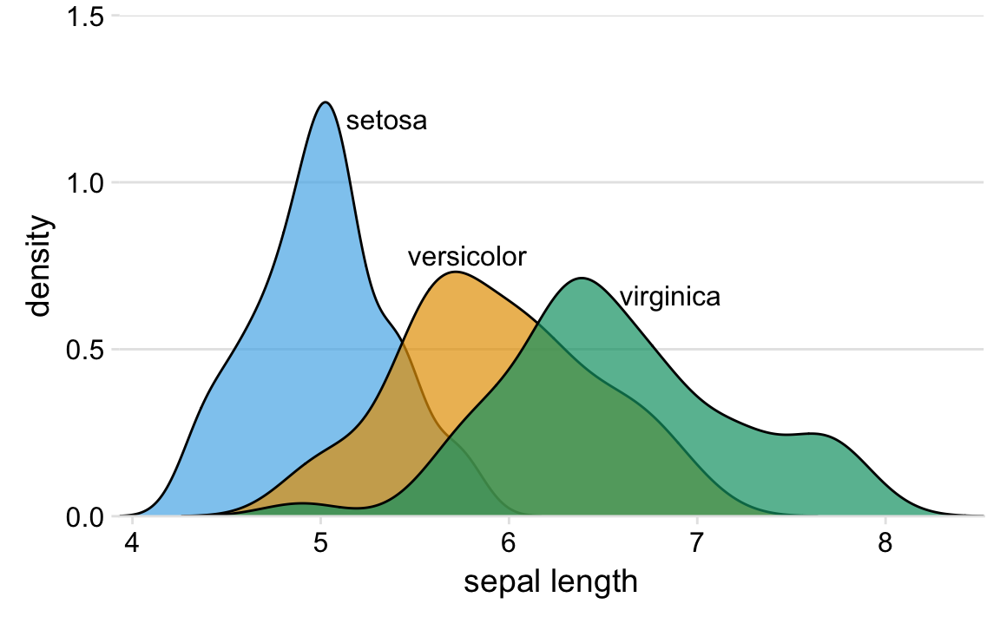

# Visualizing distributions: Histograms and density plots {#histograms-density-plots}

We frequently encounter the situation where we would like to understand how a particular variable is distributed in a dataset. To give a concrete example, consider the passengers of the ship Titanic, which sank on April 15, 2012. There were approximately 1317 passengers on the Titanic (not counting crew), and we have reported ages for 756 of them. We might want to know how many passengers of what ages there were on the Titanic, i.e., how many children, young adults, middle-aged people, seniors, and so on. We call the relative proportions of different ages among the passengers the *age distribution* of the passengers.

## Visualizing a single distribution

We can obtain a sense of the age distribution among the passengers by grouping all passengers into bins with comparable ages and then counting the number of passengers in each bin. This procedure results in a table such as Table \@ref(tab:titanic-ages). 

<table class="kable_wrapper">
<caption>(\#tab:titanic-ages)Numbers of passenger with known age on the Titanic.</caption>
<tbody>
  <tr>
   <td> 

age range    count
----------  ------
0--5            36
6--10           19
11--15          18
16--20          99
21--25         139
26--30         121

 </td>
   <td> 

age range    count
----------  ------
31--35          76
36--40          74
41--45          54
46--50          50
51--55          26
56--60          22

 </td>
   <td> 

age range    count
----------  ------
61--65          16
66--70           3
71--75           3

 </td>
  </tr>
</tbody>
</table>

We can visualize this table by drawing filled rectangles whose heights correspond to the counts and whose widths correspond to the width of the age bins (Figure \@ref(fig:titanic-ages-hist1)). Such a visualization is called a histogram.

(ref:titanic-ages-hist1) Histogram of the ages of Titanic passengers.

(\#fig:titanic-ages-hist1)(ref:titanic-ages-hist1)

**Discus histogram dependency on bin width.** 

(ref:titanic-ages-hist-grid) Histograms depend on the chosen bin width. Here, the same age distribution of Titanic passengers is shown with four different bin widths: (a) one year; (b) three years; (c) five years; (d) fifteen years.

(\#fig:titanic-ages-hist-grid)(ref:titanic-ages-hist-grid)

When making a histogram, always explore multiple bin widths.

(ref:titanic-ages-dens1) **Caption needed.**

(\#fig:titanic-ages-dens1)(ref:titanic-ages-dens1)

*Discuss scaling, different choices for kernel and bandwith*

## Visualizing multiple distributions at the same time

(ref:titanic-age-stacked-hist) **Caption needed.**

(\#fig:titanic-age-stacked-hist)(ref:titanic-age-stacked-hist)

There are two key problems with this type of visualization: First, it is never entirely clear whether all bars are meant to start at zero or exactly where the color changes. Are there about 25 females of age 18--20 or are there almost 80? (The former is the case.) Second, the bar heights for the female counts cannot be directly compared, because the bars all start at a different height.

We could try to address these problems by having all bars start at zero and making the bars partially transparent (Figure \@ref(fig:titanic-age-overlapping-hist)).

(ref:titanic-age-overlapping-hist) **Caption needed.**

(\#fig:titanic-age-overlapping-hist)(ref:titanic-age-overlapping-hist)

However, this approach generates new problems. Now it appears that there are actually three different groups, not just two, and we're still not entirely sure where each bar starts and ends.

(ref:titanic-age-overlapping-dens) **Caption needed.** *Mention special scaling here.*

(\#fig:titanic-age-overlapping-dens)(ref:titanic-age-overlapping-dens)

*Discuss scaling*

When we want to visualize exactly two distributions, we can make two separate histograms, rotate them by 90 degrees, and have the bars in one histogram point into the opposite direction of the other. This trick is commonly employed when visualizing age distributions, and the resulting plot is usually called an *age pyramid* (Figure \@ref(fig:titanic-age-pyramic)).

(ref:titanic-age-pyramid) The age distributions of male and female Titanic passengers visualized as an age pyramid.

(\#fig:titanic-age-pyramid)(ref:titanic-age-pyramid)

Importantly, this trick does not work when there are more than two distributions we want to visualize at the same time. For example, to visualize the length distributions of sepals for three different iris species, density plots are by far the best choice (Figure \@ref(fig:iris-densities)).

(ref:iris-densities) **Caption needed.**

(\#fig:iris-densities)(ref:iris-densities)

To visualize several distributions at once, kernel density plots will generally work better than histograms.

