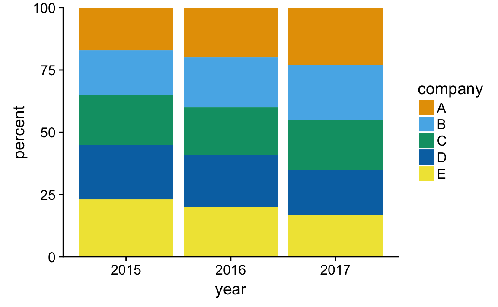

# Visualizing proportions

A pie chart (Figure \@ref(fig:bundestag-pie)).

(ref:bundestag-pie) Party composition of the 8th German Bundestag, 1976--1980, visualized as a pie chart. This visualization shows clearly that the ruling coalition of SPD and FDP had a small majority over the opposition CDU/CSU.

(\#fig:bundestag-pie)(ref:bundestag-pie)

(ref:bundestag-stacked-bars) Party composition of the 8th German Bundestag, 1976--1980, visualized as stacked bars. (a) Bars stacked vertically. (b) Bars stacked horizontally. It is not immediately obvious that SPD and FDP jointly had more seats than CDU/CSU.

(\#fig:bundestag-stacked-bars)(ref:bundestag-stacked-bars)

(ref:bundestag-bars-side-by-side) Party composition of the 8th German Bundestag, 1976--1980, visualized as side-by-side bars. As in Figure \@ref(fig:bundestag-stacked-bars), it is not immediately obvious that SPD and FDP jointly had more seats than CDU/CSU.

(\#fig:bundestag-bars-side-by-side)(ref:bundestag-bars-side-by-side)

None of these three types of visualizations are consistently superior over any other, however. Depending on the features of the dataset and the specific story you want to tell, you may want to favor one or the other approach.

Table: (\#tab:pros-cons-pie-bar) Pros and cons of common apporaches to visualizing proportions: pie charts, stacked bars, and side-by-side bars. 

----------------------------------------------------------------------------------------
                                    Pie chart         Stacked bars      Side-by-side bars
-----------------------------  ------------------- ------------------- -------------------
Clearly visualizes the data             ✔                 ✔                   ✖
as proportions of a whole

Allows easy visual comparison           ✖                 ✖                   ✔ 
of the relative proportions 

Visually emphasizes simple              ✔                 ✖                   ✖
fractions, such as 1/2, 1/3,
1/4

Looks visually appealing                ✔                 ✖                   ✔
even for very small datasets

Works well when the whole is            ✖                 ✖                   ✔ 
broken into many pieces

Works well for the                      ✖                 ✔                   ✖
visualization of many sets of
proportions or time series
of proportions
----------------------------------------------------------------------------------------

(ref:marketshare-pies) Marketshare of five hypothetical companies for the years 2015--2017, visualized as pie charts.

(\#fig:marketshare-pies)(ref:marketshare-pies)

**Additional things this chapter needs: A time course of proportions, visualized as stacked bars (ideally, just two categories); stacked density distributions (continuous x axis); treemap (maybe move to separate chapter?).**

