# Visualizing trends {#visualizing-trends}

When making scatter plots (Chapter \@ref(visualizing-associations)) or time series (Chapter \@ref(time-series)), we are often more interested in the overarching trend of the data than in the specific detail of where each individual data point lies. By drawing the trend on top of or instead of the actual data points, usually in the form of a straight or curved line, we can create a visualization that helps the reader immediately see key features of the data. There are two fundamental approaches to determining a trend: We can either smooth the data by some method, such as a moving average, or we can fit a curve with a defined functional form and then draw the fitted curve. Once we have identified a trend in a dataset, it may also be useful to look specifically at deviations from the trend or to separate the data into multiple components, including the underlying trend, any existing cyclical components, and episodic components or random noise.

## Smoothing

Let us consider a time series of the Dow Jones Industrial Average (Dow Jones for short), a stock-market index representing the price of 30 large, publicly owned U.S. companies. Specifically, we will look at the year 2009, right after the 2008 crash (Figure \@ref(fig:dow-jones)). During the tail end of the crash, in the first three months of the year 2009,  the market lost over 2400 points (~27%). Then it slowly recovered for the remainder of the year. How can we visualize these longer-term trends while de-emphasizing the less important short-term fluctuations?

(ref:dow-jones) Daily closing values of the Dow Jones Industrial Average for the year 2009. Data source: Yahoo! Finance

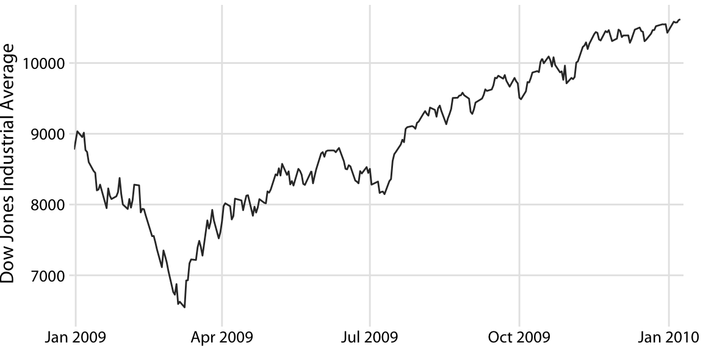

(\#fig:dow-jones)(ref:dow-jones)

In statistical terms, we are looking for a way to *smooth* the stock-market time series. The act of smoothing produces a function that captures key patterns in the data while removing irrelevant minor detail or noise. Financial analysts usually smooth stock-market data by calculating moving averages. To generate a moving average, we take a time window, say the first 20 days in the time series, calculate the average price over these 20 days, then move the time window by one day, so it now spans the 2nd to 21st day, calculate the average over these 20 days, move the time window again, and so on. The result is a new time series consisting of a sequence of averaged prices.

To plot this sequence of moving averages, we need to decide which specific time point to associate with the average for each time window. Financial analysts often plot each average at the end of its respective time window. This choice results in curves that lag the original data (Figure \@ref(fig:dow-jones-moving-ave)a), with more severe lags corresponding to larger averaging time windows. Statisticians, on the other hand, plot the average at the center of the time window, which results in a curve that overlays perfectly on the original data (Figure \@ref(fig:dow-jones-moving-ave)b).

(ref:dow-jones-moving-ave) Daily closing values of the Dow Jones Industrial Average for the year 2009, shown together with their 20-day, 50-day, and 100-day moving averages. (a) The moving averages are plotted at the end of the moving time windows. (b) The moving averages are plotted in the center of the moving time windows. Data source: Yahoo! Finance

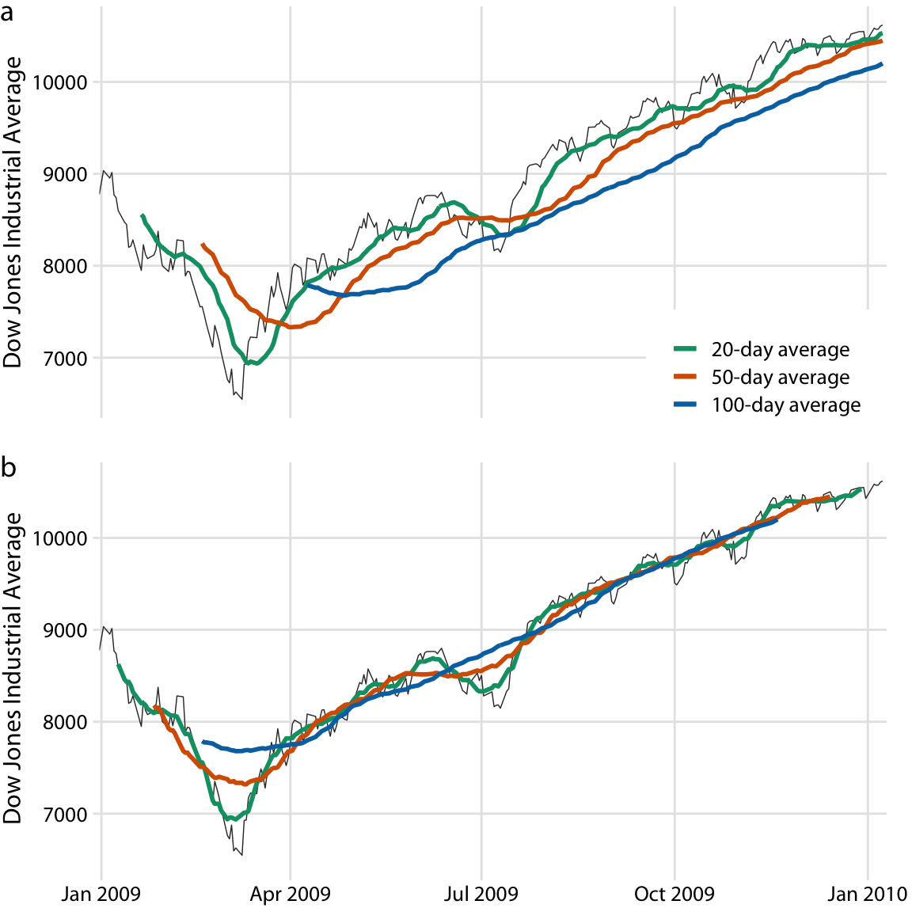

(\#fig:dow-jones-moving-ave)(ref:dow-jones-moving-ave)

Regardless of whether we plot the smoothed time series with or without lag, we can see that the length of the time window over which we average sets the scale of the fluctuations that remain visible in the smoothed curve. The 20-day moving average only removes small, short-term spikes but otherwise follows the daily data closely. The 100-day moving average, on the other hand, removes even fairly substantial drops or spikes that play out over a time span of multiple weeks. For example, the massive drop to below 7000 points in the first quarter of 2009 is not visible in the 100-day moving average, which replaces it with a gentle curve that doesn't dip much below 8000 points (Figure \@ref(fig:dow-jones-moving-ave)). Similarly, the drop around July 2009 is completely invisible in the 100-day moving average.

The moving average is the most simplistic approach to smoothing, and it has some obvious limitations. First, it results in a smoothed curve that is shorter than the original curve (Figure \@ref(fig:dow-jones-moving-ave)). Parts are missing at either the beginning or the end or both. And the more the time series is smoothed (i.e., the larger the averaging window), the shorter the smoothed curve. Second, even with a large averaging window, a moving average is not necessarily that smooth. It may exhibit small bumps and wiggles even though larger-scale smoothing has been achieved (Figure \@ref(fig:dow-jones-moving-ave)). These wiggles are caused by individual data points that enter or exit the averaging window. Since all data points in the window are weighted equally, individual data points at the window boundaries can have visible impact on the average.

Statisticians have developed numerous approaches to smoothing that alleviate the downsides of moving averages. These approaches are much more complex and computationally costly, but they are readily available in modern statistical computing environments. One widely used method is LOESS (locally estimated scatterplot smoothing, @Cleveland1979), which fits low-degree polynomials to subsets of the data. Importantly, the points in the center of each subset are weighted more heavily than points at the boundaries, and this weighting scheme yields a much smoother result than we get from a weighted average (Figure \@ref(fig:dow-jones-loess)). The LOESS curve shown here looks similar to the 100-day average, but this similarity should not be overinterpreted. The smoothness of a LOESS curve can be tuned by adjusting a parameter, and different parameter choices would have produced LOESS curves looking more like the 20-day or 50-day average. 

(ref:dow-jones-loess) Comparison of LOESS fit to 100-day moving average for the Dow Jones data of Figure \@ref(fig:dow-jones-moving-ave). The overall trend shown by the LOESS smooth is nearly identical to the 100-day moving average, but the LOESS curve is much smoother and it extends to the entire range of the data. Data source: Yahoo! Finance

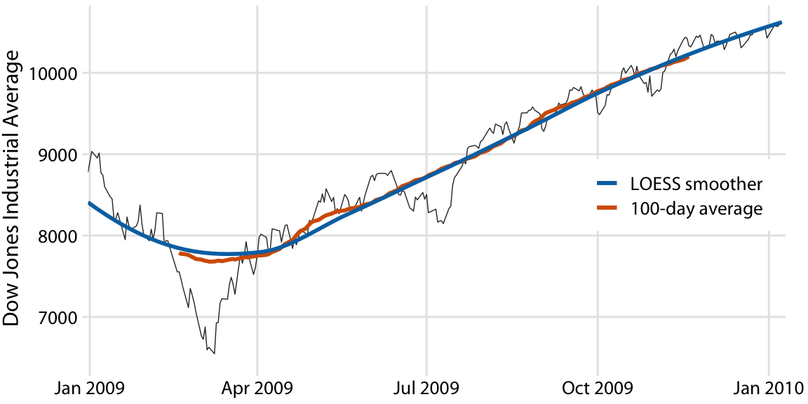

(\#fig:dow-jones-loess)(ref:dow-jones-loess)

Importantly, LOESS is not limited to time series. It can be applied to arbitrary scatter plots, as is apparent from its name, *locally estimated scatterplot smoothing*. For example, we can use LOESS to look for trends in the relationship between a car's fuel-tank capacity and its price (Figure \@ref(fig:tank-capacity-loess)). The LOESS line shows that tank capacity grows approximately linearly with price for cheap cars (below \$20,000) but it levels off for more expensive cars. Above a price of approximately \$20,000, buying a more expensive car will not get you one with a larger fuel tank.

(ref:tank-capacity-loess) Fuel-tank capacity versus price of 93 cars released for the 1993 model year. Each dot corresponds to one car. The solid line represents a LOESS smooth of the data. We see that fuel-tank capacity increases approximately linearly with price, up to a price of approximately $20,000, and then it levels off. Data source: Robin H. Lock, St. Lawrence University

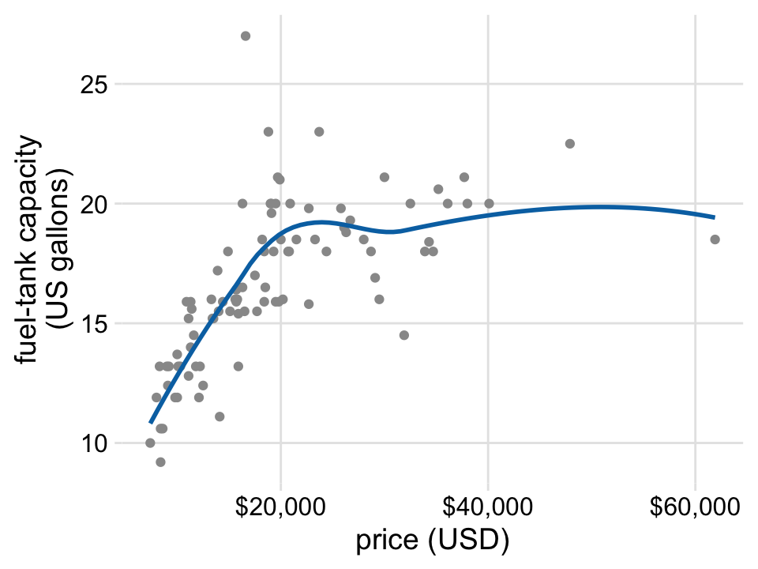

(\#fig:tank-capacity-loess)(ref:tank-capacity-loess)

LOESS is a very popular smoothing approach because it tends to produce results that look right to the human eye. However, it requires the fitting of many separate regression models. This makes it slow for large datasets, even on modern computing equipment.

As a faster alternative to LOESS, we can use spline models. A spline is a piecewise polynomial function that is highly flexible yet always looks smooth. When working with splines, we will encounter the term *knot.* The knots in a spline are the endpoints of the individual spline segments. If we fit a spline with *k* segments, we need to specify *k* + 1 knots. While spline fitting is computationally efficient, in particular if the number of knots is not too large, splines have their own downsides. Most importantly, there is a bewildering array of different types of splines, including cubic splines, B-splines, thin-plate splines, Gaussian process splines, and many others, and which one to pick may not be obvious. The specific choice of the type of spline and number of knots used can result in widely different smoothing functions for the same data (Figure \@ref(fig:tank-capacity-smoothers)).

(ref:tank-capacity-smoothers) Different smoothing models display widely different behaviors, in particular near the boundaries of the data. (a) LOESS smoother, as in Figure \@ref(fig:tank-capacity-loess). (b) Cubic regression splines with 5 knots. (c) Thin-plate regression spline with 3 knots. (d)  Gaussian process spline with 6 knots. Data source: Robin H. Lock, St. Lawrence University

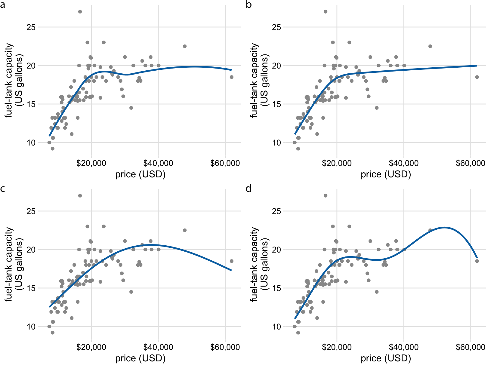

(\#fig:tank-capacity-smoothers)(ref:tank-capacity-smoothers)

Most data visualization software will provide smoothing features, likely implemented as either a type of local regression (such as LOESS) or a type of spline. The smoothing method may be referred to as a GAM, a generalized additive model, which is a superset of all these types of smoothers. It is important to be aware that the output of the smoothing feature is highly dependent on the specific GAM model that is fit. Unless you try out a number of different choices you may never realize to what extent the results you see depend on the specific default choices made by your statistical software.

Be careful when interpreting the results from a smoothing function. The same dataset can be smoothed in many different ways.

## Showing trends with a defined functional form

As we can see in Figure \@ref(fig:tank-capacity-smoothers), the behavior of general-purpose smoothers can be somewhat unpredictable for any given dataset. These smoothers also do not provide parameter estimates that have a meaningful interpretation. Therefore, whenever possible, it is preferable to fit a curve with a specific functional form that is appropriate for the data and that uses parameters with clear meaning. 

For the fuel-tank data, we need a curve that initially rises linearly but then levels off at a constant value. The function $y = A - B \exp(-mx)$ may fit that bill. Here, $A$, $B$, and $m$ are the constants we adjust to fit the curve to the data. The function is approximately linear for small $x$, with $y \approx A - B + B m x$, it approaches a constant value for large $x$, $y \approx A$, and it is strictly increasing for all values of $x$. Figure \@ref(fig:tank-capacity-model) shows that this equation fits the data at least as well as any of the smoothers we considered previously (Figure \@ref(fig:tank-capacity-smoothers)).

(ref:tank-capacity-model) Fuel-tank data represented with an explicit analytical model. The solid line corresponds to a least-squares fit of the formula $y = A - B \exp(-mx)$ to the data. Fitted parameters are $A = 19.6$, $B = 29.2$, $m = 0.00015$.  Data source: Robin H. Lock, St. Lawrence University

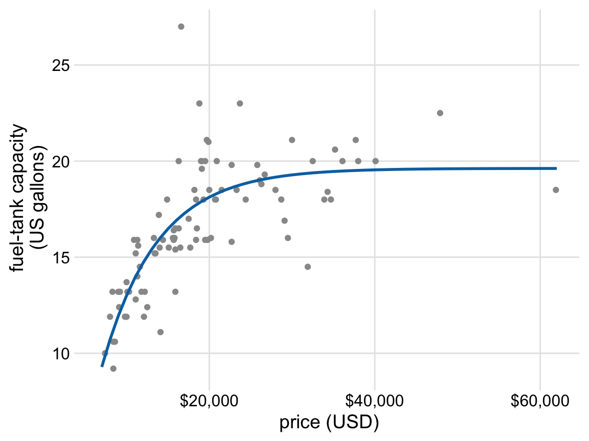

(\#fig:tank-capacity-model)(ref:tank-capacity-model)

A functional form that is applicable in many different contexts is the simple straight line, $y = A + mx$. Approximately linear relationships between two variables are surprisingly common in real-world datasets. For example, in Chapter \@ref(visualizing-associations), I discussed the relationship between head length and body mass in blue jays. This relationship is approximately linear, for both female and male birds, and drawing linear trend lines on top of the points in a scatter plot helps the reader perceive the trends (Figure \@ref(fig:blue-jays-scatter-line)).

(ref:blue-jays-scatter-line) Head length versus body mass for 123 blue jays. The birds' sex is indicated by color. This figure is equivalent to Figure \@ref(fig:blue-jays-scatter-sex), except that now we have drawn linear trend lines on top of the individual data points. Data source: Keith Tarvin, Oberlin College

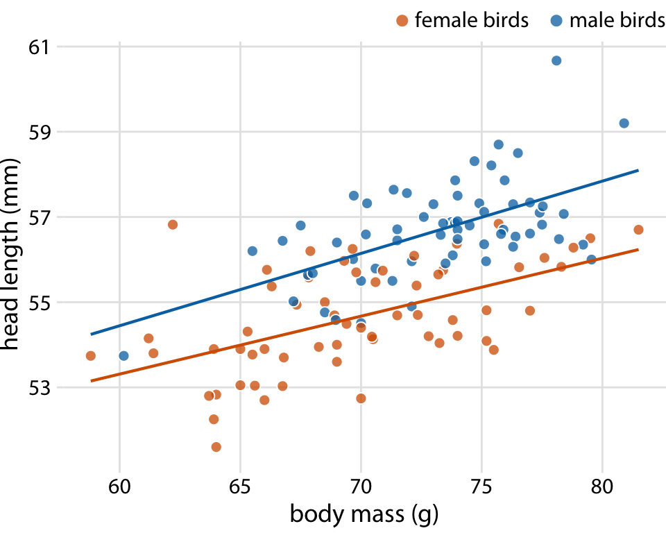

(\#fig:blue-jays-scatter-line)(ref:blue-jays-scatter-line)

When the data display a non-linear relationship, we need to guess what an appropriate functional form might be. In this case, we can assess the accuracy of our guess by transforming the axes in such a way that a linear relationship emerges. To demonstrate this principle, let's return to the monthly submissions to the preprint server bioRxiv, discussed in Chapter \@ref(visualizing-associations). If the increase in submissions in each month is proportional to the number of submissions in the previous month, i.e., if submissions grow by a fixed percentage each month, then the resulting curve is exponential. This assumption seems to be met for the bioRxiv data, because a curve with exponential form, $y = A\exp(mx)$, fits the bioRxiv submission data well (Figure \@ref(fig:biorxiv-expfit)).

(ref:biorxiv-expfit) Monthly submissions to the preprint server bioRxiv. The solid blue line represents the actual monthly preprint counts and the dashed black line represents an exponential fit to the data, $y = 60\exp[0.77(x - 2014)]$. Data source: Jordan Anaya, http://www.prepubmed.org/

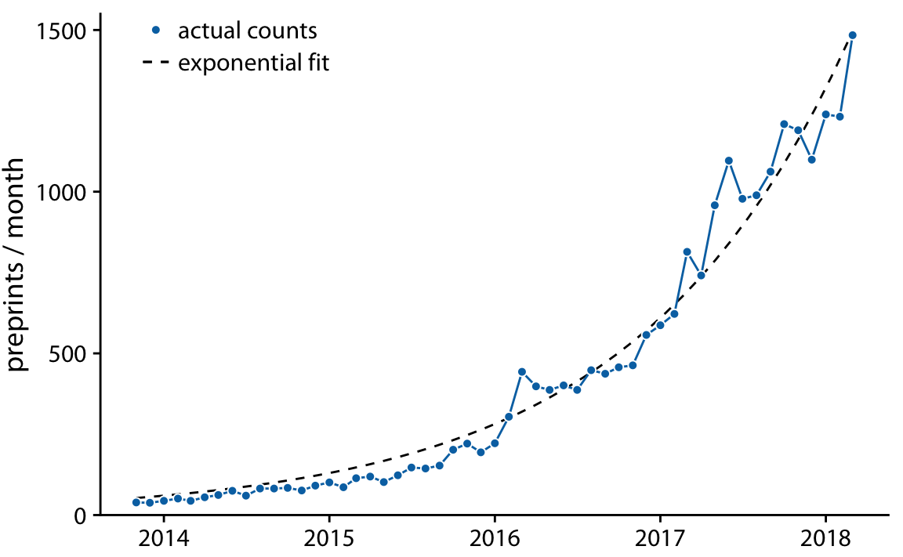

(\#fig:biorxiv-expfit)(ref:biorxiv-expfit)

If the original curve is exponential, $y = A\exp(mx)$, then a log-transformation of the *y* values will turn it into a linear relationship, $\log(y) = \log(A) + mx$. Therefore, plotting the data with log-transformed *y* values (or equivalently, with a logarithmic *y* axis) and looking for a linear relationship is a good way of determining whether a dataset exhibits exponential growth. For the bioRxiv submission numbers, we indeed obtain a linear relationship when using a logarithmic *y* axis (Figure \@ref(fig:biorxiv-logscale)).

(ref:biorxiv-logscale) Monthly submissions to the preprint server bioRxiv, shown on a log scale. The solid blue line represents the actual monthly preprint counts, the dashed black line represents the exponential fit from Figure \@ref(fig:biorxiv-expfit), and the solid black line represents a linear fit to log-transformed data, corresponding to $y = 43\exp[0.88(x - 2014)]$. Data source: Jordan Anaya, http://www.prepubmed.org/

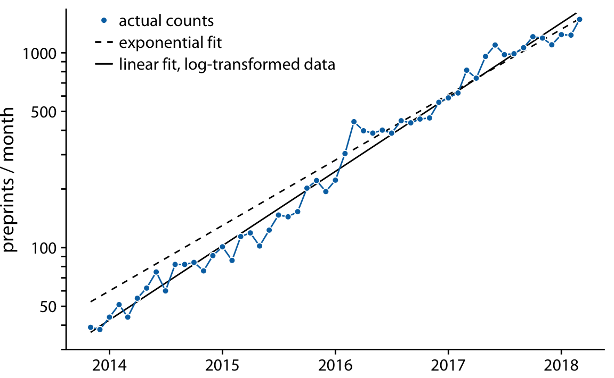

(\#fig:biorxiv-logscale)(ref:biorxiv-logscale)

In Figure \@ref(fig:biorxiv-logscale), in addition to the actual submission counts, I am also showing the exponential fit from Figure \@ref(fig:biorxiv-expfit) and a linear fit to the log-transformed data. These two fits are similar but not identical. In particular, the slope of the dashed line seems somewhat off. The line systematically falls above the individual data points for half the time series. This is a common problem with exponential fits: The square deviations from the data points to the fitted curve are so much larger for the largest data values than for the smallest data values that the deviations of the smallest data values contribute little to the overall sum squares that the fit minimizes. As a result, the fitted line systematically overshoots or undershoots the smallest data values. For this reason, I generally advise to avoid exponential fits and instead use linear fits on log-transformed data.

It is usually better to fit a straight line to transformed data than to fit a nonlinear curve to untransformed data.

A plot such as Figure \@ref(fig:biorxiv-logscale) is commonly referred to as *log--linear*, since the *y* axis is logarithmic and the *x* axis is linear. Other plots we may encounter include *log--log*, where both the *y* and the *x* axis are logarithmic, or *linear--log*, where *y* is linear and *x* is logarithmic. In a log--log plot, power laws of the form $y \sim x^\alpha$ appear as straight lines (see Figure \@ref(fig:word-counts-tail-log-log) for an example), and in a linear--log plot, logarithmic relationships of the form $y \sim \log(x)$ appear as a straight lines. Other functional forms can be turned into linear relationships with more specialized coordinate transformations, but these three (log--linear, log--log, linear--log) cover a wide range of real-world applications.

## Detrending and time-series decomposition

For any time series with a prominent long-term trend, it may be useful to remove this trend to specifically highlight any notable deviations. This technique is called *detrending*, and I will demonstrate it here with house prices. In the U.S., the mortgage lender Freddie Mac publishes a monthly index, called the *Freddie Mac House Price Index,* that tracks the change in house prices over time. The index attempts to capture the state of the entire house market in a given region, such that an increase in the index by, for example, 10% can be interpreted as an average house price increase of 10% in the respective market. The index is arbitrarily set to a value of 100 in December 2000.

Over long periods of time, house prices tend to display consistent annual growth, approximately in line with inflation. However, overlaid on top of this trend are housing bubbles that lead to severe boom and bust cycles. Figure \@ref(fig:hpi-trends) shows the actual house price index and its long-term trend for four select U.S. states. We see that between 1980 and 2017, California underwent two bubbles, one in 1990 and one in the mid-2000s. During the same period, Nevada experienced only one bubble, in the mid-2000s, and house prices in Texas and West Virginia closely followed their long-term trends the entire time. Because house prices tend to grow in percent increments, i.e., exponentially, I have chosen a logarithmic *y* axis in Figure \@ref(fig:hpi-trends). The straight lines correspond to a 4.7% annual price increase in California and a 2.8% annual price increase each in Nevada, Texas, and West Virginia. 

(ref:hpi-trends) Freddie Mac House Price Index from 1980 through 2017, for four selected states (California, Nevada, Texas, and West Virginia). The House Price Index is a unitless number that tracks relative house prices in the chosen geographic region over time. The index is scaled arbitrarily such that it equals 100 in December of the year 2000. The blue lines show the monthly fluctuations in the index and the straight gray lines show the long-term price trends in the respective states. Note that the *y* axes are logarithmic, so that the straight gray lines represent consistent exponential growth. Data source: Freddie Mac House Prices Index

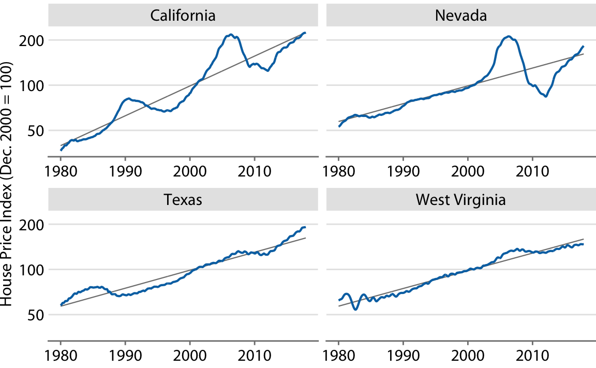

(\#fig:hpi-trends)(ref:hpi-trends)

We detrend housing prices by dividing the actual price index at each time point by the respective value in the long-term trend. Visually, this division will look like we are subtracting the gray lines from the blue lines in Figure \@ref(fig:hpi-trends), because a division of the untransformed values is equivalent to a subtraction of the log-transformed values. The resulting detrended house prices show the housing bubbles more clearly (Figure \@ref(fig:hpi-detrended)), as the detrending emphasizes the unexpected movements in a time series. For example, in the original time series, the decline in home prices in California from 1990 to about 1998 looks modest (Figure \@ref(fig:hpi-trends)). However, during that same time period, on the basis of the long-term trend we would have expected prices to rise. Relative to the expected rise the drop in prices was substantial, amounting to 25% at the lowest point (Figure \@ref(fig:hpi-detrended)).

(ref:hpi-detrended) Detrended version of the Freddie Mac House Price Index shown in Figure \@ref(fig:hpi-trends). The detrended index was calculated by dividing the actual index (blue lines in Figure \@ref(fig:hpi-trends)) by the expected value based on the long-term trend (straight gray lines in Figure \@ref(fig:hpi-trends)). This visualization shows that California experienced two housing bubbles, around 1990 and in the mid-2000s, identifiable from a rapid rise and subsequent decline in the actual housing prices relative to what would have been expected from the long-term trend. Similarly, Nevada experienced one housing bubble, in the mid-2000s, and neither Texas nor West Virginia experienced much of a bubble at all. Data source: Freddie Mac House Prices Index

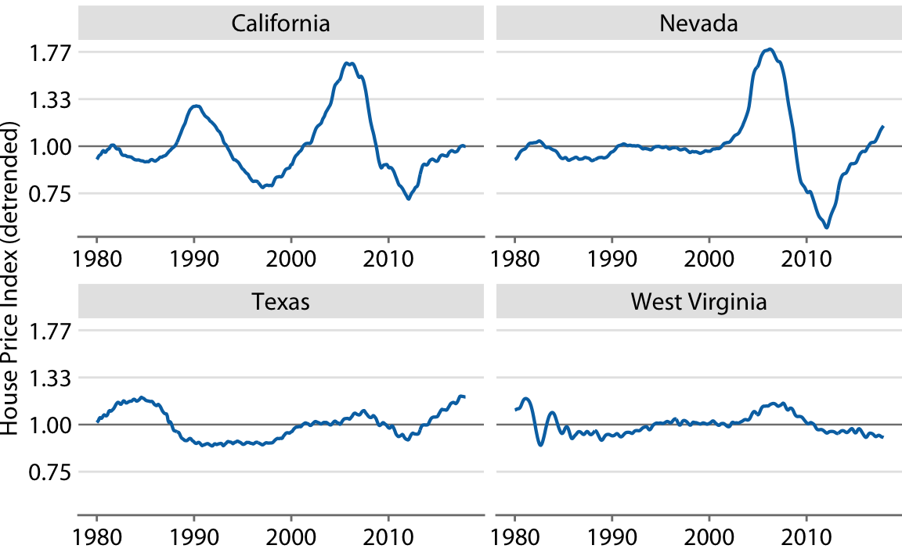

(\#fig:hpi-detrended)(ref:hpi-detrended)

Beyond simple detrending, we can also separate a time series into multiple distinct components, such that their sum recovers the original time series. In general, in addition to a long-term trend, there are three distinct components that may shape a time series. First, there is random noise, which causes small, erratic movements up and down. This noise is visible in all the time series shown in this chapter, but maybe the most clearly in Figure \@ref(fig:biorxiv-logscale). Second, there can be unique external events that leave their mark in the time series, such as the distinct housing bubbles seen in Figure \@ref(fig:hpi-trends). Third, there can be cyclical variations. For example, outside temperatures show daily cyclical variations. The highest temperatures are reached in the early afternoon and the lowest temperatures in the early morning. Outside temperatures also show yearly cyclical variations. They tend to rise in the spring, reach their maximum in the summer, and then decline in fall and reach their minimum in the winter (Figure \@ref(fig:temperature-normals-Houston)).

To demonstrate the concept of distinct time-series components, I will here decompose the Keeling curve, which shows changes in CO2 abundance over time (Figure \@ref(fig:keeling-curve)). CO2 is measured in parts per million (ppm). We see a long-term increase in CO2 abundance that is slightly faster than linear, from below 325 ppm in the 1960s to above 400 in the second decade of the 21st century (Figure \@ref(fig:keeling-curve)). CO2 abundance also fluctuates anually, following a consistent up-and-down pattern overlaid on top of the overall increase. The annual fluctuation are driven by plant growth in the northern hemisphere. Plants consume CO2 during photosynthesis. Because most of the globe's land masses are located in the northern hemisphere, and plant growth is most active in the spring and summer, we see an annual global decline in atmospheric CO2 that coincides with the summer months in the northern hemisphere.

(ref:keeling-curve) The Keeling curve. The Keeling curve shows the change of CO2 abundance in the atmosphere over time. Since 1958, CO2 abundance has been continuously monitored at the Mauna Loa Observatory in Hawaii, initially under the direction of Charles Keeling. Shown here are monthly average CO2 readings, expressed in parts per million (ppm). The CO2 readings fluctuate anually with the seasons but show a consistent long-term trend of increase. Data source: Dr. Pieter Tans, NOAA/ESRL, and Dr. Ralph Keeling, Scripps Institution of Oceanography

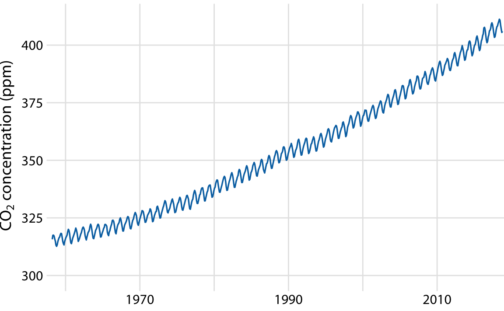

(\#fig:keeling-curve)(ref:keeling-curve)

We can decompose the Keeling curve into its long-term trend, seasonal fluctuations, and remainder (Figure \@ref(fig:keeling-curve-decomposition)). The specific method I am using here is called STL (Seasonal decomposition of Time series by LOESS, @Cleveland_et_al_1990), but there are many other methods that achieve similar goals. The decomposition shows that over the last three decades, CO2 abundance has increased by over 50 ppm. By comparison, seasonal fluctuations amount to less than 8 ppm (they never cause an increase or a decrease in more than 4 ppm relative to the long-term trend), and the remainder amounts to less than 1.6 ppm (Figure \@ref(fig:keeling-curve-decomposition)). The remainder is the difference between the actual readings and the sum of the long-term trend and the seasonal fluctuations, and here it corresponds to random noise in the monthly CO2 readings. More generally, however, the remainder could also capture unique external events. For example, if a massive volcano erruption released substantial amounts of CO2, such an event might be visible as a sudden spike in the remainder. Figure \@ref(fig:keeling-curve-decomposition) shows that no such unique external events have had a major effect on the Keeling curve in recent decades. 

(ref:keeling-curve-decomposition) Time-series decomposition of the Keeling curve, showing the monthly average (as in Figure \@ref(fig:keeling-curve)), the long-term trend, seasonal fluctuations, and the remainder. The remainder is the difference between the actual readings and the sum of the long-term trend and the seasonal fluctuations, and it represents random noise. I have zoomed into the most recent 30 years of data to more clearly show the shape of the annual fluctuations. Data source: Dr. Pieter Tans, NOAA/ESRL, and Dr. Ralph Keeling, Scripps Institution of Oceanography

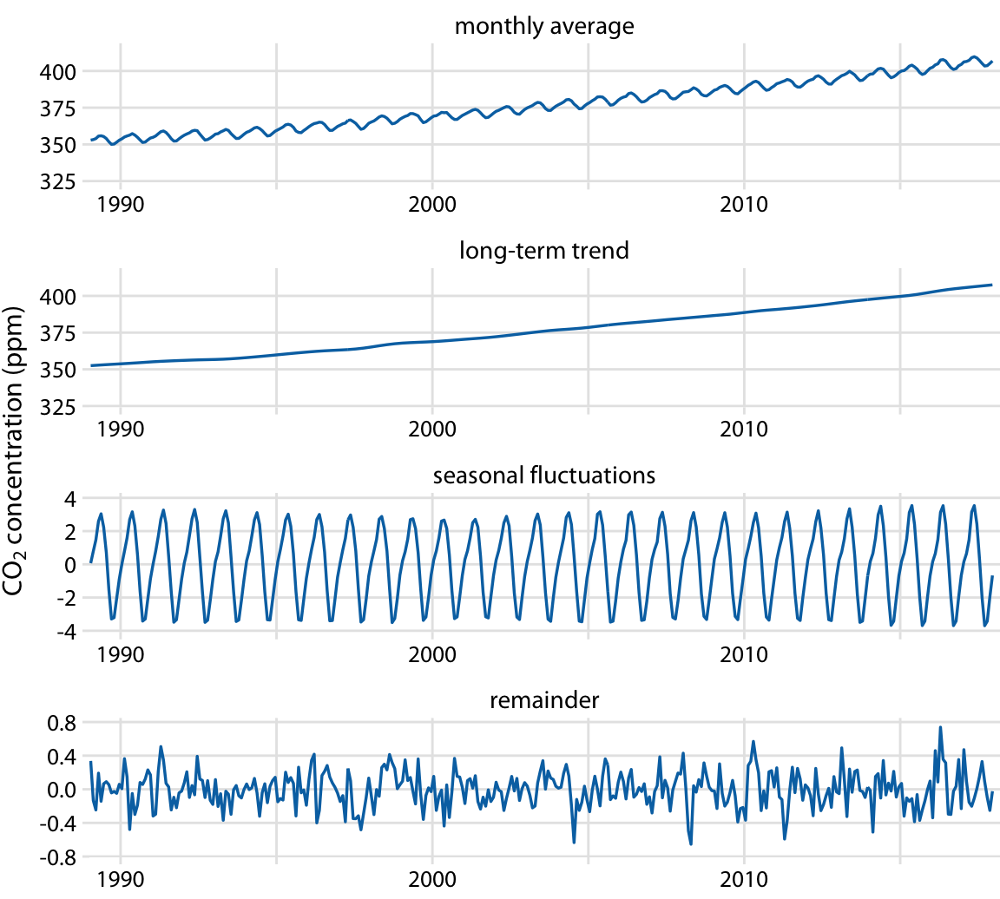

(\#fig:keeling-curve-decomposition)(ref:keeling-curve-decomposition)

